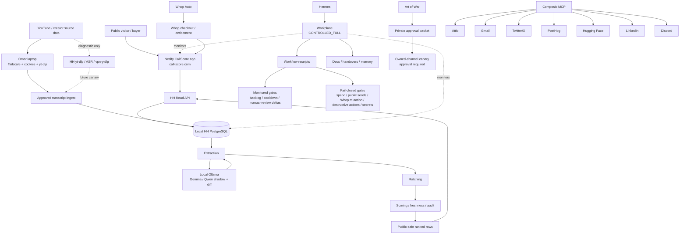

# CallScore — Agentic Crypto Creator Intelligence Platform

[](https://app.netlify.com/projects/callscore/deploys)

CallScore ranks crypto creators by evidence-backed prediction quality. It ingests creator/video/transcript data, extracts claims and market signals, matches them to outcomes, scores creator credibility/performance, and exposes a public product through [call-score.com](https://call-score.com). The platform is commercially gated through Whop and operationally governed by Hermes/Workplane receipts, handovers, default-open owned public GTM policy, and fail-closed restricted-action gates.

- **Live product:** <https://call-score.com>
- **Canonical deploy target:** Netlify
- **Canonical app repo:** `/opt/crypto-tuber-ranked` on branch `master`
- **Current readiness:** `CONTROLLED_FULL`
- **Latest canonical gate model:** [`docs/ops/2026-06-14-full-system-live-canary-gate-decisions.md`](docs/ops/2026-06-14-full-system-live-canary-gate-decisions.md)
- **Canonical session startup:** [`docs/ops/callscore-canonical-session-startup.md`](docs/ops/callscore-canonical-session-startup.md) — standard docs/skills for future Hermes sessions, including `/callscore-standard`, `headroom`, and `/agentmemory`.

## Executive summary

CallScore is an agentic crypto creator intelligence platform:

- ranks crypto creators by historical call performance and evidence quality;
- collects creator/video/transcript data through a bounded, cookie-local laptop transcript lane;
- extracts claims/signals with rule paths and local Ollama Gemma/Qwen shadow canaries;
- matches calls to symbols/outcomes and scores public-safe creator/call rows;
- serves a public website and API through Netlify + HH Read API;
- supports monetization and entitlements through Whop / Whop Auto;
- uses Hermes/Workplane for governed autonomous operations, receipts, and handovers;
- uses Art of War and Composio for default-open owned organic GTM, with restricted actions still fail-closed.

## Current production status

| Surface | Status | Evidence / rule |
| --- | --- | --- |
| Readiness verdict | `CONTROLLED_FULL` | `npm run workplane` reports `status=OK`, `automation_readiness=CONTROLLED_FULL` |
| Website | Live | `npm run verify:public -- --source live --base-url https://call-score.com` passes |
| Workplane | OK / controlled-full | owned public GTM ready; historical/provider/restricted mutation gates monitored or fail-closed |
| Transcript cadence | Proven and bounded | Omar laptop over Tailscale + residential browser cookies + laptop-side `yt-dlp`; cooldown respected after HTTP 429 |
| Gemma/Qwen | Ready with gates | local Ollama shadow/diff/write-canary path; broad promotion remains fail-closed |
| Whop | Certified for current readiness | zero-dollar/token-discount Pro renewal proof is valid checkout/payment authorization evidence |
| Art of War | Owned public canary ready | safe owned organic public posts are `READY_PUBLIC_OWNED`; spend/email/DM/non-owned/restricted claims still require approval receipt |
| Composio | Read-only inventory ready | Attio, Gmail, Twitter/X, PostHog, Hugging Face, LinkedIn, and Discord active; writes/sends remain action-gated |
| Dangerous actions | Fail-closed | paid spend, email/DM/outreach/newsletters, non-owned posting, Whop financial/customer/payment/provider mutations, destructive infra/SQL, broad DB writes, secret exposure |

## Canonical architecture diagram

Source file: [`docs/architecture/callscore-agentic-platform.mmd`](docs/architecture/callscore-agentic-platform.mmd)



For the full subgraph version, open [`docs/architecture/callscore-agentic-platform.mmd`](docs/architecture/callscore-agentic-platform.mmd). Narrative companion: [`docs/architecture/callscore-agentic-platform.md`](docs/architecture/callscore-agentic-platform.md).

## Repository and service map

| Component | Path / endpoint | Purpose | Owner / agent | Production status | Gate status |
| --- | --- | --- | --- | --- | --- |
| CallScore app | `/opt/crypto-tuber-ranked` | Next.js app, scripts, tests, docs, Workplane status | Codex / Hermes | Canonical | Controlled-full |
| Public app | `https://call-score.com` | Customer-facing product | Netlify | Live | Verify required |
| Netlify fallback/infra | `https://call-score.netlify.app` | Netlify project fallback | Netlify | Infra fallback | Not primary public URL |
| HH Read API | HH local read service | Public read source for app/API verification | HH / Hermes | Canonical | Must pass live health |
| HH PostgreSQL | local HH PostgreSQL | Canonical DB/source | HH | Canonical | No destructive/broad writes |
| Laptop transcript collector | Omar laptop over Tailscale | Cookie-local transcript acquisition | Laptop runner | Canonical transcript lane | Bounded cadence + cooldown |
| HH transcript fallback | `/srv/agents/vpn-ytdlp`, HH yt-dlp/ASR | Diagnostic/future autonomy fallback | HH | Non-canonical | Canary only |
| Hermes | `/srv/agents/hermes` | Agentic control plane | Hermes Agent | Active | Receipts/handover required |
| HH control bridge | `/srv/agents/hh-control-bridge` | HH bridge/control tooling | HH bridge | Active | Read/write safety gates |
| Workplane | `src/lib/workplane-status.ts`, `src/scripts/workplane-status.ts` | Machine-readable readiness, jobs, safe next actions | Hermes / Codex | `CONTROLLED_FULL` | Owned public GTM ready; restricted lanes gated |
| Receipts | `.tmp/workflow-receipts/` | Runtime evidence for canaries and gates | Workplane jobs | Ignored runtime evidence | Do not commit disposable receipts |
| Whop Auto | `/srv/whop-auto` | Whop registry/workflows and provider checks | Revenue operator | Canonicalized to app repo | Mutations fail-closed |
| Art of War | `/srv/agents/repos/Claude_Code_Automations` | Private/dry-run growth automation | Marketing operator | Private canary ready | Public/spend approval-gated |
| Composio | MCP `composio` | Connected app inventory/actions | Tooling operator | Read-only inventory ready | Sends/posts/writes gated |
| Library | `/srv/agents/library` | Local skill/workflow catalog | Hermes/Codex | Support service | Read-only by default |
| Handover | `docs/handovers/2026-06-14-hermes-agent-callscore-activation.md` | Resume point for agents | Hermes Agent | Canonical current handover | Read first |
| Agent memory | `agentmemory` / `callscore-memory` | Durable canonical facts | Codex/Hermes | Required context | Update after canonical facts |

## Canonical environment

Canonical local runtime env source:

```bash
/opt/crypto-tuber-ranked/.env.hermes
```

Rules:

- `.env.hermes` is local-only, `chmod 600`, and gitignored.
- Do not print values, tokens, cookies, DB URLs, auth headers, private keys, or credential-bearing remotes.
- Hermes, Workplane, CallScore scripts, Whop Auto checks, Art of War workflows, Composio tooling, and owned public GTM tooling should source this file first.
- Compatibility env paths should be symlinks/loaders to this canonical file, not competing secret stores.
- Redacted manifest: [`docs/ops/callscore-canonical-env-manifest.md`](docs/ops/callscore-canonical-env-manifest.md).
- Validator: `node --import tsx scripts/validate-hermes-env.ts`.

## Runtime architecture

### Public product

The public site runs on **Netlify** at `call-score.com`. Vercel is stale/defunct and must not be used as production. Public routes and Next.js API routes read from the canonical HH Read API / local HH PostgreSQL source. The public target-price monetization leak is fixed; public rows expose only public-safe fields.

### Canonical data source

The production source of truth is **local HH PostgreSQL** plus the **HH Read API**. Neon is stale/defunct and must not be used as production. Broad writes, destructive SQL, broad backfills, and recomputes require bounded repo-approved jobs and receipts.

### Transcript collection

Canonical transcript acquisition is Omar laptop over Tailscale using residential browser cookies and laptop-side `yt-dlp`. Cookies stay laptop-local; HH receives transcript JSON/results only through approved ingest paths. Provider `HTTP 429` is a cooldown signal: stop, record a receipt, and resume only after cooldown with bounded batches.

HH direct `yt-dlp`, ASR, and VPN `yt-dlp` lanes are diagnostic/future fallback only unless future canaries promote them.

### Intelligence pipeline

The pipeline flows through extraction, matching, scoring, freshness, and audit checks. Local Ollama Gemma/Qwen runs artifact-only shadow extraction and diff workflows. Bounded write-canaries are allowed only through explicit repo gates/receipts; broad promotion remains fail-closed.

### Hermes / Workplane control plane

Hermes and Workplane provide governed automation:

- `npm run workplane` / `npm run workplane:status` for current machine-readable readiness;
- job registry and safe next action model;
- workflow receipts in `.tmp/workflow-receipts/`;
- handovers under `docs/handovers/`;
- durable memory through `agentmemory` / `callscore-memory`;
- gate decisions under `docs/ops/`.

### Commercial / entitlement plane

Whop Auto and Whop provide checkout, Pro/Alpha entitlement checks, webhook handling, and revenue readiness. The zero-dollar/token-discount Pro renewal proof is valid checkout/payment authorization evidence. Future provider/customer/payment/pricing mutations remain fail-closed unless manifest + diff + rollback + approval receipt + local auth + explicit safe classification all pass.

### Growth / marketing plane

Art of War lives under `/srv/agents/repos/Claude_Code_Automations`. It supports campaign generation, persona scoring, owned-channel public canaries, post-execution receipts, monitoring, and restricted-lane approval packets. Owned CallScore organic posts on owned/managed channels are allowed by default when zero-cost, safe, non-financial, non-secret, and within messaging policy. Email/DM/outreach, non-owned posting, paid actions, provider/customer/payment changes, and restricted claims remain fail-closed without approval receipt.

### Connected apps

Composio is the MCP hub for connected app inventory and possible future governed actions:

- Attio CRM;
- Gmail/email;
- Twitter/X;
- PostHog;
- Hugging Face;
- LinkedIn;
- Discord.

Current read-only inventory found Attio, Gmail, Twitter/X, PostHog, Hugging Face, LinkedIn, and Discord active through Composio. Active connection does not override the GTM registry: sends, DMs, paid actions, CRM/analytics writes, provider mutations, and restricted claims remain gated.

## Data flow

```text
Creator/source discovery
→ laptop transcript collection over Tailscale
→ approved transcript ingest
→ extraction / local Gemma-Qwen shadow canaries
→ matching / symbol normalization
→ scoring / freshness / audit
→ HH Read API
→ Netlify public app
→ Whop entitlement / monetization
→ Art of War + Composio marketing/feedback loops
→ Workplane receipts, handovers, memory
```

## Agentic control plane

| Control artifact | Location | Use |
| --- | --- | --- |
| Workplane status | `npm run workplane` or `npm run workplane:status` | Current readiness and safe next action |
| Gate decisions | `docs/ops/2026-06-14-full-system-live-canary-gate-decisions.md` | Why gates are released, monitored, or fail-closed |
| Handover | `docs/handovers/2026-06-14-hermes-agent-callscore-activation.md` | Resume point and what not to repeat |
| Memory | `agentmemory` / `callscore-memory` | Durable canonical facts |
| Receipts | `.tmp/workflow-receipts/` | Runtime canary evidence; ignored unless intentionally promoted to docs |
| System map | `docs/architecture/callscore-agentic-platform.mmd` | Canonical platform diagram |

## Safety and gate model

### Released / monitored gates

These are no longer hard blockers for current production readiness when evidence remains healthy:

- transcript audit backlog while bounded laptop cadence is proven;
- provider `HTTP 429` cooldown when Workplane waits instead of retrying;
- Gemma manual-review deltas with zero missing/extra calls in the current diff;
- Art of War private approval packet readiness;
- Composio non-core connected-app gaps.

### Fail-closed gates

These remain hard safety controls:

- paid spend, ads, enrichment, paid APIs, paid LLM calls;
- public posts, DMs, email sends, or outreach without approval receipt;
- Whop pricing/product/customer/payment mutations without all required gates;
- destructive SQL or destructive infrastructure;
- broad DB writes/backfills/recomputes without bounded receipt;
- credential rotation or secret exposure;
- cookie transfer to HH;
- hammer retry after provider `HTTP 429`.

## Validation commands

Run from the canonical repo:

```bash
cd /opt/crypto-tuber-ranked
git diff --check
npm run typecheck
npm run lint
npm run build
npm run hygiene
npm run workplane:status || npm run workplane
npm run freshness:check
npm run audit:pipeline -- --summary --allow-partial-shadow
npm run verify:public
npm run verify:public -- --source live --base-url https://call-score.com
node --import tsx --test $(find tests -name '*.test.ts' | sort)
```

## Operating runbooks

### Check Workplane

```bash
cd /opt/crypto-tuber-ranked
npm run workplane:status || npm run workplane
```

Expected current state: `status=OK`, `automation_readiness=CONTROLLED_FULL`. If any core domain becomes `BLOCKED`, `PARTIAL`, or `NOT_CONNECTED`, inspect before claiming readiness.

### Check public website

```bash
cd /opt/crypto-tuber-ranked
npm run verify:public -- --source live --base-url https://call-score.com
```

Expected: live health OK with HH Read API source and homepage/leaderboard checks passing.

### Resume transcript cadence after cooldown

Use the canonical laptop lane, not HH-only fallback:

```bash
ssh -i ~/.ssh/bridge_hetzner_to_wsl -o IdentitiesOnly=yes omar@100.118.20.40 \
'hostname && /mnt/c/Windows/System32/WindowsPowerShell/v1.0/powershell.exe -NoProfile -ExecutionPolicy Bypass -File C:/Users/albak/run-transcript-collector-fixed-wslssh.ps1 -Limit 5 -Browser firefox -GapSeconds 60 -SinceDays 365 -HhHost hermes-agent-box -Write'
```

If `HTTP 429` appears: stop, record cooldown receipt, do not retry hammer.

### Review audit backlog

```bash
cd /opt/crypto-tuber-ranked
npm run audit:pipeline -- --summary --allow-partial-shadow
```

`missing_transcripts_or_terminal_reasons` is monitored backlog while the transcript mechanism remains healthy.

### Review Gemma diff

```bash
cd /opt/crypto-tuber-ranked
ls -1t .tmp/shadow-extraction/*diff*.jsonl | head
npm run shadow:diff -- --help
```

Classify manual-review rows. Do not broad-promote. Production writes require receipt-gated canary paths.

### Whop safe checks

```bash
cd /opt/crypto-tuber-ranked
node --import tsx --test tests/whop-certification-pack.test.ts tests/infrastructure-canonical.test.ts tests/whop*.test.ts
```

No live pricing/product/customer/payment mutation unless manifest + diff + rollback + approval receipt + local auth + explicit safe classification all pass.

### Art of War dry-run / preflight

```bash
cd /srv/agents/repos/Claude_Code_Automations
python3 scripts/art_of_war.py campaign-loop --dry-run --campaign-id callscore-readiness-check --output /tmp/callscore-art-of-war-readiness-check.json
```

Owned CallScore organic public posting is default-open under `READY_PUBLIC_OWNED` after messaging-policy pass and must write a post-execution receipt. Spend, email/DM/outreach, non-owned posting, Whop/payment/customer/provider mutation, DB/deploy/infra mutation, and secrets remain fail-closed without approval receipt.

### Composio inventory

```bash
codex mcp list
codex mcp get composio --json
```

Redact headers/tokens in any shared output. Use read-only inventory before any CRM/email/social/analytics action.

### Update handover

Append operational changes to:

```text
docs/handovers/2026-06-14-hermes-agent-callscore-activation.md
```

Include command evidence, receipts, changed files, what Hermes should read first, and what not to repeat.

## Deployment model

- Netlify is canonical production hosting.
- Vercel is not production.
- Deploy only from a clean validated commit.
- Do not deploy for docs-only changes.
- After runtime/app deploys, verify live with:

```bash
npm run verify:public -- --source live --base-url https://call-score.com
```

## Handover and memory

Read these before any new production activation run:

1. This README.
2. [`docs/architecture/callscore-agentic-platform.mmd`](docs/architecture/callscore-agentic-platform.mmd).
3. [`docs/architecture/callscore-agentic-platform.md`](docs/architecture/callscore-agentic-platform.md).
4. [`docs/ops/2026-06-14-full-system-live-canary-gate-decisions.md`](docs/ops/2026-06-14-full-system-live-canary-gate-decisions.md).
5. [`docs/handovers/2026-06-14-hermes-agent-callscore-activation.md`](docs/handovers/2026-06-14-hermes-agent-callscore-activation.md).
6. `agentmemory` / `callscore-memory`.

## Known non-core operational backlog

- Continue bounded transcript backlog clearing after cooldown.
- Optional: complete Hugging Face Composio auth if a Composio-backed HF lane becomes required.
- Next GTM action: run one owned X/Twitter public canary under `READY_PUBLIC_OWNED`, then write execution receipt and monitor read-only metrics.
- Optional: stale mirror/archive/secret quarantine cleanup with separate explicit approval.

## Canonical GTM agent registry

GTM/channel ownership lives in [`docs/ops/callscore-gtm-agent-registry.json`](docs/ops/callscore-gtm-agent-registry.json), with human summary at [`docs/ops/callscore-gtm-agent-registry.md`](docs/ops/callscore-gtm-agent-registry.md) and diagram at [`docs/architecture/callscore-gtm-agent-registry.mmd`](docs/architecture/callscore-gtm-agent-registry.mmd). Read it before any marketing, Whop, Composio, CRM, social, email, community, analytics, or provider action. It now marks owned organic X/LinkedIn/owned-community/SEO/Whop-copy lanes as `READY_PUBLIC_OWNED`; restricted lanes remain gated.
