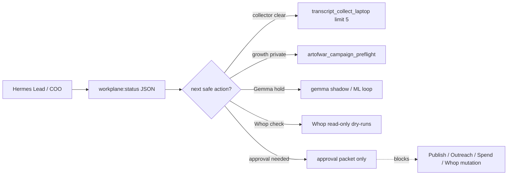
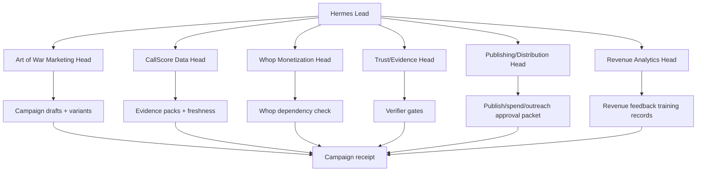
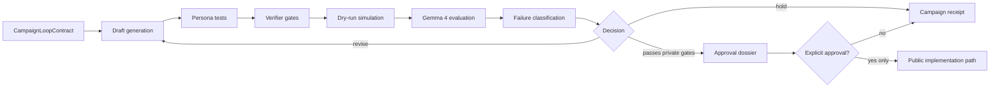
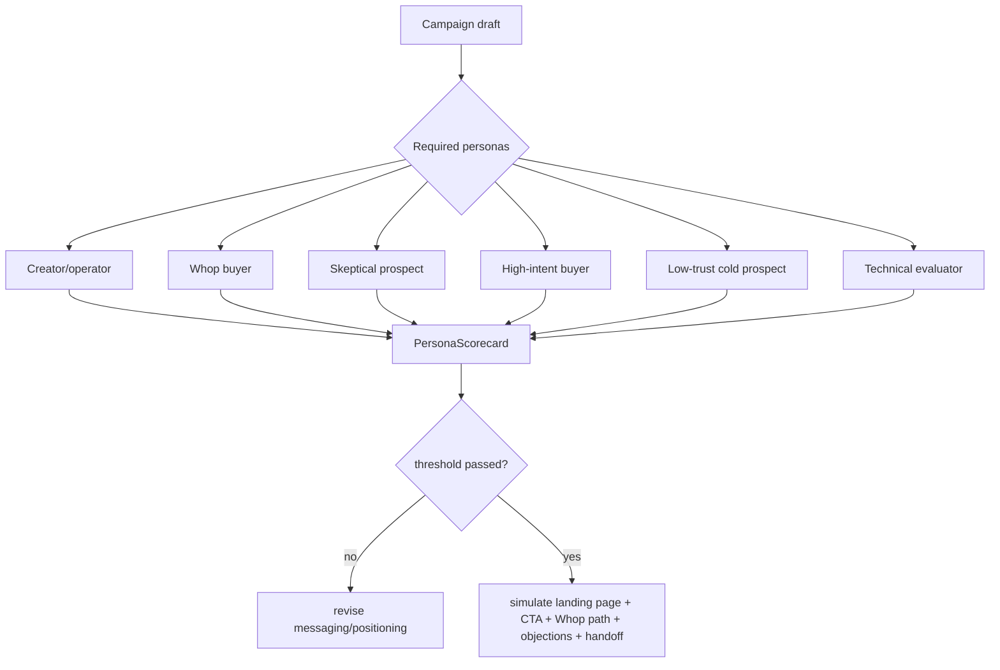
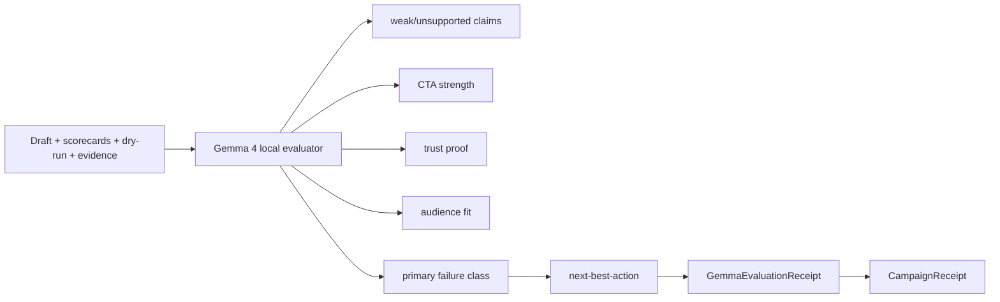
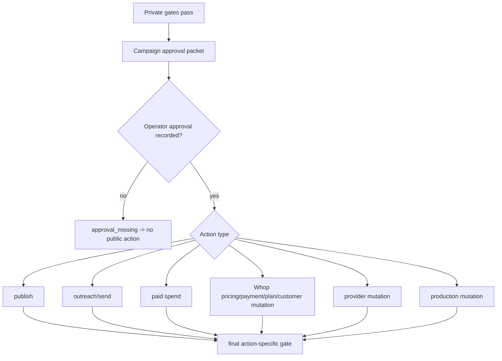

# CallScore Canonical Master Plan — Fully Updated With Merged Safety + Revenue-Ops Baseline Status

**Base plan date:** 2026-06-10
**Local update date:** 2026-06-11
**Status:** Active canonical execution plan
**Objective:** Move CallScore from live public app to certified autonomous commercial revenue system.

---

## 0. Strict Verdict
### 0.0.1 2026-06-13 Activation / Monetization Boundary / Operationalization Update

```text
TARGET-PRICE MONETIZATION PATCH: COMMITTED
COMMIT: 2062a72 Protect target prices behind Pro entitlement
DEPLOY STATUS: LIVE / VERIFIED
LIVE PUBLIC API LEAK STATUS: FIXED
OPERATIONALIZATION STATUS: MONETIZATION BOUNDARY DEPLOYED; FULL SYSTEM ACTIVATION REMAINS PARTIAL
```

Current canonical source state:

- Active source tree: `/opt/crypto-tuber-ranked`.
- Stale/thin mirrors were observed under `/srv/agents/...` and `/srv/whop-auto/...`; do not treat them as production source of truth unless revalidated.
- Commit `2062a72159795d215c77536813813f63175b67c7` implements the target-price monetization boundary.
- Netlify project confirmed: `call-score` / `https://call-score.com`.
- An earlier authorized production deploy was interrupted. The local Netlify deploy process was killed and deploy id `6a2d0e6b8edfb59624b86d85` remained `state=new`, `published_at=null`.
- A fresh authorized Netlify production deploy completed successfully: deploy id `6a2d0f971463d69d78b32371`, `state=ready`, `published_at=2026-06-13T08:08:39.809Z`, URL `https://6a2d0f971463d69d78b32371--call-score.netlify.app`.
- Production alias `https://call-score.com` now serves the target-price monetization boundary from commit `2062a72`.

Monetization boundary now in committed code:

- Creator call-history target prices are `Pro` gated, not `Alpha` gated.
- Free/public users may see target existence and target outcome only.
- Free/public serialized calls with a target return:
  - `target_price: null`
  - `validated_target_price: null`
  - `raw_quote: null` as an extra leak guard
  - `hit_target` preserved
  - `target_status` preserved
  - `target_required_tier: "pro"`
  - `can_view_target_price: false`
- Pro/Alpha serialized calls with a target return the real numeric `target_price` and `can_view_target_price: true`.
- UI target-cell rendering:
  - no target: `—`
  - free/public gated hit: `Pro ✓`
  - free/public gated miss: `Pro ✕`
  - entitled path: formatted numeric target plus `✓` / `✕`
- Pricing copy now states:
  - Free: creator profiles and call-history summaries.
  - Pro: target prices, exports, alerts, and watchlists.
  - Alpha: backtests, API keys, webhooks, and advanced signal workflows.

Verification evidence before commit:

- `git diff --check`: pass.
- `npm run typecheck`: pass.
- `npm run lint`: pass.
- `npm run build`: pass.
- Targeted target-boundary/page tests: `31/31` pass.
- Explicit full test sweep: `615/615` pass.
- `npm run hygiene`: `Secret hygiene: ok`.

Live verification evidence after deploy:

- `https://call-score.com/api/health`: healthy (`ok=true`, `db=ok`, HH read API source).
- `https://call-score.com/api/creator/93?limit=100`: no known target-price leak rows for `1700`, `60`, or `55000`.
- Public/free API target rows now show:
  - `ETHUSDT` bearish: `target_price=null`, `validated_target_price=null`, `hit_target=true`, `target_required_tier="pro"`, `can_view_target_price=false`.
  - `SOLUSDT` bullish: `target_price=null`, `validated_target_price=null`, `hit_target=true`, `target_required_tier="pro"`, `can_view_target_price=false`.
  - `BTCUSDT` bearish: `target_price=null`, `validated_target_price=null`, `hit_target=false`, `target_required_tier="pro"`, `can_view_target_price=false`.
- Headless Chromium live DOM check on `/creator/99bitcoins`, page 3 of call history: `Pro ✓` appears twice, `Pro ✕` appears once, and `1,700` / `60` / `55,000` target labels are absent.

Immediate P0:

```text
TARGET-PRICE MONETIZATION BOUNDARY IS LIVE. NEXT P0: CONTINUE FULL ACTIVATION AUDIT WITHOUT WEAKENING REMAINING GATES.
```

Public monetization safety for target prices is certified for the known 99Bitcoins leak vector. Do not certify full autonomous revenue while transcript cadence, Gemma shadow hold, Whop mutation approval, Art of War public-action approval, and full VM activation gates remain unresolved.

Operationalization sequence from this state:

1. Confirm no orphan Netlify/Next build processes remain.
2. Confirm working tree clean and `HEAD == 2062a72`.
3. Confirm Netlify latest deploy `6a2d0e6b8edfb59624b86d85` is not published or has failed/cancelled before starting another deploy.
4. Run a fresh production deploy only with explicit operator approval.
5. After deploy, verify:
   - `/api/health` healthy.
   - `/api/creator/93?limit=100` does not expose `target_price` values `1700`, `60`, or `55000` to public/free requests.
   - Target rows preserve outcomes and include `target_required_tier="pro"` / `can_view_target_price=false`.
   - `/creator/99bitcoins` renders `Pro ✓`, `Pro ✓`, `Pro ✕` and not numeric target labels for free/public users.
6. If live verification passes, update this master plan with deploy id, published timestamp, and leak-fixed verdict.
7. Then continue full-system activation gates: transcript cadence, Hermes/workplane, Gemma shadow hold, Whop read-only checks, Art of War private loop, secret hygiene, and ops docs.

### 0.0.2 2026-06-13 Canonical readiness update after `85f6757`

```text
CANONICAL HEAD: 85f6757 Extend Gemma shadow evidence with bounded diff sample
CANONICAL BRANCH: master
CANONICAL FULL-SYSTEM READINESS: PARTIAL
SAFE OPERATION MODE: YES — read-only / dry-run / report-only lanes
CERTIFY AUTONOMOUS REVENUE: NO
TARGET-PRICE LEAK: FIXED LIVE
PUBLIC LIVE VERIFY: PASS, HH-read source aligned
WORKPLANE: OK, automation_readiness=PARTIAL
GEMMA SHADOW: READY_WITH_GATES / ARTIFACT-ONLY
TRANSCRIPT CADENCE: PARTIAL / TARGETING REPAIR REQUIRED
PUBLIC / SPEND / WHOP / DB MUTATION: APPROVAL-GATED
```

Current canonical source state:

- Active repo remains `/opt/crypto-tuber-ranked`.
- Current canonical commit is `85f6757 Extend Gemma shadow evidence with bounded diff sample` on `master`.
- The target-price monetization leak remains fixed live: public creator `93` exposes no numeric `target_price` / `validated_target_price` values for known targets `1700`, `60`, or `55000`; the ETH/SOL/BTC rows preserve `hit_target`, `target_required_tier="pro"`, and `can_view_target_price=false`.
- `npm run verify:public -- --source live --base-url https://call-score.com` passes against the live HH-read source: health ok, leaderboard metadata equals rows (`36/36`), and homepage funnel counts are non-zero (`raw=16186`, `public=7995`, `ranked=42`).
- Workplane status is `OK` with `automation_readiness=PARTIAL`; the daily pipeline timer is active; current source safety shows `unsafe_source_ranks=0` and `api_unsafe_official.count=0`.
- Freshness status is `WARN` with no blockers; warnings are transcript-only (`transcript provider credential missing failures=2`, `yt-dlp bot verification failures=9`).

Gemma / shadow extraction state:

- PR #66 eval-schema benchmark and the current production-schema benchmark have both been reconciled and pass `10/10` under separate explicit schema contracts.
- Latest real-transcript bounded sample: `.tmp/shadow-extraction/gemma-production-shadow-sample-fullcover-20260613T155241Z.jsonl`.
- Sample evidence: `rows=5`, `videos=5`, `schema_valid=5/5`, `failed_records=0`, `accepted_calls=1`, full transcript coverage `5/5`.
- Shadow diff evidence: `removed_calls=2`, `changed_calls=1`, `no_accepted_calls=2`, `manual_review=0`.
- A durable committed summary exists at `docs/audits/gemma-production-shadow-sample-fullcover-20260613T155241Z.summary.json`.
- Promotion/write remains blocked until explicit operator approval after diff review. No production writes, deploy, paid LLM/API calls, Whop mutation, public action, or spend were performed.

Transcript / ingestion state:

- Transcript cadence remains the main operational P1.
- Latest bounded collector evidence: job `1832`, attempted `5`, successes `0`, failures `5`, success rate `0`, recent failure reason `transcript_failed=15`; cooldown is clear.
- Freshness warnings still show provider-credential and YouTube bot-verification failures.
- Next safe action is not a broad rerun; first repair transcript targeting/failure classification, then run a bounded laptop/cookie collector or ASR-backed canary.

Current blocker ranking:

- P0: none for known live target-price leak or live public HH-read verification.
- P1: transcript cadence/failure classification; Gemma promotion/write approval and diff review; audit-pipeline transcript/shadow completeness; Composio MCP/CLI formalization; Whop/public marketing/provider mutations remain approval-gated.
- P2: stale mirrors, historical log redaction, and credential rotation review require explicit archive/rotation owner action.

Next exact safe action:

```text
Inspect latest transcript collector job 1832 failures and repair targeting/failure classification; then run only a bounded limit-5 laptop/cookie collector or local ASR-backed canary. Separately review the Gemma shadow diff artifact before requesting explicit shadow:promote/write-canary approval.
```

### 0.0.3 2026-06-13 transcript blocker classification after `9a2a46b`

```text
CANONICAL HEAD BEFORE REMEDIATION: 9a2a46b Record canonical readiness after Gemma shadow sample
CANONICAL BRANCH: master
CANONICAL FULL-SYSTEM READINESS: PARTIAL
SAFE OPERATION MODE: READY — read-only / dry-run / artifact-only / approval-gated lanes
TARGET-PRICE LEAK: FIXED LIVE
PUBLIC LIVE VERIFY: PASS, HH-read source aligned
WORKPLANE: OK, automation_readiness=PARTIAL
TRANSCRIPT CADENCE: NOT PROVEN; EXACT EXTERNAL/LAPTOP/ASR BLOCKERS CLASSIFIED
COMPOSIO MCP: CONFIGURED LOCALLY; AUTH INVALID/EXPIRED FOR TOOL DISCOVERY
GEMMA/QWEN SHADOW: READY_WITH_GATES / ARTIFACT-ONLY
PUBLIC / SPEND / WHOP / DB MUTATION: APPROVAL-GATED
```

Fresh transcript evidence:

- Latest Workplane transcript collector state still shows job `1832`, attempted `5`, successes `0`, failures `5`, recent reason `transcript_failed`; cooldown is clear.
- HH yt-dlp bounded dry-run (`limit=1`, no DB write) classified the provider blocker as `bot_verification_required`.
- Transcript waterfall bounded dry-run (`limit=3`, methods `hh-yt-dlp-ejs-wpc,laptop-yt-dlp,media-asr-fallback`) produced a safe handoff record instead of retrying broadly:
  - `status="pending_handoff"`
  - `reason="external_handoff_required"`
  - `method="laptop_ytdlp"`
  - `previous_failure_reason="bot_verification_required"`
  - video candidate `cryptowendyo` / `NdO9GZMJfj0`
- HH media fallback dry-run (`limit=1`) remains blocked by `asr_unavailable`; `yt-dlp` and `ffmpeg` are present, but local Whisper/faster-whisper style ASR runtime is absent.
- No production DB writes, broad transcript retries, paid providers, cookie printing, deploys, Whop mutation, public action, or spend were performed.

Code hardening from this pass:

- Failed transcript ingest now preserves a bounded, normalized failure detail preview in `transcript_error`, preventing future opaque `transcript_failed` rows when laptop/collector output includes a traceback or tool failure.
- Laptop collector classifier now recognizes Python/tool traceback and PowerShell runtime exceptions as `collector_traceback`.
- Transcript handoff audit records `previous_failure_reason`, so Workplane/Hermes can show why HH acquisition yielded to laptop collection.
- Media fallback CLI parsing now accepts `--gap-ms 0` as an intentional zero delay instead of falling back to the default gap.

Composio / MCP evidence:

- Local Composio config paths and API-key variable names exist, and an isolated SDK probe environment was created under `.tmp/` without committing it or printing secrets.
- Read-only tool-discovery probes fail with `AuthenticationError`; current blocker is `auth_invalid_or_expired`, not missing project context.
- Exact operator action: refresh/store a valid Composio API key in the approved local secret store or env file, never chat, then rerun the read-only `composio_mcp_probe` workflow.

Whop / marketing safety evidence:

- Targeted Whop/workplane/receipt tests pass and Whop mutation paths remain fail-closed without approval receipts.
- Art of War private dry-run executed with `public_action_performed=false`, `external_mutation_performed=false`, and `failure_class=audience_mismatch`; no public action or spend.

Validation after transcript-classification patch:

- `git diff --check`: pass.
- Targeted transcript/laptop tests: `53/53` pass.
- Targeted Workplane/receipt/Whop tests: `39/39` pass.
- `npm run typecheck`: pass.
- `npm run lint`: pass.
- `npm run build`: pass.
- `npm run hygiene`: pass, `Secret hygiene: ok`.
- Full test sweep: `635/635` pass.
- `npm run workplane:status` with approved local env: `OK`, `automation_readiness=PARTIAL`.
- `npm run freshness:check` with approved local env: `WARN`, no blockers; transcript provider/bot warnings remain.
- `npm run audit:pipeline` with approved local env: exit `0`, blockers still `missing_publication_dates`, `missing_transcripts_or_terminal_reasons`, `pending_shadow_recheck`.
- `npm run verify:public`: pass local direct-DB mode.
- `npm run verify:public -- --source live --base-url https://call-score.com`: pass live HH-read mode.
- Live `/api/health`: `ok=true`, `source=hh_read_api`; live creator `93` known target leak count remains `0`, with ETH/SOL/BTC gated target rows returning null target prices and preserved outcomes.

Current blocker ranking:

- P0: none for target-price monetization, live health, public HH-read verification, Whop mutation gates, or marketing spend/public gates.
- P1: transcript useful cadence not proven until either laptop/cookie collector succeeds in a bounded run or local ASR is installed/configured; Composio MCP tool discovery blocked by invalid/expired local auth; Gemma promotion/write remains approval-gated after artifact-only evidence.
- P2: stale mirror archive/delete, historical log redaction, Mermaid rendering, and prompt/doc consolidation.

Next exact safe action:

```text
Run the bounded laptop transcript collector from the operator environment with browser cookies for the handoff candidate, or install/configure local ASR on the VM and rerun `npm run transcript:media-fallback -- --limit 1 --since-days 45 --dry-run --gap-ms 0`; then rerun `transcript_waterfall_canary` and only proceed to artifact-only Gemma/Qwen shadow over any new transcript evidence.
```

### 0.0.4 2026-06-13 canonical laptop transcript path reactivated

```text
CANONICAL TRANSCRIPT PATH: OMAR LAPTOP COLLECTOR OVER TAILSCALE
TRANSCRIPT CANARY STATUS: PASS — BOUNDED LIMIT 1 WRITE THROUGH APPROVED INGEST
LATEST TRANSCRIPT SUCCESS: 2026-06-13 18:30:47+01
SAFE OPERATION MODE: READY / PARTIAL
FULL ACTIVATION: PARTIAL UNTIL REPEATED LIMIT-5 CADENCE AND DOWNSTREAM EXTRACTION/MATCH/SCORE GATES PASS
```

Correction to prior transcript blocker classification:

- The canonical near-term transcript acquisition path is not HH direct `yt-dlp` or HH ASR fallback. It is the Omar laptop collector over Tailscale, certified by PR #64 and this master plan section `2026-06-12 Laptop Collector Post-Ingest Certification`.
- HH direct `yt-dlp` remains diagnostic only and currently classifies `bot_verification_required`.
- HH media fallback remains a future autonomy lane and is blocked until local ASR is installed/configured.

Fresh access evidence:

- Tailscale peer `omarslaptop-1` / `100.118.20.40` is online and reachable from HH.
- HH can SSH into laptop WSL using the existing bridge key path, without printing secrets.
- Windows `ssh hh` from the laptop was blocked at connect time, but WSL `ssh hermes-agent-box` works.
- User-provided fixed collector exists at `C:\Users\albak\run-transcript-collector-fixed.ps1`.
- A non-destructive working copy was created at `C:\Users\albak\run-transcript-collector-fixed-wslssh.ps1` so the Windows collector can call HH through explicit WSL SSH: `wsl.exe -d Ubuntu -u omar ssh hermes-agent-box`.

Fresh canary evidence:

- Dry-run limit 1 from laptop Firefox/residential path succeeded for video `KQNpABBLxzs`, transcript length `3035` chars, with no DB write.
- Write limit 1 from the same path succeeded through approved HH transcript ingest:
  - `mode=WRITE`
  - `records=1`
  - `updated=1`
- Worklist after ingest moved to the next pending items, proving the ingested video no longer appears in the first pending slot.
- Workplane status after ingest reports latest transcript success/attempt `2026-06-13 18:30:47.405219+01` and remains `OK` / `automation_readiness=PARTIAL`.
- Freshness remains `WARN` with no blockers; warnings still include historical provider credential and HH yt-dlp bot-verification failures.
- Receipt: `.tmp/workflow-receipts/transcript_waterfall_canary/laptop-canonical-write1-20260613T173047Z.json`.

Safety:

- No cookies, secrets, env values, DB URLs, tokens, or credential-bearing remotes were printed.
- No deploy, Whop mutation, public action, paid provider/API, broad DB write, destructive SQL, or destructive infra action occurred.
- DB mutation was limited to one approved transcript ingest record through the existing application path.
- Downstream extraction/matching/scoring was intentionally not run in this step because it writes production call/scoring state and should run only under an explicit bounded pipeline scope.

Updated blocker ranking:

- P0: none for known live public target-price safety or safe read-only/dry-run operation.
- P1: prove repeated transcript cadence with bounded limit-5 laptop collector runs; then run downstream extraction/matching/scoring through approved bounded pipeline gates. Composio auth still needs refresh for full MCP tool discovery.
- P2: normalize the fixed laptop script back into canonical repo script once the WSL SSH bridge path is confirmed stable; stale mirror cleanup and historical log redaction remain later work.

Next exact safe action:

```text
Run `C:\Users\albak\run-transcript-collector-fixed-wslssh.ps1 -Limit 5 -Browser firefox -GapSeconds 45 -SinceDays 45 -HhHost hermes-agent-box -Write` from Omar laptop when cooldown is clear, then run bounded post-ingest extraction/matching/scoring only under explicit approved pipeline scope.
```


### 0.0.5 2026-06-13 agentmemory / canonical recall update

```text
CANONICAL MEMORY DISCIPLINE: ACTIVE
AGENTMEMORY SKILL PACK: INSTALLED / VALIDATED
CALLSCORE MEMORY SKILL: PRESERVED AS callscore-memory
LATEST CANONICAL REPO HEAD BEFORE THIS DOC UPDATE: fbf799f Record laptop transcript canary reactivation
```

Purpose:

- Prevent future agents from forgetting canonical CallScore/Hermes basics already proven by PRs, committed docs, and bounded canaries.
- Transcript work must load the canonical memory first and prefer the laptop/Tailscale collector path before falling back to HH direct `yt-dlp` or ASR diagnostics.

Installed/validated local Codex skills:

- `agentmemory-agents`
- `agentmemory-architecture`
- `agentmemory-config`
- `agentmemory-hooks`
- `agentmemory-mcp-tools`
- `agentmemory-rest-api`
- `commit-context`
- `commit-history`
- `forget`
- `handoff`
- `recall`
- `recap`
- `remember`
- `session-history`
- `write-agentmemory-skill`
- `callscore-memory` — local CallScore/Hermes canonical basics skill restored from the prior custom `agentmemory` backup.

Validation evidence:

- All installed AgentMemory skill directories passed local `quick_validate.py` after frontmatter normalization for Codex-supported keys.
- Shared troubleshooting references were installed under local Codex skills for AgentMemory cross-links.
- Existing custom CallScore/Hermes memory was preserved; no secrets were printed.

Canonical transcript memory now reinforced:

- Near-term transcript acquisition is Omar laptop over Tailscale/residential browser cookies.
- Working HH-to-laptop access: Tailscale peer `omarslaptop-1` / `100.118.20.40`, WSL host `OmarsLaptop`.
- User-provided collector: `C:\Users\albak\run-transcript-collector-fixed.ps1`.
- Current working copy for HH bridge: `C:\Users\albak\run-transcript-collector-fixed-wslssh.ps1` using `wsl.exe -d Ubuntu -u omar ssh hermes-agent-box`.
- Latest bounded write evidence: one transcript ingested through approved HH transcript ingest path, receipt `.tmp/workflow-receipts/transcript_waterfall_canary/laptop-canonical-write1-20260613T173047Z.json`.

Agent operating rule from this point:

```text
For CallScore/Hermes work, load `callscore-memory` / canonical basics before diagnosing transcript, Hermes readiness, Gemma/Qwen, Whop, Composio, Netlify, or marketing gates. Do not downgrade the certified laptop collector to generic HH yt-dlp/ASR fallback without fresh evidence.
```

Next exact safe action remains:

```text
Run bounded laptop collector limit 5 through `C:\Users\albak\run-transcript-collector-fixed-wslssh.ps1 -Limit 5 -Browser firefox -GapSeconds 45 -SinceDays 45 -HhHost hermes-agent-box -Write`, then run approved bounded downstream extraction/matching/scoring verification.
```

```text
CERTIFY AUTONOMOUS REVENUE: NO
```

The app is live, provider canonicality is mostly aligned, and the public homepage now has an HH read API data path. However, CallScore cannot be certified as an autonomous commercial revenue system while the public leaderboard can display stale, low-sample, excluded, or semantically unsafe creators as official ranked creators.

Canonical infrastructure remains:

- Canonical app repo: `OmarA1-Bakri/CallScore`
- Canonical branch: `master`
- Canonical hosting: Netlify
- Production domain: `https://call-score.com`
- Production DB primary: HH PostgreSQL / pgsql
- Public read path target: Netlify public app -> HH read API -> HH local PostgreSQL / pgsql
- Scheduled write path target: Netlify scheduled function -> secured HH enqueue endpoint -> HH local PostgreSQL / pgsql -> Hermes worker
- Deprecated host: Vercel
- Legacy DB: Neon backup compatibility only; not canonical and not to be restored as canonical

Previous P0 blocker from the earlier master plan:

- PR38 homepage HH-read hotfix merged but was not deployed because Netlify build failed during lint/type-check.

That blocker has been superseded by later provider work.

Historical P0 blocker, superseded by later HH-read/live-source verification:

```text
PUBLIC LEADERBOARD DATA CONTRACT WAS COMMERCIALLY UNSAFE; CURRENT LIVE HH-READ VERIFY PASSES WITH UNSAFE SOURCE RANKS AT 0.
```

Current meaning:

- PR39/provider work moved production beyond the earlier PR38 build blocker.
- `HH_READ_API_BASE` is set.
- Production can show HH-backed data.
- HH PostgreSQL target has been verified as local `callscore/public` on `::1:5432` via `callscore_app`.
- Global call volume is not the problem.
- The data contract downstream of the database is wrong:
  - official leaderboard ranks low-N creators;
  - stale/incomplete creators can rank highly;
  - `creator_stats.all_time` semantics are inconsistent;
  - 30d period appears structurally broken or badly defined;
  - exclusion policy is not consistently enforced;
  - read API serializes unsafe rows as official leaderboard data.

Autonomous revenue remains uncertified until this full chain is proven:

```text
Visitor
-> CallScore public app
-> trustworthy public leaderboard / product surface
-> Whop checkout
-> entitlement verification
-> HH pgsql-backed job/event pipeline
-> Hermes worker execution
-> scoring / matching / ML verification
-> Art of War growth loop
-> measured conversion feedback
```

---


### 0.1 2026-06-11 Data Pipeline / Website Data Recovery Certification Update

```text
END-TO-END DATA FRESHNESS CERTIFICATION: PARTIAL / EXTERNAL TRANSCRIPT CREDENTIAL REQUIRED
DATA/WORKER/FRESHNESS REMEDIATION COMPLETE: PARTIAL
HH READ API NATIVE BUCKET CONTRACT: CERTIFIED
PUBLIC HOMEPAGE SAFETY: CERTIFIED SAFE DISPLAY
SOURCE CREATOR_STATS RANK SAFETY: CERTIFIED AFTER 2026-06-11 RECOMPUTE
```

Runtime evidence captured on 2026-06-11:

- Repo/runtime path: `/opt/crypto-tuber-ranked`; recovery work merged through master `c459fc5448b27195231e2292a3be1706156b6b81`; slow-YT-DLP cadence patch is the next local patch from that base.
- Public HH read API serves native bucket keys for `all_time`, `12m`, `90d`, and `30d`.
- Native HH read API proof after recovery:
  - `leaderboard.rows == officialRankedRows` for public responses.
  - `officialRankedRows` has `unsafeOfficial = []`.
  - `30d` returns `officialRankedRows = []` and `emptyReason = PENDING_MATURITY`.
  - `all_time` official count remains 17 after source-safe recompute.
- Worker/service proof:
  - `callscore-enqueue.service`: active/running and restarted to load expanded enqueue types.
  - `callscore-read-api.service`: active/running with native bucket contract.
  - Docker Hermes worker was rebuilt/recreated from current code and is running.
  - Real non-smoke jobs `match_prices_batch` and `compute_scores` were created, claimed, and completed on 2026-06-11.
- DB writer privilege recovery:
  - Existing role `callscore_app` now has minimum application-path write privileges for `videos`, `calls`, `pipeline_jobs`, `pipeline_job_events`, and `creator_stats`.
  - `calls.DELETE` is intentionally granted because the existing extraction application path replaces stored calls for a video inside a transaction.
  - Required sequence `USAGE`/`SELECT` grants were applied for inserts.
  - No broad superuser/admin grant, ownership change, DROP, TRUNCATE, or manual business-data repair SQL was used.
- Pipeline recovery evidence:
  - RSS video discovery canary succeeded for `@CryptosRUs`.
  - Full RSS discovery catch-up ran across 196 creators and wrote 1,232 eligible video rows; `videos_total` is now 15,476 and latest video inserted is 2026-06-11.
  - A legacy transcript-provider constraint edge case was fixed and verified with `thatmartiniguy` RSS canary.
  - Transcript canary now records explicit `provider_credentials_missing` failures instead of silently leaving stale queue items.
  - Extraction canary inserted two calls through the application path.
  - Price-match canary matched the two mature extracted calls.
  - Source-safe `npm run score` recompute ran after catch-up; `creator_stats` updated on 2026-06-11.
- Source rank safety after recompute:
  - `30d` ranked rows: 0.
  - `all_time` ranked rows: 17; low-N official ranks: 0; zero-call official ranks: 0.
  - `90d` ranked rows: 17; low-N official ranks: 0; zero-call official ranks: 0.
  - Altcoin Daily official source ranks: 0.
- Freshness self-check:
  - `npm run freshness:check -- --read-api-base https://ops-bridge.call-score.com/api/read` reports current DB timestamps, non-smoke jobs, grants, source unsafe ranks, native read API status, and transcript provider warnings.
  - Current result is `WARN`, not `PASS`, because transcript provider credentials are absent and canary attempts are classified as `provider_credentials_missing`.

Remaining hard blocker before complete end-to-end freshness certification:

```text
A WORKING TRANSCRIPT PROVIDER CREDENTIAL/PATH IS REQUIRED.
```

Accepted provider paths:

1. `SERPAPI_API_KEY` or supported aliases (`SERPAPI_TOKEN`, `SERPAI_TOKEN`, `SERP_API_KEY`, `SERPAPI_KEY`) for the existing transcript waterfall.
2. A working approved yt-dlp cookies configuration via `YTDLP_COOKIES_PATH` / `YTDLP_COOKIES` or `YTDLP_COOKIES_FROM_BROWSER`.
3. A new approved transcript provider integration that can store transcripts without committing or printing secrets.

After provider access is supplied, rerun transcript catch-up, extraction catch-up, scoring, source-safe stats recompute, and API/homepage certification.


### 0.2 2026-06-11 Slow YT-DLP Transcript Cadence Update

```text
CANONICAL TRANSCRIPT PATH: SLOW YT-DLP
SLOW YT-DLP CODE SAFETY: PR #50 MERGED
DAILY PIPELINE TIMER: INSTALLED / ACTIVE / CERTIFIED
TRANSCRIPT ACQUISITION: BLOCKED BY YOUTUBE BOT VERIFICATION UNTIL COOKIE PATH IS PROVIDED
DATA/WORKER/FRESHNESS REMEDIATION: PARTIAL — EXACT COOKIE GATE REMAINS
```

Runtime evidence captured on 2026-06-11 after the PR #49 recovery baseline:

- Repo/runtime path: `/opt/crypto-tuber-ranked`; base master `c459fc5448b27195231e2292a3be1706156b6b81`; slow-YT-DLP cadence patch merged via PR #50 (`091da45`).
- Slow transcript runner defaults are now intentionally conservative:
  - canonical provider path: `yt-dlp` subtitle/caption retrieval only; no video download; no playlist expansion;
  - default transcript batch limit: 25;
  - default transcript concurrency: 1;
  - default sleep interval: 20 seconds;
  - default max sleep interval: 60 seconds;
  - retry cooldown: 24 hours;
  - stale provider-block retry: 7 days;
  - lock file: `/tmp/callscore-slow-ytdlp-transcripts.lock`;
  - provider/rate-limit/bot errors stop the batch instead of hammering YouTube.
- Supported redacted credential paths remain:
  - `YTDLP_COOKIES_PATH=/absolute/path/to/youtube-cookies.txt`;
  - `YTDLP_COOKIES=<secure cookie file content via runtime env>`;
  - `YTDLP_COOKIES_FROM_BROWSER=<yt-dlp supported browser profile spec>`.
- A daily cadence is installed and active on HH:
  - systemd timer: `callscore-daily-pipeline.timer`;
  - service: `callscore-daily-pipeline.service`;
  - schedule: daily around 03:20 local time with randomized delay;
  - command: `npm run pipeline:daily -- --write --read-api-base https://ops-bridge.call-score.com/api/read --transcript-limit 25 --transcript-concurrency 1 --transcript-gap-ms 20000 --limit-creators 250 --limit-videos 10 --since-days 45 --extract-limit 50 --match-limit 500 --match-batch-size 100`;
  - environment: `.env.hermes` plus redacted runtime env;
  - non-overlap lock: `/tmp/callscore-daily-pipeline.lock`.
- Manual daily canary completed safely on 2026-06-11:
  - RSS discovery upserted bounded recent video rows;
  - slow-YT-DLP transcript canary attempted one current video and stopped on `bot_verification_required`;
  - extraction processed two eligible local videos and inserted two calls;
  - price matching ran on the bounded set;
  - `compute_scores` ran and refreshed `creator_stats`;
  - freshness check returned `WARN` with no blockers and explicit transcript warnings.
- Current DB proof after canary:
  - videos: 15,476; latest video inserted 2026-06-11 10:19:54+01;
  - raw calls: 16,027; latest call inserted 2026-06-11 10:54:25+01;
  - latest transcript attempt 2026-06-11 10:54:14+01;
  - latest transcript success remains 2026-05-25 16:01:08+01;
  - latest `creator_stats` update 2026-06-11 10:54:48+01;
  - source unsafe ranks: 0; Altcoin Daily official source ranks: 0.
- Public HH API proof after canary:
  - `all_time`: official 17, provisional 27, watchlist 100, stale 20, excluded 1, pending 0, `unsafeOfficial = []`;
  - `30d`: `emptyReason = PENDING_MATURITY`, official 0;
  - `leaderboard.rows == officialRankedRows`.

Exact remaining credential gate:

```text
YouTube currently rejects unauthenticated yt-dlp transcript canaries with bot verification.
Provide one approved runtime-only credential path without committing or printing secrets:

1. YTDLP_COOKIES_PATH=/absolute/path/to/youtube-cookies.txt
2. YTDLP_COOKIES_FROM_BROWSER=<yt-dlp supported browser spec available to the worker>
3. YTDLP_COOKIES=<redacted Netscape cookie file content via secure runtime env>

After this is supplied, rerun the same daily command with --transcript-limit 25, confirm at least one transcript success, then allow the daily drain to reduce the backlog safely.
```

Transcript backlog as of this update is visible in the freshness self-check. Current largest classes are pending/no transcript, legacy YouTube rate/captcha failures, transcript-disabled videos, and the new explicit `bot_verification_required` canary failures. The backlog is not to be cleared by a single large run; it must drain through the daily bounded slow-YT-DLP cadence.

---


### 0.3 2026-06-11 Creator Eligibility Recalibration Update

```text
CREATOR ELIGIBILITY STRATEGY: CERTIFIED / IMPLEMENTED LOCALLY
DEFAULT PUBLIC LEADERBOARD: 12m
OFFICIAL CREATOR POLICY: RECALIBRATED FOR SERIOUS LOWER-FREQUENCY CREATORS
SAMPLE-ADJUSTED RANKING: IMPLEMENTED IN SOURCE STATS WRITER
SOURCE CREATOR_STATS RECOMPUTE: COMPLETED 2026-06-11 12:04:43+01
TRANSCRIPT COMPLETION: EXTERNAL CREDENTIAL REQUIRED
```

Simulation verdict on live HH PostgreSQL data:

- Current strict strategy was too restrictive for the intended product because it required high volume before any official treatment.
- The chosen strategy is `D_official_certified_sample_adjusted`:
  - `all_time`: 24+ mature qualifying calls for official; 50+ certified.
  - `12m`: 12+ mature qualifying calls for official; 25+ certified.
  - `90d`: 3+ mature qualifying calls for recent-form official; 10+ certified.
  - `30d`: disabled / `PENDING_MATURITY`.
- This accepts the product rule that one serious mature qualifying call per month is enough for 12m official inclusion, while certified labels remain reserved for larger samples.
- Ranking is no longer raw-average-first for official source ranks. The source stats writer assigns `accuracy_rank` by sample-adjusted Creator Rank Score:

```text
sample_adjusted_score = (creator_raw_score * N + global_baseline_score * prior_N) / (N + prior_N)
```

- Priors: `all_time=24`, `12m=25`, `90d=10`; fallback baseline constant remains `50` when no DB-derived baseline exists.
- No schema migration was required; the adjusted score is computed during rank assignment, with `alpha_score` retaining its legacy storage meaning of average 0-100 Call Score.

Live simulation counts before recompute:

| Strategy | Period | Official | Certified | Provisional | Watchlist | Stale | Excluded | Pending | Unsafe official |
|---|---:|---:|---:|---:|---:|---:|---:|---:|---:|
| A current strict | all_time | 19 | 19 | 26 | 129 | 19 | 4 | 0 | 0 |
| A current strict | 12m | 32 | 32 | 11 | 131 | 19 | 4 | 0 | 0 |
| A current strict | 90d | 16 | 16 | 30 | 128 | 19 | 4 | 0 | 0 |
| B one-call/month | all_time | 36 | 19 | 16 | 122 | 19 | 4 | 0 | 0 |
| B one-call/month | 12m | 42 | 32 | 9 | 123 | 19 | 4 | 0 | 0 |
| B one-call/month | 90d | 53 | 32 | 13 | 108 | 19 | 4 | 0 | 0 |
| C balanced | all_time | 23 | 19 | 29 | 122 | 19 | 4 | 0 | 0 |
| C balanced | 12m | 42 | 32 | 9 | 123 | 19 | 4 | 0 | 0 |
| C balanced | 90d | 42 | 32 | 24 | 108 | 19 | 4 | 0 | 0 |
| D chosen | all_time | 36 | 19 | 16 | 122 | 19 | 4 | 0 | 0 |
| D chosen | 12m | 42 | 32 | 9 | 123 | 19 | 4 | 0 | 0 |
| D chosen | 90d | 53 | 32 | 13 | 108 | 19 | 4 | 0 | 0 |
| D chosen | 30d | 0 | 0 | 0 | 0 | 0 | 4 | 193 | 0 |

Post-recompute source `creator_stats` proof:

- `12m`: rows 197; official/ranked 42; low-N official violations 0; zero-call official ranks 0; updated 2026-06-11 12:04:42+01.
- `all_time`: rows 197; official/ranked 36; low-N official violations 0; zero-call official ranks 0; updated 2026-06-11 12:04:38+01.
- `90d`: rows 197; official/ranked 53; low-N official violations 0; zero-call official ranks 0; updated 2026-06-11 12:04:43+01.
- `30d`: rows 197; official/ranked 0; `PENDING_MATURITY`; updated 2026-06-11 12:04:43+01.
- Source unsafe named ranks remain 0 for Altcoin Daily, Alex Becker, MoneyZG, and Crypto Inspector.

Final status after this recalibration:

- The previous 17-official count was too restrictive under product policy.
- It was also temporarily affected by source thresholds and policy exclusions rather than only transcript freshness.
- Correct post-recompute source official counts are `12m=42`, `all_time=36`, `90d=53`, `30d=0`.
- Data/worker/freshness remediation remains `PARTIAL / EXTERNAL CREDENTIAL REQUIRED` only because no working YT-DLP cookie path is present in runtime.
- Exact remaining action remains one of:
  - `YTDLP_COOKIES_PATH=/absolute/path/to/youtube-cookies.txt`;
  - `YTDLP_COOKIES_FROM_BROWSER=<yt-dlp supported browser spec available to the worker>`;
  - `YTDLP_COOKIES=<redacted Netscape cookie file content via secure runtime env>`.

Readiness:

- Whop-auto readiness: `IN PROGRESS / PROVIDER PROOF REQUIRED`; repo tests and public checkout/OAuth route proof pass, but live provider dashboard and entitlement proof remain open.
- Art of War readiness: `READY PLANNING NEXT / BLOCKED ON WHOP PROVIDER PROOF` before public external growth execution.
- Autonomous revenue status: `NO` until commerce/growth loops are certified.

---
### 0.4 2026-06-11 YT-DLP Cookie Activation Attempt

```text
YT-DLP COOKIE PATH STATUS: INSTALLED BUT INVALID / BOT-VERIFICATION BLOCKED
HOST COOKIE ENV: YTDLP_COOKIES_PATH configured in .env.hermes (redacted)
HOST COOKIE FILE: /opt/callscore/secrets/youtube-cookies.txt, mode 600, owner root:root
DOCKER WORKER PATH: /run/secrets/youtube-cookies.txt via read-only bind mount
TRANSCRIPT CANARY: FAIL — one-video slow YT-DLP canary classified bot_verification_required
BOUNDED CATCH-UP: BLOCKED — not run after canary failed, to avoid YouTube retry hammering
SOURCE-SAFE RANKS: STILL CERTIFIED; no recompute required from transcript failure
```

Evidence:

- Existing candidate cookie source found at `/srv/whop-auto/workspace/crypto-tuber-ranked/cookies.txt`; contents were never printed.
- Candidate was installed to `/opt/callscore/secrets/youtube-cookies.txt` with restrictive runtime-only permissions and wired through `.env.hermes`.
- `docker-compose.yml` now mounts that host file read-only into the Hermes worker at `/run/secrets/youtube-cookies.txt` and sets `YTDLP_COOKIES_PATH` for the worker container.
- One-video CallScore canary command ran with `--limit 1 --concurrency 1 --gap-ms 20000 --write` and stopped safely on `bot_verification_required` for video `mhJJSppeUi4`.
- Because the cookie path was loaded but YouTube still rejected access, the remaining blocker is now a fresh/valid YouTube cookie, not missing code/timer/API methodology.

Exact remaining operator action:

1. Replace `/opt/callscore/secrets/youtube-cookies.txt` with a fresh valid Netscape-format YouTube cookie file, then keep mode `600` and owner `root:root`; or
2. Provide `YTDLP_COOKIES_FROM_BROWSER=<yt-dlp supported browser spec available to the worker>`; or
3. Provide `YTDLP_COOKIES=<redacted Netscape cookie content via secure runtime env>`.

After replacement, run the one-video transcript canary first. Only if it succeeds, run the bounded 25-video current-window catch-up and then source-safe recompute/API/homepage certification.

---


### 0.5 2026-06-11 Next-Phase Execution Handoff — Cookie Gate, Whop Start, Art of War Boundary

```text
YT-DLP COOKIE REPLACEMENT: NOT COMPLETED — NO NEW VALID COOKIE SOURCE FOUND
TRANSCRIPT CANARY STATUS: BLOCKED BY INVALID COOKIE / BOT VERIFICATION
WHOP-AUTO CERTIFICATION: STARTED — REPO TESTS PASS; PUBLIC CHECKOUT/OAUTH ROUTE PROOF PASS; PROVIDER PROOF REQUIRED
ART OF WAR NEXT GOAL: PREPARE AFTER WHOP PROVIDER PROOF; NO EXTERNAL GROWTH ACTIONS YET
```

Fresh evidence captured on 2026-06-11 after PR #53:

- Runtime cookie wiring is present but still uses the previously rejected candidate: host file `/opt/callscore/secrets/youtube-cookies.txt`, mode `600`, owner `root:root`; Docker worker sees a non-empty mounted cookie path at `/run/secrets/youtube-cookies.txt`.
- A redacted sweep found no newer approved YouTube cookie source. The installed cookie remains invalid for YouTube transcript access because the one-video canary classifies `bot_verification_required`.
- Do not run bounded transcript catch-up until a fresh one-video canary succeeds. Exact next transcript action remains: replace `/opt/callscore/secrets/youtube-cookies.txt` with a fresh valid Netscape-format YouTube cookie file, keep mode `600` and owner `root:root`, recreate/restart only the Hermes worker if needed, then run the one-video canary.
- Freshness self-check with `.env.hermes` loaded returns `WARN` with no blockers. Warnings are exactly transcript provider credential missing failures and yt-dlp bot verification failures; daily timer remains active; source unsafe ranks remain 0; native read API buckets remain certified.
- Whop certification has started safely:
  - Whop route/auth/webhook certification tests passed, 34/34.
  - Public checkout route probes returned `303` and `cache-control: no-store` for pro monthly, pro annual, alpha monthly, and alpha annual.
  - Public OAuth start redirects to Whop using canonical callback `https://call-score.com/api/auth/whop/callback`.
  - Public session route returns `200` with `cache-control: no-store`.
  - No Whop provider mutation, live purchase, pricing/payment change, secret rotation, infrastructure mutation, or production DB mutation was performed.
- Whop commerce remains `PARTIAL / PROVIDER PROOF REQUIRED` until live dashboard settings, product/plan inventory, entitlement/revocation behavior, and webhook/event persistence requirements are certified.
- Art of War autonomous growth loop is the next planning target only after Whop provider proof is closed or explicitly blocked by provider approval. Public external growth actions remain forbidden until commerce is certified.


### 0.6 2026-06-11 Session Closeout — Current Done/Remaining State

```text
CURRENT MASTER: 4745e6e6bfebaf74554c54034b3fe58f87dad341
LATEST MERGED PR: #54 — RECORD NEXT-PHASE WHOP CERTIFICATION BOUNDARY
DATA SAFETY / LEADERBOARD METHODOLOGY: CERTIFIED
TRANSCRIPT COMPLETION: BLOCKED ONLY BY FRESH VALID YOUTUBE COOKIE
WHOP-AUTO: STARTED; ROUTE/AUTH/WEBHOOK REPO PROOF PASS; PROVIDER PROOF REQUIRED
ART OF WAR: NEXT AFTER WHOP PROVIDER PROOF; NO EXTERNAL AUTONOMOUS GROWTH ACTIONS YET
```

Work completed in this session:

1. Preserved the current final transcript gate instead of retry-hammering YouTube:
   - Runtime cookie wiring remains present at `/opt/callscore/secrets/youtube-cookies.txt` on the host and `/run/secrets/youtube-cookies.txt` in the Hermes worker container.
   - A redacted cookie sweep found no newer approved cookie source.
   - The installed cookie is still invalid/stale because the one-video slow-YT-DLP canary remains classified as `bot_verification_required`.
   - No bounded transcript catch-up was run after the failed canary.

2. Started Whop-auto commerce certification safely:
   - Public checkout routes for pro monthly, pro annual, alpha monthly, and alpha annual returned `303` redirects to Whop with `cache-control: no-store`.
   - Public Whop OAuth start returned a Whop redirect using canonical callback `https://call-score.com/api/auth/whop/callback`.
   - Public session route returned `200` with `cache-control: no-store`.
   - Local Whop route/auth/webhook/post-checkout/site-url/certification tests passed 34/34.
   - No Whop provider mutation, live purchase, pricing/payment change, secret rotation, infrastructure change, production DB mutation, or external growth action occurred.

3. Updated and merged documentation:
   - PR #54 merged to `master`.
   - `docs/ops/whop-auto-certification.md` now records public route proof and provider-proof gaps.
   - This canonical master plan now records the cookie gate, Whop certification-start evidence, and Art of War boundary.

Fresh verification evidence from this session:

- `git diff --check`: pass.
- Whop certification test pack: pass, 34/34.
- `npm test`: pass.
- `npm run lint`: pass.
- `npm run typecheck`: pass.
- `npm run build`: pass.
- `npm run freshness:check -- --read-api-base https://ops-bridge.call-score.com/api/read` with `.env.hermes` loaded: `WARN`, blockers `[]`; warnings are only transcript credential/bot-verification related.
- Public HH read API buckets remain native and safe:
  - `12m`: official 42;
  - `all_time`: official 36;
  - `90d`: official 53;
  - `30d`: official 0, `PENDING_MATURITY`;
  - `unsafeOfficial=[]`;
  - `leaderboard.rows == officialRankedRows`.

Canonical remaining work from here, in order:

1. **Fresh YouTube cookie canary** — replace `/opt/callscore/secrets/youtube-cookies.txt` with a fresh valid Netscape-format YouTube cookie file, keep `600 root:root`, recreate/restart only the Hermes worker if needed, and run exactly one slow-YT-DLP video canary first.
2. **Bounded transcript catch-up** — only after canary success, run the 25-video current-window catch-up with concurrency 1, 20s gap, lock/backoff enabled; then extraction, matching/scoring, source-safe recompute, freshness check, API/homepage certification.
3. **Whop provider-proof certification** — certify Whop dashboard settings, product/plan inventory, callback/success/cancel URLs, entitlement/revocation behavior, and webhook/event persistence requirements without mutating pricing/payment unless separately approved.
4. **Art of War autonomous growth loop** — after Whop provider proof closes or is explicitly provider-blocked, prepare and then execute only approval-safe growth-loop actions; no public external growth/ads/outreach before commerce certification.
5. **Autonomous revenue certification** — only after data freshness and Whop commerce proof are closed can CallScore move from `NO` to a revenue-autonomy certification candidate.


### 0.7 2026-06-11 Final Transcript + Whop Provider-Proof Run — Evidence And Remaining Gates

```text
CURRENT MASTER: 252790939014c82a275773221111e84149f5e0ff
LATEST MERGED PR: #55 — RECORD CANONICAL SESSION CLOSEOUT
DATA SAFETY / LEADERBOARD METHODOLOGY: CERTIFIED
TRANSCRIPT COMPLETION: BLOCKED BY FRESH VALID YOUTUBE COOKIE
WHOP-AUTO: ROUTE/CODE PROOF PASS; LIVE PROVIDER PROOF BLOCKED BY DASHBOARD URL DRIFT + INVENTORY READ SCOPE
ART OF WAR: READY TO PLAN ONLY AFTER WHOP PROVIDER PROOF CLOSES OR IS EXPLICITLY ACCEPTED AS PROVIDER-BLOCKED
```

Fresh evidence captured in this run:

1. Transcript cookie gate rechecked without exposing secrets:
   - Host cookie path exists at `/opt/callscore/secrets/youtube-cookies.txt`, mode `600`, owner `root:root`, size non-zero.
   - Hermes worker container can read its mounted `YTDLP_COOKIES_PATH`.
   - Redacted candidate sweep found only the installed host file and the same-sized `/srv/whop-auto/workspace/crypto-tuber-ranked/cookies.txt`; no newer approved cookie source was available.
   - Freshness self-check remains `WARN`, blockers `[]`, with warnings limited to transcript credential missing failures and yt-dlp bot verification failures.
   - Because no fresh cookie source was available, no additional YT-DLP canary or 25-video catch-up was run; this avoids retry-hammering YouTube with a known rejected cookie.

2. Public Whop route/code proof revalidated:
   - Whop certification pack passed 18/18.
   - Expanded Whop/auth/premium/webhook/post-checkout/site-url tests passed 34/34.
   - Live public checkout routes returned `303` to Whop with `cache-control: no-store` for pro monthly, pro annual, alpha monthly, and alpha annual.
   - Invalid checkout tier/interval returned `400` with `cache-control: no-store`.
   - Public OAuth start returned a Whop redirect whose request-level callback is `https://call-score.com/api/auth/whop/callback`.
   - Public `/api/auth/session` returned `200` with `cache-control: no-store`.

3. Live Whop provider read was attempted using the approved local Whop-auto provider-read context, with secrets redacted:
   - Whop app read succeeded for the repo manifest app `app_xAovzIphKgXtmM`; that app is `unlisted` and configured for `https://automation.call-score.com`, with redirect URI `https://automation.call-score.com/api/auth/whop/callback`.
   - Whop app read also succeeded for the public OAuth client/app id observed from production redirects, `app_cDfDRY1cj8yQJZ`; that app is `live` but provider dashboard state still points at `https://call-score.netlify.app` and redirect URI `https://call-score.netlify.app/api/auth/whop/callback`.
   - Product, plan, checkout-configuration, and webhook inventory reads returned `401` with the available provider-read key, so product/plan inventory and webhook dashboard state are not provider-certified from this context.
   - No Whop pricing/payment/product/plan/webhook/app-setting mutation was performed.

Whop provider-proof blockers are now exact, not broad:

1. Update/verify the production Whop app used by `NEXT_PUBLIC_WHOP_APP_ID=app_cDfDRY1cj8yQJZ` so provider dashboard settings use:
   - base/site URL: `https://call-score.com`
   - OAuth callback: `https://call-score.com/api/auth/whop/callback`
   - no active `call-score.netlify.app`, Vercel preview, localhost, or dev callback URL.
2. Provide provider dashboard proof or an API key/scope that can read products, plans, checkout configurations, webhooks, and entitlements for the CallScore company/app.
3. Verify the four live checkout route plan IDs against provider inventory:
   - pro monthly: `plan_NAa2zmHBIx6Qo`
   - pro annual: `plan_iHti858gVSzcY`
   - alpha monthly: `plan_AdlVrE9OqVNAv`
   - alpha annual: `plan_ryBHTb0Ui27PE`
4. Prove entitlement/revocation behavior with a non-destructive Whop test account, sandbox/test mode, or provider-safe fixture tied to live provider state.
5. Webhook persistence decision remains: current app verifies signed Whop webhook delivery and treats Whop live access checks as entitlement source-of-truth; durable local revenue/event persistence is deferred until provider inventory/webhook proof is available or commercial ops requires a local revenue ledger.

Canonical remaining order after this run:

1. **Fresh YouTube cookie** — install a fresh valid Netscape-format YouTube cookie at `/opt/callscore/secrets/youtube-cookies.txt`, mode `600`, owner `root:root`; recreate/restart only Hermes worker if needed; then run exactly one slow-YT-DLP transcript canary.
2. **Bounded transcript catch-up** — only after the one-video canary passes, run the 25-video current-window catch-up, extraction, matching/scoring, source-safe recompute, freshness self-check, API/homepage certification.
3. **Whop provider-proof closure** — fix/verify provider dashboard URL drift for the live app, obtain product/plan/webhook/entitlement provider read proof, and certify commerce without mutating pricing/payment/live plans unless separately approved.
4. **Art of War** — move from planning to autonomous growth-loop execution only after Whop provider proof closes or the operator explicitly accepts the provider gate as blocked and bounded.


### 0.8 2026-06-11 Final Cookie + Whop Closure Run — Current Result

```text
CURRENT MASTER AT START: a1aa0b4c0c82d3bbee7649b052123cd26f7eb97d
TRANSCRIPT COOKIE: ACTIVE BUT INVALID / NO FRESH VALID SOURCE AVAILABLE
WHOP PUBLIC APP URL CORRECTION: ATTEMPTED, BLOCKED BY PROVIDER 401 WRITE SCOPE
WHOP PLAN INVENTORY: CERTIFIED BY DIRECT PROVIDER PLAN/PRODUCT READS
CHECKOUT ROUTE ALIASES: PATCHED LOCALLY TO SUPPORT /api/checkout/{tier}-{interval}
ART OF WAR: PLANNING ONLY UNTIL COOKIE + WHOP WRITE/ENTITLEMENT GATES CLOSE
```

Fresh execution evidence from this run:

1. YouTube cookie refresh gate:
   - Existing runtime cookie remains present at `/opt/callscore/secrets/youtube-cookies.txt`, mode `600`, owner `root:root`, non-empty.
   - Hermes worker still reads the mounted `YTDLP_COOKIES_PATH`.
   - Redacted file sweep found no fresh supplied cookie under `/tmp`, `/opt/callscore`, `/srv`, `/home`, or `/root`; only the previously known stale runtime cookie and same-sized workspace copy were present.
   - Local browser cookie stores were discovered, but a bounded `yt-dlp --cookies-from-browser` export reported zero browser cookies and only produced request-generated cookies; it was not installed as a valid authenticated YouTube cookie.
   - No project one-video canary or 25-video catch-up was run because no fresh valid cookie source became active.

2. Whop provider dashboard correction:
   - Live public Whop app `app_cDfDRY1cj8yQJZ` was re-read and still showed `base_url=https://call-score.netlify.app` and callback `https://call-score.netlify.app/api/auth/whop/callback`.
   - Allowed provider URL correction was attempted with canonical `https://call-score.com` base URL and `https://call-score.com/api/auth/whop/callback`.
   - Whop returned `401 unauthorized` for the PATCH, so provider write scope/dashboard access is insufficient from the available key.
   - No pricing, payment, product, plan, webhook, billing, or secret mutation occurred.

3. Whop provider inventory proof improved:
   - Direct provider reads of the four route plan IDs succeeded.
   - Pro monthly `plan_NAa2zmHBIx6Qo`: visible renewal plan, 30-day billing, Whop purchase URL observed.
   - Pro annual `plan_iHti858gVSzcY`: visible renewal plan, 365-day billing, Whop purchase URL observed.
   - Alpha monthly `plan_AdlVrE9OqVNAv`: visible renewal plan, 30-day billing, Whop purchase URL observed.
   - Alpha annual `plan_ryBHTb0Ui27PE`: visible renewal plan, 365-day billing, Whop purchase URL observed.
   - Product reads for the Pro and Alpha product IDs succeeded; both products are provider-visible but currently hidden.
   - Webhook list read still returns `401`, so provider webhook dashboard certification remains blocked on read scope.

4. Checkout route behavior:
   - Existing canonical routes remain certified: `/api/checkout/pro?interval=monthly`, `/api/checkout/pro?interval=annual`, `/api/checkout/alpha?interval=monthly`, `/api/checkout/alpha?interval=annual` return `303` to Whop and `cache-control: no-store`.
   - The checklist alias routes `/api/checkout/pro-monthly`, `/api/checkout/pro-annual`, `/api/checkout/alpha-monthly`, and `/api/checkout/alpha-annual` initially returned `400`; route code was patched to map these aliases to the same existing environment-backed Whop checkout URLs.

Remaining exact gates after this run:

1. **Fresh authenticated YouTube cookie** — provide a valid Netscape YouTube cookie file and install it with:
   `sudo install -m 600 /path/to/fresh-youtube-cookies.txt /opt/callscore/secrets/youtube-cookies.txt && sudo chown root:root /opt/callscore/secrets/youtube-cookies.txt && cd /opt/crypto-tuber-ranked && docker compose up -d hermes-worker`
2. **Whop provider write access/dashboard action** — update live public app `app_cDfDRY1cj8yQJZ` from `call-score.netlify.app` to `call-score.com`, or provide an API key/session with permission to PATCH app URL/callback settings.
3. **Whop webhook/entitlement proof** — provide provider read scope or dashboard/test-account proof for webhook configuration and live entitlement/revocation behavior. Code-level entitlement and webhook signature tests pass, but live provider proof remains access-gated.

## 1. Source Of Truth

This master plan incorporates:

- Earlier canonical plan dated 2026-06-10.
- PR #34, #35, #36, #37, #38 progress.
- Thread 2 provider update that PR39 moved production past the PR38 build blocker.
- HH enqueue endpoint implementation and Cloudflared route proof from Thread 1.
- Netlify scheduled wrapper migration to HH enqueue endpoint.
- PR37 response-contract remediation for the candles wrapper.
- HH read API proof and production `HH_READ_API_BASE` intent.
- Corrected HH PostgreSQL survivorship audit.
- Leaderboard root-cause / fix-readiness audit.
- Codex handover plan for leaderboard remediation.
- Operator product policy that Altcoin Daily is categorically excluded because it is a news/media channel, not a target creator.
- 2026-06-11 merged PR #40 read API/frontend safety contract (`b18cc9e`).
- 2026-06-11 merged PR #41 shared creator eligibility/exclusion policy (`5673c25`).
- 2026-06-11 merged PR #42 Whop-auto commerce certification pack (`8d9d9b2`).
- 2026-06-11 merged PR #44 homepage legacy HH compatibility restore (`ad942fdf`).
- 2026-06-11 merged PR #45 methodology/rubric certification audit and public-copy patch (`93e87d9`).
- 2026-06-11 merged PR #47 public count/copy clarification (`010eafef`).
- 2026-06-11 runtime certification: native HH read API buckets certified after `callscore-read-api.service` restart; PR #49 recovered DB writer privileges, RSS discovery, scoring, source-safe stats, and native buckets; PR #50 merged slow-YT-DLP daily cadence and remains blocked only by a working YouTube cookie/credential path.
- 2026-06-11 merged PR #54 next-phase Whop certification boundary (`4745e6e`): public Whop checkout/OAuth route proof passes, repo Whop tests pass, provider proof remains required, and Art of War remains gated behind commerce certification.

Thread boundaries:

- Thread 1 owns HH VM, `/srv`, `/opt`, pgsql, systemd/Docker, Cloudflared/Tailscale, runtime proof.
- Thread 2 owns GitHub / Netlify / provider truth.
- Codex execution should operate on the canonical repo/worktree and produce reviewable patches.
- Any production DB mutation, recompute, migration, restart, deploy, Whop mutation, Cloudflare route mutation, or destructive git operation requires explicit approval.

---

## 2. Canonical Provider State

| Field | Value |
| --- | --- |
| Canonical app repo | `OmarA1-Bakri/CallScore` |
| Canonical branch | `master` |
| Canonical host | Netlify |
| Netlify site | `call-score` |
| Netlify site ID | `5bea28b8-e56d-4173-aee1-6c75efb64adb` |
| Production domain | `https://call-score.com` |
| Deprecated host | Vercel |
| Primary DB | HH PostgreSQL / pgsql |
| Legacy DB | Neon — backup compatibility only, not canonical |
| Public read API base intent | `https://ops-bridge.call-score.com/api/read` |

Provider state from latest project context:

- PR39 has been reported merged.
- Production has been reported live on commit `ba5d35918575a1416f86c31c9a4dbdd1f8c0184f`.
- Current production deploy has been reported as `6a28ece2eabc096dfaf96138`.
- `HH_READ_API_BASE` has been reported set to `https://ops-bridge.call-score.com/api/read`.
- Production shows data, but the operator reports the data is wrong.

Important certification note:

The above PR39/deploy facts were supplied in project context and should be verified by Thread 2 or provider tooling before final certification. The new blocker is not “does the homepage show data?” but “does the homepage show commercially safe, correctly classified data?”

Canonical language:

- Production DB primary: HH PostgreSQL / pgsql.
- Public website data path target: Netlify public app -> HH read API -> HH local PostgreSQL / pgsql.
- Scheduled write/enqueue path target: Netlify scheduled function -> secured HH enqueue endpoint -> HH local PostgreSQL / pgsql -> Hermes worker.

---

## 3. Historical Milestones — Preserved

### 3.1 PR #34 — Host Network

Title: Align Hermes worker networking with HH pgsql runtime
State: MERGED

Patch:

- `docker-compose.yml`
- `services.hermes-worker.network_mode: host`

Certification:

- `CERTIFY PR #34 MERGED: YES`
- `CERTIFY CANONICAL HOST NETWORK PATCH: YES`

### 3.2 PR #35 — Cron Secret Hardening

Title: Harden `CRON_SECRET` server-side env trim
State: MERGED

Patch:

- `src/lib/cron.ts`
- `tests/cron-auth.test.ts`

Certification:

- `CERTIFY CRON_SECRET SERVER-SIDE TRIM HARDENING: YES`
- `CERTIFY OLD NETLIFY RUNTIME CRON_SECRET MISMATCH AS CURRENT P0: NO — superseded`

### 3.3 HH Enqueue Endpoint And Cloud Route

Local service: `callscore-enqueue.service`
Local bind: `127.0.0.1:8788`
Endpoint: `POST /internal/callscore/enqueue`
Auth: use the approved local enqueue secret mechanism; do not print or paste header values.

Cloudflared public route:

- `HH_ENQUEUE_URL: https://ops-bridge.call-score.com/internal/callscore/enqueue`
- Route behavior: `/internal/callscore/enqueue* -> http://127.0.0.1:8788`

Known local proof IDs:

- run id: `1871`
- job id: `1819`
- job type: `candle_refresh`
- final job status: `succeeded`
- event flow: enqueued, claimed, heartbeat, dispatch_started, dispatch_completed, completed
- HH pgsql counts changed: `pipeline_jobs 415 -> 416`, `pipeline_job_events 2490 -> 2496`

Certification:

- `CERTIFY HH ENQUEUE ENDPOINT LOCAL: YES`
- `CERTIFY HH PGSQL ENQUEUE LOCAL: YES`
- `CERTIFY HERMES WORKER LOOP LOCAL: YES`
- `CERTIFY PUBLIC ENDPOINT REACHABLE AND PROTECTED: YES`

### 3.4 PR #36 — Netlify Candles Wrapper To HH Enqueue

Title: Route candles schedule through HH enqueue endpoint
State: MERGED

Patch:

- `netlify/functions/cron-candles-enqueue.js`
- `tests/cron-candles-wrapper.test.ts`

Certification:

- `CERTIFY PR #36 MERGED: YES`
- `CERTIFY CANDLES WRAPPER ROUTED TO HH ENQUEUE IN CODE: YES`
- `CERTIFY PR36 PRODUCTION PROOF: NO — response-contract failure`

### 3.5 PR #37 — Netlify Response Contract Fix

Title: Return valid candles wrapper responses
State: MERGED
Production deploy ID from prior plan: `6a2861bef9546d0008719adc`
Deploy state: ready

Behavior:

- Success returns 200 JSON Response.
- HH non-2xx returns safe 502 JSON Response.
- Exception returns safe 500 JSON Response.
- Timeout returns safe 504 JSON Response.
- Preserves `HH_ENQUEUE_URL` and `HH_ENQUEUE_SECRET` usage.
- Preserves no direct DB write from Netlify wrapper.

Certification:

- `CERTIFY PR #37 MERGED: YES`
- `CERTIFY NETLIFY DEPLOY PR37 READY: YES`
- `CERTIFY RESPONSE CONTRACT PATCH DEPLOYED: YES`
- `CERTIFY FINAL CANDLES WRAPPER HH ENQUEUE PROOF AFTER PR37: NOT CERTIFIED IN THIS PLAN`

### 3.6 PR #38 — Homepage HH Read API Hotfix

Title: Use HH read API for homepage data
State: MERGED
Merge commit from prior plan: `a5c0cbc9445a7cdbd4b5dae191ed864b6a282421`

Patch:

- `src/lib/hh-read-api.ts`
- `src/app/page.tsx`

Original blocker:

- PR38 production deploy failed during lint/type-check.
- This blocker was later superseded by PR39/provider work.

Certification:

- `CERTIFY PR #38 MERGED: YES`
- `CERTIFY ORIGINAL PR38 DEPLOY READY: NO`
- `CERTIFY PR38 BUILD BLOCKER AS CURRENT P0: NO — superseded by leaderboard correctness blocker`

### 3.7 PR #39 — Homepage HH Read Path Live / Build Blocker Superseded

Reported provider state:

- PR39 merged.
- Production live on commit `ba5d35918575a1416f86c31c9a4dbdd1f8c0184f`.
- Production deploy reported as `6a28ece2eabc096dfaf96138`.
- `HH_READ_API_BASE` set.
- Production shows HH-backed data.

Current status:

- `CERTIFY PR39 PROVIDER STATE: REQUIRES THREAD 2 PROVIDER VERIFICATION`
- `CERTIFY HOMEPAGE SHOWS DATA: YES / reported`
- `CERTIFY HOMEPAGE DATA CORRECTNESS: NO`
- `CERTIFY PUBLIC LEADERBOARD COMMERCIAL TRUST: NO`

---

## 4. Verified Data Findings — Current P0 Basis

### 4.1 HH PostgreSQL Target Is Correct

Read-only SQL audit established:

- DB: `callscore`
- schema: `public`
- server: `::1`
- port: `5432`
- user: `callscore_app`

Verdict:

Wrong DB / Neon leakage is not the active explanation.

### 4.2 Global Call Volume Exists

Corrected global call survivorship:

- all-time raw calls: `16,023`
- 12m raw calls: `5,127`
- all-time confidence `>= 0.70`: `8,589`
- 12m confidence `>= 0.70`: `3,378`
- all-time `price_at_call` present: `15,745`
- 12m `price_at_call` present: `5,127`
- all-time `price_30d` present: `15,733`
- 12m `price_30d` present: `5,116`
- all-time `return_30d` present: `15,733`
- 12m `return_30d` present: `5,116`
- all-time `score > 0`: `7,947`
- 12m `score > 0`: `2,785`
- all-time public eligible: `7,947`
- 12m public eligible: `2,785`

Verdict:

Global ingestion/pricing/scoring is not empty. The product failure is downstream.

### 4.3 Alex Becker Stale / Low-N Official Rank Example

Corrected per-creator output:

- creator: `Alex Becker's Channel`
- handle: `@AlexBeckersChannel`
- videos_total: `268`
- videos_with_transcript: `268`
- videos_calls_extracted_true: `268`
- raw_calls: `614`
- raw_calls_12m: `41`
- confidence_ge_070: `298`
- confidence_ge_070_12m: `24`
- price_at_call_present: `610`
- price_at_call_present_12m: `41`
- public_eligible: `296`
- public_eligible_12m: `24`
- creator_stats_all_time_total_calls: `24`
- all_time_accuracy_rank: `1`
- latest_video_date: `2025-10-11`
- latest_call_date: `2025-10-11`
- stats_latest_updated_at: `2026-06-09`

Verdict:

Alex is stale/incomplete and low-N under the current stats sample, yet official rank #1.

Production impact:

A stale/incomplete creator can appear as official top creator.

### 4.4 Low-N Creators Are Ranked

Examples from corrected output:

- Alex Becker: `24` calls, rank `1`
- MoneyZG: `12` calls, rank `2`
- Crypto Inspector: `8` calls, rank `3`
- Bitcoin Expert India: `18` calls, rank `5`
- Blockchain Backer: `13` calls, rank `8`
- Shamon: `6` calls, rank `12`
- Taiki Maeda: `5` calls, rank `13`

Verdict:

`THRESHOLD_EXISTS_NOT_USED` or threshold is too low / not enforced by public API.

Production impact:

Commercially weak sample sizes are presented as official rankings.

### 4.5 `creator_stats.all_time` Semantics Are Inconsistent

Examples:

- Altcoin Daily: computed public eligible all-time `3,165` vs `creator_stats all_time total_calls 429`
- Discover Crypto: `872` vs `300`
- Crypto Banter: `813` vs `128`
- CryptosRUs: `602` vs `138`
- Alex Becker: `296` vs `24`
- VirtualBacon: `108` vs `25`

Verdict:

`creator_stats.period = 'all_time'` is not reliably all historical public-eligible calls.

Production impact:

“All-time” public ranking can be based on an unclear or filtered subset while presented as all-time.

### 4.6 Altcoin Daily Exclusion Failure

Current data:

- name: `Altcoin Daily`
- handle: `@AltcoinDaily`
- raw_calls: `6,822`
- public eligible all-time: `3,165`
- creator_stats_all_time_total_calls: `429`
- all_time_accuracy_rank: `19`

Canonical product policy:

Altcoin Daily is categorically excluded. It is a news/media channel, not a target creator.

Verdict:

- `EXCLUSION_NOT_USED_BY_STATS`
- `EXCLUSION_NOT_USED_BY_API`
- `IDENTITY_MISMATCH_RISK`

Production impact:

A known non-target news/media channel can appear in creator rankings.

### 4.7 30d Period Appears Structurally Broken

Many active creators show:

- `creator_stats_30d_total_calls = 0`
- `d30_accuracy_rank = null`

Likely issue:

The 30d period likely combines a recent call-date window with `return_30d` maturity, producing an empty or near-empty period.

Verdict:

`BROKEN_PERIOD_LOGIC / EMPTY_BY_DESIGN` until exact period helper is corrected.

Production impact:

30d public leaderboard can show empty, zero-call, or misleading ranking behavior.

---

## 5. Canonical Product Policy

### 5.1 Target Creator Definition

CallScore ranks accountable crypto creators / market callers, not generic crypto news, media, aggregation, or reporting channels.

Rankable creator criteria:

- individual or accountable creator identity;
- clear market opinion / call ownership;
- sufficient public-eligible call sample;
- fresh enough creator dataset;
- not excluded by product policy;
- not a news aggregation/media channel;
- not contaminated / ambiguous source.

### 5.2 Altcoin Daily Hard Exclusion

Canonical rule:

Altcoin Daily, in any identifier format, must never appear in creator rankings.

Reason:

Altcoin Daily is a crypto news / media / aggregation channel, not the type of individual creator or accountable market caller CallScore targets.

Identifier forms to exclude:

- Altcoin Daily
- altcoin daily
- `@AltcoinDaily`
- `@altcoindaily`
- AltcoinDaily
- altcoindaily
- known channel IDs linked to Altcoin Daily
- normalized equivalents

Altcoin Daily must not appear in:

- `officialRankedRows`
- `provisionalRows`
- `watchlistRows`
- homepage leaderboard
- `creator_stats` official ranking after stats-level fix
- future creator admission as rankable

Allowed only in admin/audit bucket:

- `excludedRows`
- reason: `EXCLUDED_MEDIA_NEWS_CHANNEL`

---

## 6. Current Root-Cause Chain

Confirmed chain:

```text
creator freshness / coverage is inconsistent
  -> creator_stats period semantics are inconsistent / unsafe
  -> ranking thresholds and exclusions are not enforced consistently
  -> read API serializes unsafe stats rows as official leaderboard data
  -> frontend shows commercially invalid leaderboard
```

Root cause:

A layered stats/read contract failure compounded by creator freshness gaps.

Confidence:

- High for read API failure.
- High for low-N ranking failure.
- High for Altcoin Daily exclusion failure.
- High for Alex freshness / stale ranking failure.
- Medium-high for `creator_stats` period semantics pending exact writer patch verification.

Unsafe public behavior:

The public leaderboard can show stale, low-sample, excluded, non-target, or semantically ambiguous creators as official ranked creators.

---

## 7. Current Execution Priority — Updated With 2026-06-11 Local Status

Old P0:

Fix PR38 build/type-check and deploy homepage HH read hotfix.

New P0:

Patch the HH read API / canonical read layer so unsafe rows cannot be exposed as official public rankings.

Updated order and current status:

| Priority | Work | Status |
| --- | --- | --- |
| P0A | Freeze and verify current state | Complete locally |
| P0B | Patch read API safety contract | Complete locally on branch `callscore/leaderboard-read-api-safety-contract` |
| P0C | Validate API buckets with no DB mutation | Unit/static validation complete; live/local API runtime validation pending |
| P0D | Restart read API only after explicit approval | Not approved / not done |
| P0E | Patch frontend to respect buckets | Local frontend display contract patch complete; unmerged, undeployed, and not production-certified |
| P0F | Deploy only after explicit approval | Not approved / not done |
| P1 | Canonical exclusion policy shared utility | LOCAL PATCH IN PROGRESS on `callscore/revenue-ops-baseline-plan-policy`; shared policy utility extracted; PR/merge pending |
| P2 | `creator_stats` period semantics and ranking writer correction | Pending |
| P3 | Stats recompute only after explicit approval | Pending |
| P4 | 30d redesign / disable official 30d | API-level disable complete locally; methodology redesign pending |
| P5 | Creator freshness repair | Pending |
| P6 | Identity normalization | Pending |
| P7 | Remaining public read API rollout beyond homepage | Pending |
| P8 | Controlled scheduled candles enqueue proof | Pending |
| P9 | Whop live commerce proof | PARTIAL — public route/auth/code proof pass; provider plan/product inventory now certified by direct reads; live app URL correction attempted but blocked by provider 401 write scope; webhook/entitlement provider proof still access-gated |
| P10 | Art of War autonomous growth loop certification | READY PLANNING NEXT / BLOCKED ON WHOP PROVIDER PROOF; no public external actions until Whop provider dashboard/inventory/entitlement proof closes |

---

## 8. Codex Workflow — Immediate Remediation Plan

### 8.1 Operating Rules For Codex

Codex must not:

- restart services;
- run migrations;
- recompute stats;
- rerun extraction;
- mutate production DB;
- change Netlify/Whop/Cloudflare;
- deploy to production;
- change secrets;
- perform destructive git operations.

Codex should:

- inspect code;
- create minimal patches;
- add tests;
- produce validation commands;
- keep changes reversible;
- avoid broad refactors;
- avoid recompute or production actions.

### 8.2 Phase 0 — Freeze And Inspect Current Repo

Required local freeze commands:

```bash
git rev-parse HEAD
git status --short
git branch --show-current
```

Required search:

```bash
grep -R "creator_stats\|accuracy_rank\|total_calls\|recomputeAllStats\|callscore-read-api\|Altcoin Daily\|legacy" -n src scripts . 2>/dev/null | head -200
```

Expected source areas:

- `src/scripts/callscore-read-api-server.mjs`
- `src/lib/recompute-stats.ts`
- `src/lib/public-methodology.ts`
- `src/lib/leaderboard-eligibility.ts`
- `src/lib/legacy-creator-overrides.ts`
- `src/scripts/compute-scores.ts`
- `src/scripts/pipeline-jobs.ts`
- `src/scripts/hermes-worker.ts`
- homepage leaderboard components

Mutation allowed:

No production mutation. Local code inspection only.

### 8.3 Phase 1 — Read API Safety Patch

Goal:

Stop unsafe rows being returned as official leaderboard entries.

Target:

- `src/scripts/callscore-read-api-server.mjs` or canonical equivalent endpoint feeding `/api/read/home?period=...`

Required API behavior:

Replace flat leaderboard response with buckets:

```js
{
  period,
  officialRankedRows,
  provisionalRows,
  watchlistRows,
  staleRows,
  excludedRows,
  pendingMaturityRows,
  emptyReason,
  counts: {
    publicEligibleCalls,
    officialRankedCreators,
    provisionalCreators,
    watchlistCreators,
    staleCreators,
    excludedCreators,
    pendingMaturityCreators
  }
}
```

Official ranked rules:

- `accuracy_rank IS NOT NULL`
- `total_calls >= official threshold`
- `total_calls > 0`
- creator is not excluded
- creator is not stale
- creator is target creator class
- period is valid

Initial thresholds:

- all_time official minimum: `50`
- 12m official minimum: `25`
- 90d official minimum: `10`
- 30d official leaderboard: disabled for now
- absolute floor: no official row below `25` unless period-specific approved exception exists

Hard exclusion:

Altcoin Daily in any identifier format.

Fix unsafe predicates:

Replace:

- `score IS NOT NULL`
- `extraction_confidence >= 0.65`

With:

- `score > 0`
- `extraction_confidence >= 0.70`

Reason:

`calls.score` defaults to 0, so `score IS NOT NULL` is invalid as a public scored-call predicate.

Acceptance criteria:

- No Altcoin Daily in `officialRankedRows`, `provisionalRows`, or `watchlistRows`.
- No Alex Becker official rank while stale/low-N.
- No official row with `total_calls < threshold`.
- No official row with null rank.
- No official row with zero calls.
- 30d returns no fake official leaderboard.
- Counts reflect buckets, not raw `creator_stats` rows.

Risk:

Low.

Approval before live use:

- code patch: yes
- read API restart: yes
- DB mutation: no
- recompute: no
- deploy: yes if pushing via Netlify/GitHub

### 8.4 Phase 2 — Frontend Display Contract

Goal:

Make UI consume bucketed API response safely.

Required behavior:

- official leaderboard uses `officialRankedRows` only.
- `excludedRows` hidden from public surfaces.
- `staleRows` not shown as official rank.
- `provisionalRows` not shown as official rank.
- `pendingMaturityRows` not shown as official rank.
- 30d period displays `emptyReason` / pending maturity state, not fake ranking.

Acceptance criteria:

- Homepage does not show low-N/stale/excluded rows as official ranks.
- Altcoin Daily invisible on public leaderboard.
- Alex Becker not shown as #1 unless refreshed and threshold-valid.
- 30d does not show fake zero-call official ranking.

Risk:

Low-medium.

Approval:

Frontend deploy required before production.

### 8.5 Phase 3 — Canonical Exclusion Policy

Goal:

Make product exclusions consistent across API, stats writer, frontend, and future admission.

New canonical exclusion type:

```ts
type ExclusionReason =
  | "EXCLUDED_MEDIA_NEWS_CHANNEL"
  | "EXCLUDED_CONTAMINATED_CALL_SOURCE"
  | "EXCLUDED_NON_TARGET_CREATOR"
  | "EXCLUDED_DUPLICATE_OR_ALIAS";
```

Normalization:

- lowercase
- trim
- remove leading `@`
- normalize whitespace
- compare display name
- compare handle
- compare channel ID if known
- compare aliases

Altcoin Daily canonical policy:

Excluded because it is a crypto news/media/aggregation channel, not a target accountable creator.

Apply to:

- read API
- frontend public filtering
- `creator_stats` rank assignment
- future creator admission
- admin/audit output

Risk:

Low for API-only enforcement. Medium when pushed into stats writer and recomputed.

### 8.6 Phase 4 — `creator_stats` Semantics Correction

Goal:

Make `creator_stats.period` explicit and truthful.

Required period definitions:

- `all_time`: all historical public-eligible calls
- `12m`: public-eligible calls within last 12 months
- `90d`: mature public-eligible calls in the defined 90d methodology
- `30d`: disabled or marked pending until redesigned

Public default:

`12m`

Reason:

- fresh enough for commercial relevance;
- large enough sample;
- less polluted by old market regimes.

Required writer behavior:

- calculate public eligible calls;
- calculate sample threshold;
- calculate rank eligibility;
- apply exclusion eligibility;
- apply freshness eligibility;
- assign rank only when `total_calls >= threshold` and not excluded and not stale and target creator;
- otherwise `accuracy_rank = null`.

Acceptance criteria:

For true all-time:

`creator_stats.total_calls = computed public eligible all-time calls`

For 12m:

`creator_stats.total_calls = computed public eligible 12m calls`

No overloaded `all_time` that secretly behaves like a filtered active window.

Risk:

Medium.

Approval:

- writer patch: yes
- worker restart: maybe
- stats recompute: yes
- DB mutation: yes via recompute

Do not execute recompute without explicit approval.

### 8.7 Phase 5 — Ranking Threshold Correction At Source

Goal:

Stop generating low-N official ranks in `creator_stats`.

Proposed official thresholds:

- all_time official: `50`
- 12m official: `25`
- 90d official: `10` or `15`
- 30d official: disabled

Provisional thresholds:

- all_time provisional: `10`
- 12m provisional: `10`
- 90d provisional: `5`

Validation SQL:

```sql
SELECT
  period,
  COUNT(*) FILTER (WHERE accuracy_rank IS NOT NULL) AS ranked,
  COUNT(*) FILTER (WHERE accuracy_rank IS NOT NULL AND total_calls < 25) AS ranked_lt_25
FROM creator_stats
GROUP BY period
ORDER BY period;
```

Expected after stats-level fix:

`ranked_lt_25 = 0`

Risk:

Medium.

Approval:

- stats writer patch: yes
- recompute: yes

### 8.8 Phase 6 — 30d Period Redesign

Problem:

Current 30d likely behaves like:

```text
calls made in last 30 days AND return_30d exists
```

That is structurally empty or near-empty because 30d returns require maturity.

Immediate fix:

Disable official 30d leaderboard:

```js
{
  period: "30d",
  officialRankedRows: [],
  emptyReason: "PENDING_MATURITY",
  pendingMaturityRows: [...]
}
```

Later option:

30d means calls that matured in the last 30 days.

Approximate window:

```sql
call_date between now() - interval '60 days' and now() - interval '30 days'
```

Do not switch to a shorter return horizon without methodology approval.

### 8.9 Phase 7 — Creator Freshness Repair

Goal:

Prevent stale or incomplete creator data from ranking.

Initial freshness rule:

Active creator is stale if `latest_video_date < now() - interval '180 days'`.

Required audit fields:

- creator
- latest_video_date
- latest_transcript_date
- latest_extracted_call_date
- latest_priced_call_date
- latest_scored_call_date
- latest_creator_stats_update
- latest_pipeline_job
- freshness_status

Alex Becker required behavior before repair:

Not official; reason = stale / low-N.

After repair, Alex can be official only if:

- fresh video inventory exists;
- transcripts exist;
- calls extracted;
- prices matched;
- scores computed;
- threshold met;
- not excluded.

Repair actions requiring approval:

- refresh videos;
- fetch transcripts;
- extract calls;
- match prices;
- score;
- recompute stats;
- validate API buckets.

Risk:

Medium-high.

### 8.10 Phase 8 — Identity Normalization

Goal:

Stop alias/handle/channel ID inconsistencies from breaking exclusions and presentation.

Future canonical fields:

- display_name
- normalized_name
- youtube_handle_normalized
- youtube_channel_id
- creator_type
- exclusion_reason
- alias list

Risk:

Medium.

This waits until read/API/stats safety is in place.

---

## 9. Validation Plan

### 9.1 Unit / Static Tests

Add or update tests for:

- `normalizeCreatorIdentity()`
- `isExcludedCreator()`
- `classifyLeaderboardRow()`
- official threshold gating
- stale gating
- 30d pending maturity behavior
- bucket counts
- read API response contract

Required fixtures:

- Altcoin Daily row
- Alex Becker stale low-N row
- MoneyZG low-N row
- valid official creator row
- 30d empty/pending maturity period
- null-rank row
- zero-call row

Expected:

- Altcoin Daily -> `excludedRows` only
- Alex stale/low-N -> `staleRows` or `provisionalRows`, not `officialRankedRows`
- MoneyZG low-N -> `provisionalRows`, not `officialRankedRows`
- valid creator -> `officialRankedRows`
- 30d -> `officialRankedRows = []`
- null-rank -> not official
- zero-call -> not official

### 9.2 API Validation After Patch

For each period:

- `all_time`
- `12m` if implemented
- `90d`
- `30d`

Validate:

- `officialRankedRows` contains no Altcoin Daily
- `officialRankedRows` contains no excluded creators
- `officialRankedRows` contains no stale creators
- `officialRankedRows` contains no low-N creators
- `officialRankedRows` contains no null-rank rows
- `officialRankedRows` contains no zero-call rows
- 30d returns `emptyReason` / pending maturity, not fake official ranks
- counts equal bucket counts

### 9.3 SQL Validation After Stats-Writer Fix And Approved Recompute

Low-N ranks:

```sql
SELECT
  period,
  COUNT(*) FILTER (WHERE accuracy_rank IS NOT NULL) AS ranked,
  COUNT(*) FILTER (WHERE accuracy_rank IS NOT NULL AND total_calls < 25) AS ranked_lt_25
FROM creator_stats
GROUP BY period
ORDER BY period;
```

Expected:

`ranked_lt_25 = 0`

Altcoin validation:

```sql
SELECT
  cs.period,
  cs.accuracy_rank,
  c.name,
  c.youtube_handle,
  cs.total_calls
FROM creator_stats cs
JOIN creators c ON c.id = cs.creator_id
WHERE cs.accuracy_rank IS NOT NULL
  AND (
    lower(c.name) LIKE '%altcoin daily%'
    OR lower(replace(c.youtube_handle, '@', '')) = 'altcoindaily'
  );
```

Expected:

`0 rows`

Alex validation:

```sql
SELECT
  c.name,
  c.youtube_handle,
  MAX(v.published_at) AS latest_video_date,
  MAX(ca.call_date) AS latest_call_date,
  cs.total_calls,
  cs.accuracy_rank
FROM creators c
LEFT JOIN videos v ON v.creator_id = c.id
LEFT JOIN calls ca ON ca.creator_id = c.id
LEFT JOIN creator_stats cs
  ON cs.creator_id = c.id
 AND cs.period = 'all_time'
WHERE c.name ILIKE '%Alex Becker%'
   OR c.youtube_handle = '@AlexBeckersChannel'
GROUP BY c.name, c.youtube_handle, cs.total_calls, cs.accuracy_rank;
```

Expected before repair:

Stale / not official.

Expected after repair:

Fresh `latest_video_date` and official only if threshold-valid.

---

## 10. Public Read API Rollout Beyond Homepage

This remains required but is demoted behind P0 leaderboard safety.

Known direct DB-read paths from prior audit:

- `src/app/creator/[handle]/page.tsx`
- `src/app/call/[id]/page.tsx`
- `src/lib/creator-handles.ts`
- `src/lib/public-counts.ts`
- `src/app/api/leaderboard/route.ts`
- `src/app/api/creator/[id]/route.ts`
- `src/app/api/consensus/route.ts`
- `src/app/api/v1/leaderboard/route.ts`
- `src/app/api/v1/creators/route.ts`
- `src/app/api/v1/creators/[id]/route.ts`
- `src/app/api/v1/calls/route.ts`
- `src/app/api/v1/consensus/route.ts`

Future read API migration targets:

- `GET /api/read/leaderboard`
- `GET /api/read/public-counts`
- `GET /api/read/creator/:handle`
- `GET /api/read/call/:id`
- `GET /api/read/v1/leaderboard`
- `GET /api/read/v1/creators`
- `GET /api/read/v1/creators/:id`
- `GET /api/read/v1/calls`
- `GET /api/read/v1/consensus`

Auth rule:

Public-safe endpoints may be unsigned if certified public-safe. Commercial/API-like reads should use server-side `HH_READ_SECRET` only, never exposed to browser.

---

## 11. Whop / Commerce Plan

Current status:

- Whop manifest clean: YES
- Whop env key readiness: YES
- Whop commerce live proof: PARTIAL / ROUTE+CODE PROOF PASS / PROVIDER ACTION REQUIRED FOR DASHBOARD URL DRIFT + INVENTORY READ SCOPE

Still required:

1. Verify Whop OAuth callback URL: `https://call-score.com/api/auth/whop/callback` — PUBLIC ROUTE PROOF PASS 2026-06-11; PROVIDER DASHBOARD BLOCKED because live Whop app read shows `https://call-score.netlify.app/api/auth/whop/callback` and manifest app read shows `https://automation.call-score.com/api/auth/whop/callback`
2. Verify checkout URLs for:
   - pro monthly — PUBLIC ROUTE PROOF PASS 2026-06-11
   - pro annual — PUBLIC ROUTE PROOF PASS 2026-06-11
   - alpha monthly — PUBLIC ROUTE PROOF PASS 2026-06-11
   - alpha annual — PUBLIC ROUTE PROOF PASS 2026-06-11
3. Verify user entitlement path with non-destructive test account or provider-safe proof — BLOCKED ON PROVIDER TEST ACCOUNT / READ ACCESS.
4. Verify success/cancel routes resolve to canonical production domain — PUBLIC APP ROUTE PROOF PASS; PROVIDER DASHBOARD RETURN/CANCEL INVENTORY STILL REQUIRES READ ACCESS.
5. Verify no stale development/provider URLs remain in Whop app settings — FAIL/BLOCKED: provider reads show live app `app_cDfDRY1cj8yQJZ` still configured with `call-score.netlify.app`; update provider dashboard to `call-score.com`.
6. Do not mutate pricing/payment/plans without explicit approval.

Certification target:

`CERTIFY WHOP COMMERCE LIVE: YES`

---

## 12. Art Of War / Autonomous Revenue Loop Plan

After leaderboard safety, homepage data, scheduled enqueue, and worker loop are proven:

1. Confirm Art of War control artifacts use canonical provider facts.
2. Confirm scheduled wrappers feed pgsql-backed pipeline jobs.
3. Confirm Hermes worker processes jobs to completion.
4. Confirm scoring/matching/ML verification produces trustworthy measurable output.
5. Confirm alerts/status surfaces reflect current pipeline state.
6. Confirm growth/control loop can produce measured conversion feedback.
7. Confirm no stale host/provider language in operator-facing docs.

Certification target:

`CERTIFY AUTONOMOUS REVENUE: YES` only when revenue path + worker loop + trustworthy product surface + growth loop are all proven.

---

## 13. Updated Certification Matrix

| Certification | Status |
| --- | --- |
| CERTIFY GITHUB CANONICALITY | YES / provider-directed |
| CANONICAL REPO | `OmarA1-Bakri/CallScore` |
| CANONICAL BRANCH | `master` |
| PR #34 MERGED | YES |
| PR #35 MERGED | YES |
| PR #36 MERGED | YES |
| PR #37 MERGED | YES |
| PR #38 MERGED | YES |
| PR #39 MERGED | REPORTED YES — needs provider recheck for final cert |
| CERTIFY NETLIFY HOST CANONICAL | YES |
| CERTIFY PR38 BUILD BLOCKER CURRENT | NO — superseded |
| CERTIFY HH_READ_API_BASE SET IN NETLIFY | REPORTED YES |
| CERTIFY HOMEPAGE SHOWS HH-BACKED DATA | REPORTED YES |
| CERTIFY HOMEPAGE DATA CORRECTNESS | NO |
| CERTIFY PUBLIC LEADERBOARD COMMERCIAL TRUST | NO |
| CERTIFY HH ENQUEUE ENDPOINT LOCAL | YES |
| CERTIFY HH ENQUEUE PUBLIC PROTECTED | YES |
| CERTIFY HH PGSQL LOCAL | YES |
| CERTIFY HERMES WORKER HEALTHY | YES |
| CERTIFY LOCAL WORKER LOOP FROM HH ENQUEUE | YES |
| CERTIFY PRODUCTION DB PRIMARY | YES — HH PostgreSQL / pgsql |
| CERTIFY NEON CANONICAL | NO |
| CERTIFY RAW POSTGRES EXPOSED | NO |
| CERTIFY GLOBAL CALL VOLUME EXISTS | YES |
| CERTIFY CREATOR_STATS SEMANTICS SAFE | NO |
| CERTIFY LOW-N RANKING BLOCKED | MERGED READ/API + HOMEPAGE PATCH YES via PR #40; PRODUCTION NOT CERTIFIED |
| CERTIFY ALTCOIN DAILY EXCLUDED FROM RANKINGS | MERGED READ/API + HOMEPAGE PATCH YES via PR #40; SHARED POLICY MERGED YES via PR #41; STATS-WRITER/PRODUCTION NOT CERTIFIED |
| CERTIFY 30D PERIOD SAFE | MERGED READ/API DISABLE YES via PR #40; PRODUCTION NOT CERTIFIED; METHODOLOGY REDESIGN PENDING |
| CERTIFY READ API SAFE BUCKET CONTRACT | MERGED YES via PR #40 (`b18cc9e`); DEPLOYED REQUIRES VERIFICATION; PRODUCTION NOT CERTIFIED |
| CERTIFY FRONTEND SAFE BUCKET DISPLAY | MERGED YES via PR #40 (`b18cc9e`); HOMEPAGE USES `officialRankedRows`; DEPLOYED REQUIRES VERIFICATION; PRODUCTION NOT CERTIFIED |
| CERTIFY WHOP MANIFEST CLEAN | YES |
| CERTIFY WHOP COMMERCE ENV READY | YES |
| CERTIFY WHOP COMMERCE LIVE | PARTIAL; WHOP-AUTO CERTIFICATION PACK MERGED YES via PR #42; PROVIDER PROOF REQUIRED |
| CERTIFY PROVIDER DRIFT CLOSED | NO |
| CERTIFY AUTONOMOUS REVENUE | NO |

---

## 14. Next Operator Action — Updated After Local Patch

Original next Codex task from the 2026-06-10 plan:

```text
Create the read API safety patch only.
```

Current local status:

This task is complete locally on branch:

```text
callscore/leaderboard-read-api-safety-contract
```

Changed files for local read API safety patch:

- `src/lib/leaderboard-safety.mjs`
- `src/scripts/callscore-read-api-server.mjs`
- `tests/leaderboard-safety.test.mjs`

Changed files for local frontend display contract patch:

- `src/app/page.tsx`
- `src/lib/home-read-api-contract.ts`
- `src/lib/leaderboard-safety.d.ts`
- `tests/home-read-api-contract.test.ts`

Local behavior summary:

- Bucketed read API contract implemented locally.
- `leaderboard.rows` now serializes safe `officialRankedRows` only.
- Homepage now reads official rows from `officialRankedRows` explicitly and does not treat compatibility `leaderboard.rows` as the primary frontend contract.
- Homepage direct-DB fallback is bucketed through the same safety contract before rendering official rows.
- Altcoin Daily hard-excluded from public ranking buckets.
- Low-N, stale, null-rank, zero-call, and excluded rows cannot be official locally.
- 30d official leaderboard disabled as pending maturity.
- Read API count predicate fixed to `score > 0` and `extraction_confidence >= 0.70`.

Validation completed locally:

- `node --test tests/leaderboard-safety.test.mjs`: PASS, 11/11.
- `node --check src/scripts/callscore-read-api-server.mjs && node --check src/lib/leaderboard-safety.mjs`: PASS.
- `node --import tsx --test tests/home-read-api-contract.test.ts`: PASS, 5/5.
- `node --import tsx --test tests/home-read-api-contract.test.ts tests/page-home-shape.test.ts tests/leaderboard-shape.test.ts`: PASS, 17/17.
- `npm test`: PASS.
- `npm run lint`: PASS.
- `git diff --cached --check`: PASS.
- `npm run typecheck`: FAILS on pre-existing/out-of-scope missing `dotenv` / `googleapis` dependency/type issues and an implicit `any` in `src/lib/youtube.ts`.
- `npm run build`: FAILS on the same pre-existing typecheck blocker.

Independent review:

- Code review: APPROVE, zero blocking issues.
- Architecture review: CLEAR, zero blocking issues.
- Non-blocking future hardening: replace public `SELECT *` call responses with explicit allowlists.

Production action status:

No DB mutation, recompute, migration, extraction rerun, service restart, deploy, Netlify change, Whop change, Cloudflare change, secret change, or destructive git operation was performed.

Next required operator/provider actions before certification:

1. Review local patch.
2. Resolve or explicitly waive pre-existing typecheck/build blocker.
3. Approve merge/deploy/restart path if desired.
4. After approved live update, validate `/api/read/home` buckets against HH read API.
5. Certify production only from provider/runtime evidence, not from local patch existence.

Recommended validation after approved live rollout:

```bash
curl -s "https://ops-bridge.call-score.com/api/read/home?period=all_time" | jq '{
  period,
  emptyReason,
  counts,
  officialNames: [.officialRankedRows[].name],
  provisionalNames: [.provisionalRows[].name],
  watchlistNames: [.watchlistRows[].name],
  staleNames: [.staleRows[].name],
  excludedNames: [.excludedRows[].name],
  unsafeOfficial: [
    .officialRankedRows[]
    | select(
        (.total_calls // .totalCalls // 0) < 25
        or ((.accuracy_rank // .accuracyRank) == null)
        or ((.name // "" | ascii_downcase) | contains("altcoin daily"))
        or ((.youtube_handle // .handle // "" | ascii_downcase) | contains("altcoindaily"))
      )
  ]
}'
```

Expected:

- `unsafeOfficial = []`
- Altcoin Daily absent from `officialRankedRows`, `provisionalRows`, `watchlistRows`, and `leaderboard.rows`
- Altcoin Daily present only in `excludedRows` if present
- Alex Becker absent from `officialRankedRows` while stale/low-N
- MoneyZG absent from `officialRankedRows` while low-N
- Crypto Inspector absent from `officialRankedRows` while low-N
- 30d `officialRankedRows = []`
- 30d `emptyReason = "PENDING_MATURITY"`

---

## 15. Non-Negotiable Safety Rules

Do not:

- print secrets
- print connection strings
- dump raw env JSON
- run migrations
- mutate DB
- recompute stats
- rerun extraction
- deploy without approval
- restart services without approval
- mutate Whop pricing/payment/plans without approval
- merge without approval
- reset `/opt` blindly
- merge/rebase divergent HH local master blindly
- restore Neon as canonical
- expose raw PostgreSQL
- set Netlify `DATABASE_URL` / `POSTGRES_URL` to HH localhost
- use Tailscale-only URLs from Netlify
- add `next.config` lint/type suppression without explicit approval
- silently change methodology

Do:

- move directly
- keep evidence redacted
- certify only what is proven
- keep HH pgsql as canonical DB language
- use Thread 1 for HH runtime/DB proof
- use Thread 2 for provider proof
- prefer minimal, reversible, auditable actions
- stop public damage before recomputing data machinery
- keep Altcoin Daily categorically excluded from creator rankings

---

## 16. Codex Handover Summary

The immediate problem is not missing call data. HH PostgreSQL has `16,023` raw calls, `7,947` all-time public eligible calls, and `2,785` 12m public eligible calls.

The current product failure is that stale, low-N, excluded, and semantically unsafe `creator_stats` rows are serialized as official public leaderboard ranks.

The first patch must be the read API safety contract:

- bucket rows into `officialRankedRows`, `provisionalRows`, `watchlistRows`, `staleRows`, `excludedRows`, `pendingMaturityRows`;
- enforce official thresholds;
- exclude Altcoin Daily in every identifier format;
- block stale creators from official ranking;
- block null-rank and zero-call official rows;
- disable official 30d ranking for now;
- fix counts so they reflect public/bucketed eligibility, not raw `creator_stats` rows;
- replace unsafe predicates: `score IS NOT NULL` and confidence `>= 0.65`.

2026-06-11 local update:

The first patch has been implemented locally and staged. It remains non-production until reviewed, approved, merged/deployed/restarted through the proper provider/runtime channels, and validated against live HH read API output.

Do not recompute stats as part of this first fix.

After this patch, update the frontend to respect the new buckets. Then move exclusion logic into a canonical shared policy. Only after explicit approval should stats writer semantics, recompute, 30d redesign, creator freshness repair, or identity normalization be executed.

Altcoin Daily is categorically excluded because it is a news/media channel, not a target creator. It must never appear in creator rankings.

---

## 17. Follow-Up PR Order After This Patch

### P1: Frontend Display Contract

- Homepage consumes `officialRankedRows` only for official rankings.
- Other buckets rendered separately or hidden by product decision.
- Excluded rows hidden from public leaderboard.
- Stale/provisional/pending maturity rows not displayed as official rank.

### P2: Shared Canonical Exclusion Policy

- Move exclusion logic into shared canonical policy utility.
- Use across read API, frontend public filtering, `creator_stats` rank assignment, future creator admission, and admin/audit output.

### P3: `creator_stats` Period Semantics And Ranking Writer

- `all_time = all historical public-eligible calls`.
- `12m = public-eligible calls within last 12 months`.
- `90d = mature public-eligible calls in defined 90d methodology`.
- `30d = disabled or pending until redesigned`.
- Assign `accuracy_rank` only when threshold/exclusion/freshness/target gates pass.
- Requires approval before recompute.

### P4: Stats Recompute After Explicit Approval

- Validate low-N ranks are gone.
- Validate Altcoin Daily has no `accuracy_rank`.

### P5: 30d Redesign

- Preferred later option: calls that matured in last 30 days.
- Approximate window: `call_date between now() - interval '60 days' and now() - interval '30 days'`.
- Do not sneak in 7d horizon without methodology approval.

### P6: Creator Freshness Repair

- Refresh videos, transcripts, call extraction, prices, scores, recompute only after explicit approval.

### P7: Identity Normalization

- `display_name`
- `normalized_name`
- `youtube_handle_normalized`
- `youtube_channel_id`
- `creator_type`
- `exclusion_reason`
- alias list


---

## 17A. Post-PR40 Merge Update — 2026-06-11

PR #40, **Add leaderboard read API safety and frontend bucket contract**, has been merged to `master`.

- Merge commit: `b18cc9e05187da3c85a3768ece7a26cb51338633`
- Branch commit: `a3f9ddb94016fc8f3e4818e1faaf827131431fb1`
- Status: MERGED YES
- Canonical host deploy status: REQUIRES VERIFICATION
- Production HH read API runtime status: REQUIRES VERIFICATION
- Production public leaderboard certification: NO — not certified until live `/api/read/home` and homepage checks pass.

Validation before merge:

- `git diff --cached --check` — pass
- `node --test tests/leaderboard-safety.test.mjs` — pass
- `node --import tsx --test tests/home-read-api-contract.test.ts tests/page-home-shape.test.ts tests/leaderboard-shape.test.ts` — pass
- `npm test` — pass
- `npm run lint` — pass
- `npm run typecheck` — pass after installing already-declared dependencies locally
- `npm run build` — pass
- `node --check src/scripts/callscore-read-api-server.mjs` — pass
- `node --check src/lib/leaderboard-safety.mjs` — pass

Provider status observed before merge:

- Netlify deploy preview for PR #40: success (`https://deploy-preview-40--call-score.netlify.app`)
- Vercel status: failing because account is blocked; Vercel remains deprecated and non-canonical.

Important certification boundary:

PR #40 productionizes the code path in git, but does **not** by itself certify runtime production behavior. Certification still requires provider/runtime proof that the production frontend and HH read API are running the merged code and that live responses satisfy the bucket contract.


## 17B. Shared Creator Eligibility Policy Merge Update — 2026-06-11

PR #41, **Centralize creator ranking eligibility policy**, has been merged to `master`.

- Merge commit: `5673c256f8c3ab12126162fd283e7652d98ed759`
- Branch commit: `0df49cff58f2f0f1e31e27f30805c534a4ef2efc`
- Status: MERGED YES
- Canonical host deploy status: REQUIRES VERIFICATION
- Production runtime certification: not applicable for stats-writer until a future writer patch consumes the policy and an approved recompute is performed.

Merged scope:

- Added `src/lib/creator-eligibility-policy.mjs` as the canonical shared product policy utility.
- Added `src/lib/creator-eligibility-policy.d.ts` for TypeScript consumers.
- Moved Altcoin Daily and non-target/news/media/aggregation/contaminated/duplicate/ambiguous creator exclusion logic out of leaderboard-specific code.
- Kept `src/lib/leaderboard-safety.mjs` as the read/API classifier while importing and re-exporting shared policy functions for compatibility.
- Added `tests/creator-eligibility-policy.test.mjs`.

Validation before merge:

- `node --test tests/creator-eligibility-policy.test.mjs tests/leaderboard-safety.test.mjs` — pass
- `node --import tsx --test tests/home-read-api-contract.test.ts tests/page-home-shape.test.ts tests/leaderboard-shape.test.ts` — pass
- `npm test` — pass
- `npm run lint` — pass
- `npm run typecheck` — pass
- `npm run build` — pass
- `node --check src/lib/creator-eligibility-policy.mjs` — pass
- `node --check src/lib/leaderboard-safety.mjs` — pass

Provider status observed before merge:

- Netlify deploy preview for PR #41: success (`https://deploy-preview-41--call-score.netlify.app`)
- Vercel status: failing because account is blocked; Vercel remains deprecated and non-canonical.

Status boundary:

- Shared policy: MERGED YES
- Production read/API/UI behavior: still requires live endpoint/homepage certification after deployment.
- Stats-writer enforcement: not yet; future patch must consume this policy in rank assignment before approved recompute.

## 17C. Whop-Auto Certification Pack Merge Update — 2026-06-11

PR #42, **Add Whop-auto commerce certification pack**, has been merged to `master`.

- Merge commit: `8d9d9b24185c40790bdd894b5cc8b09a8a514760`
- Branch commit: `32262ee7886644fb56d38130eaeece1f482f44ab`
- Status: MERGED YES
- Canonical host deploy status: REQUIRES VERIFICATION
- Live Whop provider proof: REQUIRES VERIFICATION

Merged scope:

- Added `docs/ops/whop-auto-certification.md` as the non-mutating Whop commerce-live proof pack.
- Extended checkout route tests so all four revenue plan checkout URLs are covered: pro monthly, pro annual, alpha monthly, alpha annual.
- Added Whop webhook route tests for unsigned rejection, signed JSON acknowledgement, and invalid JSON rejection.
- Added a certification-pack test that keeps required Whop proof points anchored in docs.

Validation before merge:

- `node --import tsx --test tests/checkout-route.test.ts tests/whop-webhook-route.test.ts tests/whop-certification-pack.test.ts tests/whop-oauth.test.ts tests/auth.test.ts tests/premium.test.ts tests/post-checkout-ux.test.ts tests/site-url.test.ts` — pass
- `git diff --check` — pass
- `npm test` — pass
- `npm run lint` — pass
- `npm run typecheck` — pass
- `npm run build` — pass

Provider status observed before merge:

- Netlify deploy preview for PR #42: success (`https://deploy-preview-42--call-score.netlify.app`)
- Vercel status: failing because account is blocked; Vercel remains deprecated and non-canonical.

Status boundary:

- Certification pack: MERGED YES
- Live Whop dashboard settings: not provider-certified by this repo patch
- Live checkout URLs: not provider-certified by this repo patch
- Live entitlement: not provider-certified by this repo patch
- Whop pricing/product/plan/payment settings: not mutated


## 17D. Homepage Legacy HH Compatibility Restore — 2026-06-11

PR #44, **Restore homepage data from legacy HH read payload**, has been merged to `master`.

- Merge commit: `ad942fdf0579d11faf6a93b4063fdd78a4a6c507`
- Status: MERGED YES
- Production homepage status: VERIFIED HTTP 200 after merge
- Native HH read API bucket status: NO — live HH read API still returns legacy flat `leaderboard.rows`
- Homepage safety status: DEPLOYED / REPORTED SAFE through compatibility bucketing

Verified live behavior after PR #44:

- Homepage returns HTTP 200.
- Homepage shows creators again; safe examples visible include Cilinix Crypto, Crypto Rover, CryptosRUs, Lark Davis, Discover Crypto, and Crypto Banter.
- Unsafe examples are absent from the public official leaderboard: Altcoin Daily, Alex Becker, MoneyZG, Crypto Inspector.
- “No official ranked creators” no longer appears.

Important boundary:

- The homepage is currently safe because it re-buckets legacy HH rows before rendering.
- The HH read API runtime still needs native bucketed contract deployment/restart/certification.
- The compatibility path must not be removed until `officialRankedRows`, `provisionalRows`, `watchlistRows`, `staleRows`, `excludedRows`, and `pendingMaturityRows` are served natively by HH read API in production.

## 17E. Methodology / Rubric Certification Update — 2026-06-11

PR #45, **Clarify CallScore methodology and creator rank contract**, has been merged to `master`.

- Merge commit: `93e87d9bc9b649b421571f0314fa6def290fddd1`
- Branch commit: `e0bf4a8429f8e0f7daf8a78bb9c4fb91ba1d77b2`
- Status: MERGED YES
- Canonical host deploy status: REQUIRES VERIFICATION
- Production methodology-page certification: DEPLOYED REQUIRES VERIFICATION

Scope:

- Audited implemented call scoring, creator ranking, read API safety, homepage compatibility, and public methodology copy.
- Added `docs/methodology-rubric-certification.md` as the current methodology audit and approval-gated v2 plan.
- Added `src/lib/methodology-rubric.ts` to define public methodology states, official thresholds, current ranking method, and v2 recommendation without changing production ranking behavior.
- Updated `/methodology` copy to distinguish Call Score from Creator Rank Score and to document official/provisional/watchlist/stale/excluded/pending-maturity states.
- Added `tests/methodology-rubric.test.ts`.

Current methodology verdict:

```text
17 official creators: ACCEPTABLE WITH PRODUCT COPY CHANGES.
```

Reason:

A small official leaderboard is commercially acceptable when official ranking is explicitly presented as a strict eligibility state rather than the full tracked-creator universe. Live HH legacy all_time payload has 100 rows. Frontend compatibility bucketing classifies:

- officialRankedRows: 17
- provisionalRows: 29
- watchlistRows: 53
- excludedRows: 1
- staleRows: 0, because legacy HH payload does not include freshness fields
- pendingMaturityRows: 0 for all_time

Known methodology gaps:

- HH read API runtime still does not serve native buckets.
- `creator_stats.alpha_score` currently stores average 0–100 Call Score despite legacy naming.
- Stats writer thresholds are not aligned with read/UI safety thresholds.
- Score lifecycle and score value are still conflated in writer/count paths because stored `score = 0` can mean unscored placeholder.
- 30d official ranking remains disabled and methodology redesign is approval-gated.
- Creator-owned call attribution needs first-class lifecycle/policy support before methodology v2 certification.

Certification deltas:

| Certification | Status |
| --- | --- |
| Call scoring methodology | PARTIAL — implemented and now documented more accurately; lifecycle/value split pending |
| Creator ranking methodology | PARTIAL — read/UI eligibility strict; stats writer/source alignment pending |
| 17 official creator explanation | MERGED YES via PR #45 — documented from live HH compatibility bucketing |
| Public methodology page accuracy | MERGED YES via PR #45 (`93e87d9`); deploy/certification pending |
| Score lifecycle vs score value | NO / APPROVAL-GATED — requires schema/writer/recompute plan |
| Native HH read API bucket contract | MERGED CODE; RUNTIME NOT CERTIFIED |
| Homepage compatibility bucketing | DEPLOYED / REPORTED SAFE; keep until native HH buckets are live |
| 30d methodology | APPROVAL-GATED; official ranking disabled |

Approval gates remain unchanged: no production DB mutation, migration, stats recompute, extraction rerun, HH restart, provider mutation, or methodology-changing live ranking recompute without explicit approval.


## 17F. End-To-End Data Freshness And Worker Certification — 2026-06-11

Status: READ-ONLY CERTIFICATION COMPLETE / DATA FRESHNESS NOT CERTIFIED.

Scope:

- Repo/worktree inspected on `master` at `15233ab06ca12b4b137bddd5181a057a19a12ff1`.
- HH runtime inspected read-only: systemd status, process list, Docker status/log tail, public HH read API, public homepage, and SELECT-only PostgreSQL audit.
- No production DB mutation, migration, recompute, extraction rerun, enqueue, restart, deploy, provider change, secret change, or destructive git operation was performed.

Runtime/service findings:

- `callscore-enqueue.service`: active/running since 2026-06-09 18:37:22 BST.
- `callscore-read-api.service`: active/running since 2026-06-09 20:29:00 BST, but live public route still returns the legacy flat `leaderboard.rows` contract.
- `hermes-worker.service`: systemd wrapper active/exited; Docker container and `node --import tsx src/scripts/hermes-worker.ts --poll-ms 15000` process are running.
- Worker DB connectivity proof: Docker log shows `worker_start` and `database_ok` on 2026-06-11 05:49:37Z.
- Queue proof: latest persisted pipeline job/event is job `1819`, `candle_refresh`, succeeded at 2026-06-09 17:37:33Z. No newer persisted pipeline job was found.

HH PostgreSQL findings:

- DB identity: `callscore` / `public` on `::1:5432` via `callscore_app`.
- Creators in DB: 197 total, 178 with videos, 95 with calls, 84 with positive creator_stats.
- Videos: 14,611 total; latest published video 2026-05-31T23:16:01Z; latest inserted video 2026-06-01T00:00:24Z.
- Video freshness: 145 creators fresh within 30d, 154 within 90d, 158 within 180d, 39 stale/missing by latest video date.
- Transcripts: 9,299 videos with transcript; latest transcript attempt 2026-06-03T07:18:51Z; only 3 of 1,353 videos published in the last 30 days have transcripts/extraction complete.
- Calls: 16,023 raw calls; latest call date 2026-05-15T00:00:00Z; latest call insert 2026-05-25T03:05:35Z.
- Scoring: 8,589 calls meet extraction confidence `>= 0.70`; 7,947 calls meet the temporary public predicate `score > 0 AND extraction_confidence >= 0.70`; latest public-scored call date 2026-05-08T19:14:38Z; latest public-scored insert 2026-05-25T03:04:45Z.
- `creator_stats`: latest update 2026-06-09T02:05:37Z. `all_time` has 197 rows, 58 ranked rows, 33 rows with `total_calls >= 25`, 113 zero-call rows, and 139 null-rank rows. `30d` has 197 rows, 0 ranked rows, and all rows zero-call/null-rank.

Current public read/API findings:

- `https://ops-bridge.call-score.com/api/read/home?period=all_time|12m|90d|30d` returns HTTP 200 but still exposes legacy keys only: `ok`, `counts`, `leaderboard`.
- Native bucket keys are not present in the HH runtime response.
- Legacy `counts` are stale/unsafe in runtime: `publicScoredCalls=16023`, `scoredCalls=16023`, `confidencePassCalls=14801`, matching the old `score IS NOT NULL` / `extraction_confidence >= 0.65` semantics rather than the merged safety predicate.
- Homepage remains safe because Netlify frontend compatibility bucketing reclassifies legacy rows before rendering official rankings.

17 official creator explanation from HH DB + current classifier:

For `all_time` creator_stats rows, applying the current safety classifier with DB freshness fields produces:

- total rows: 197
- officialRankedRows: 17
- provisionalRows: 27
- watchlistRows: 132
- staleRows: 20
- excludedRows: 1
- pendingMaturityRows: 0
- publicEligibleCalls represented by classified creator_stats rows: 2,357

The official set is small because official rows must be non-excluded, non-stale, non-null-rank, above the all-time threshold of 50 calls, and above the hard floor of 25 calls. The largest exclusion examples remain correct:

- Altcoin Daily is excluded by policy but still has `creator_stats` ranks at source for all_time/90d, so source-writer and recompute repair remain required.
- Alex Becker is stale and low-N, therefore not official.
- MoneyZG, Crypto Inspector, and other low-N ranked source rows are provisional/watchlist, not official.

Verdict on 17 official creators:

`PARTIAL / NOT FINAL-CERTIFIED`.

The 17-count is methodologically valid under the current read/UI safety gates, but end-to-end data freshness is not certified. Recent videos are not consistently converting into transcripts/extractions/calls/scores, and the HH read API runtime is still legacy. The official count may be correct as a safety output, but it is not yet certified as a complete current-market coverage output.

Public count mismatch resolution:

- Homepage `197 creators tracked` is DB-derived from HH PostgreSQL `COUNT(*) FROM creators`.
- Methodology-page `123` was the repo-maintained static seed/admission baseline from `TRACKED_CREATOR_COUNT`.
- Public copy should not label the seed-list count as live tracked creators. It is now labelled as `creator seed list` with explanatory copy.
- OpenGraph static card removed stale scored-call style counting and now avoids fake live-count claims.

Updated certification deltas:

| Certification | Status |
| --- | --- |
| Worker process running | YES — Docker/node worker process running and DB connection OK |
| Scheduled jobs current today | NO — latest persisted job was 2026-06-09T17:37:27Z |
| Videos fresh today | PARTIAL — latest video inserted 2026-06-01; latest published 2026-05-31 |
| Transcripts fresh today | NO — latest transcript attempt 2026-06-03; 30d transcript/extraction coverage is 3/1,353 |
| Calls fresh today | NO — latest call inserted 2026-05-25; latest call date 2026-05-15 |
| Scoring fresh today | NO — latest public-scored call insert 2026-05-25 |
| `creator_stats` fresh today | PARTIAL — latest stats update 2026-06-09, but source semantics still unsafe and source ranks include excluded/low-N rows |
| HH read API native bucket contract | NO — runtime still legacy flat `leaderboard.rows` |
| Homepage current data safe | YES for public official rendering through compatibility bucketing |
| Homepage current data freshness certified | NO |
| 17 official creators acceptable | PARTIAL — methodologically safe, not complete-market certified |
| Public counts/copy consistency | LOCAL PATCH YES — methodology seed-list label and OpenGraph static count claim corrected |

Required next hard target:

`Pipeline Freshness Recovery Plan` — after explicit approval, repair the stopped/stale upstream pipeline without recompute-by-surprise: prove scheduler enqueue cadence, restore transcript/extraction job production, then run an approval-gated freshness catch-up and separately approval-gated stats recompute.

Approval gates remain unchanged: no production DB mutation, migration, stats recompute, extraction rerun, enqueue, HH restart, provider mutation, or methodology-changing live ranking recompute without explicit approval.


## 18. Next UltraGoal — Revenue-Operations Certification Bridge

### Title

`UltraGoal: Revenue-Operations Certification Bridge`

### One-Sentence Definition

Move CallScore from local leaderboard/read/UI safety patches to an approval-gated, production-certified product surface plus a ready-to-execute commerce, data-correction, and autonomous-operations certification layer.

### Why This Is The Correct Next Goal

The project has crossed the first local safety threshold: unsafe leaderboard rows are blocked in code, and the homepage contract is locally patched to consume `officialRankedRows`. The next meaningful move is not another isolated UI tweak. It is a certification bridge that proves the product surface in production, locks the database/data contract plan, prepares the stats-writer repair without unauthorized recompute, and opens the Whop / Art of War / Hermes operational proof track.

This goal unlocks:

- trustworthy public leaderboard certification;
- production read API / homepage correctness proof;
- a documented and approval-ready stats semantics repair path;
- shared creator eligibility/exclusion policy;
- Whop commerce-live proof;
- autonomous operations workflows for data refresh, safety checks, revenue events, and growth feedback.

### Detailed Scope

#### A. Leaderboard Correctness Certification

- Review and merge the local read API safety contract only after explicit approval.
- Productionize the HH read API safety contract only after explicit approval.
- Verify `/api/read/home?period=all_time`, `12m`, `90d`, and `30d`.
- Confirm `leaderboard.rows` contains only `officialRankedRows`.
- Confirm homepage official rankings use only `officialRankedRows`.
- Confirm Altcoin Daily is absent from public ranking buckets and appears only in `excludedRows` if present.
- Confirm stale, low-N, null-rank, zero-call, and pending-maturity rows are never official.
- Confirm counts match bucketed/public-safe data.

#### B. Frontend Display Contract

- Keep homepage and leaderboard UI on the bucketed API response.
- Keep `provisionalRows`, `staleRows`, `watchlistRows`, `pendingMaturityRows`, and `excludedRows` out of official ranking components.
- Keep 30d in pending-maturity / unavailable state until methodology is redesigned.
- Remove or rewrite public UI language that overclaims unsafe ranking semantics.

#### C. Database And Data Correctness Certification

- Verify HH PostgreSQL / pgsql is still the canonical production DB.
- Verify no Neon fallback or provider drift is active in production paths.
- Document current `creator_stats` period semantics exactly as observed.
- Decide the stats-writer repair scope without recompute.
- Prepare the approved next plan for:
  - period semantics;
  - official/provisional thresholds;
  - exclusion enforcement;
  - freshness gates;
  - rank nulling for ineligible creators.
- Provide validation SQL and expected results.
- Do not recompute stats without explicit approval.

#### D. Canonical Exclusion And Creator Eligibility Policy

- Move Altcoin Daily and future exclusions into a shared canonical policy utility.
- Define target creator eligibility:
  - accountable creator identity;
  - own market opinion / call ownership;
  - sufficient public-eligible sample;
  - freshness;
  - not contaminated, duplicated, or ambiguous.
- Define non-target classes:
  - news/media channels;
  - aggregators;
  - contaminated call sources;
  - duplicate/alias identities;
  - ambiguous/non-accountable creators.

#### E. 30d Methodology

- Keep official 30d leaderboard disabled.
- Document future choices without changing methodology silently.
- Preferred later design: “calls matured in the last 30 days.”
- Do not introduce shorter return horizons without explicit methodology approval.

#### F. Whop-Auto Revenue Path

- Verify Whop checkout flows.
- Verify entitlement verification.
- Verify gated product behavior.
- Verify success/cancel routes.
- Verify no stale provider URLs remain.
- Verify autonomous Whop event handling where applicable.
- Define exact proof for `CERTIFY WHOP COMMERCE LIVE: YES` and `CERTIFY WHOP-AUTO: YES`.

#### G. Art Of War Autonomous Growth Loop

Prove the loop design and approval boundaries for:

- campaign generation;
- audience targeting;
- content / offer iteration;
- conversion measurement;
- feedback into product/growth strategy;
- operator approval gates for spend, provider mutation, messaging, and public launch;
- no unsafe autonomous spend or provider mutation without approval.

#### H. Agentic Workflow Operationalization

Define, test, or prepare operating playbooks for:

- scheduled data refresh;
- Hermes worker execution;
- scoring / matching / ML verification;
- read API health;
- leaderboard safety checks;
- Whop entitlement checks;
- revenue event logging;
- alerting;
- daily/weekly certification reports;
- regression detection;
- recovery playbooks.

---

## 19. Definition Of Done For The Next UltraGoal

The `Revenue-Operations Certification Bridge` is done when all are true:

1. Local patches for read API safety and frontend safe bucket display are PR-ready and reviewed.
2. Production rollout instructions exist with explicit approval gates for merge, deploy, and read API restart.
3. Non-production validation commands are complete and passing except documented pre-existing typecheck/build blockers.
4. Production validation checklist exists for all read API periods.
5. Database/provider certification checklist confirms HH pgsql canonicality and identifies any provider drift.
6. Stats-writer correction plan is precise enough to implement, with no recompute performed.
7. Shared eligibility/exclusion policy patch plan is ready.
8. 30d remains disabled as official and has a documented future methodology decision.
9. Whop commerce-live proof checklist is execution-ready.
10. Art of War autonomous growth loop proof checklist is execution-ready.
11. Agentic operations workflow map exists with owners, checks, alerts, and recovery playbooks.
12. Updated certification matrix separates local, unmerged, deployed, reported, and production-certified states.

---

## 20. Phase-By-Phase Execution Plan

### Phase 1 — Patch Review And Merge Readiness

**Objective:** Make existing local patches PR-ready without production action.

**Exact actions:**

- Review staged changes.
- Split into coherent commits/PR sections if desired:
  - read API safety contract;
  - frontend display contract;
  - canonical plan update.
- Resolve or document pre-existing typecheck/build blockers.
- Run targeted tests and lint.

**Allowed:** local inspection, local edits, tests, lint, typecheck/build attempts, PR description drafting.

**Forbidden:** push, merge, deploy, restart, provider mutation, DB mutation, recompute.

**Likely touched files:**

- `src/lib/leaderboard-safety.mjs`
- `src/scripts/callscore-read-api-server.mjs`
- `src/app/page.tsx`
- `src/lib/home-read-api-contract.ts`
- `src/lib/leaderboard-safety.d.ts`
- `tests/leaderboard-safety.test.mjs`
- `tests/home-read-api-contract.test.ts`
- `docs/plans/2026-06-11-callscore-canonical-master-plan.md`

**Validation commands:**

```bash
node --test tests/leaderboard-safety.test.mjs
node --import tsx --test tests/home-read-api-contract.test.ts tests/page-home-shape.test.ts tests/leaderboard-shape.test.ts
npm test
npm run lint
npm run typecheck
npm run build
git diff --cached --check
```

**Expected outputs:** targeted tests, `npm test`, lint, and diff check pass; typecheck/build either pass or fail only on documented pre-existing blockers.

**Approval gate:** explicit approval before push/merge/deploy/restart.

**Rollback plan:** revert local commits or branch; no production rollback because no production action in this phase.

**Certification criteria:** `READ API SAFE BUCKET CONTRACT: LOCAL PATCH YES`; `FRONTEND SAFE BUCKET DISPLAY: LOCAL PATCH YES`.

### Phase 2 — Approval-Gated Production Rollout Plan

**Objective:** Prepare exact production rollout without executing it.

**Exact actions:**

- Produce merge/deploy/restart checklist.
- Identify who owns Thread 1 runtime restart and Thread 2 provider deploy proof.
- Define pre/post checks.
- Define rollback steps.

**Allowed:** documentation, command drafting, dry-run-safe local checks.

**Forbidden:** actual merge, deploy, restart, provider mutation.

**Validation commands after approval only:**

```bash
curl -s "https://ops-bridge.call-score.com/api/read/home?period=all_time" | jq '.period,.counts,.officialRankedRows,.excludedRows'
curl -s "https://ops-bridge.call-score.com/api/read/home?period=12m" | jq '.period,.counts,.officialRankedRows,.excludedRows'
curl -s "https://ops-bridge.call-score.com/api/read/home?period=90d" | jq '.period,.counts,.officialRankedRows,.excludedRows'
curl -s "https://ops-bridge.call-score.com/api/read/home?period=30d" | jq '.period,.emptyReason,.officialRankedRows,.pendingMaturityRows'
```

**Expected outputs:** unsafe official rows array is empty; 30d official rows empty with `PENDING_MATURITY`.

**Approval gate:** explicit approval for merge/deploy/restart.

**Rollback plan:** revert deployment to previous Netlify deploy and restart prior HH read API service version if needed.

**Certification criteria:** production read API and homepage evidence captured.

### Phase 3 — Database / Stats Semantics Audit Plan

**Objective:** Move from read-layer mitigation to source-of-truth repair plan without mutation.

**Exact actions:**

- Write read-only SQL audit pack for:
  - HH DB identity;
  - `creator_stats` periods;
  - low-N official ranks;
  - Altcoin Daily rank leakage;
  - stale creator official ranks;
  - 30d emptiness.
- Document observed semantics and required writer changes.
- Prepare stats-writer PR plan.

**Allowed:** read-only SQL, code inspection, docs, tests.

**Forbidden:** recompute, migrations, write SQL, extraction/rerun.

**Validation SQL:**

```sql
SELECT current_database(), current_schema(), inet_server_addr(), inet_server_port(), current_user;

SELECT period,
       COUNT(*) FILTER (WHERE accuracy_rank IS NOT NULL) AS ranked,
       COUNT(*) FILTER (WHERE accuracy_rank IS NOT NULL AND total_calls < 25) AS ranked_lt_25,
       COUNT(*) FILTER (WHERE total_calls = 0) AS zero_call_rows
FROM creator_stats
GROUP BY period
ORDER BY period;

SELECT cs.period, cs.accuracy_rank, c.name, c.youtube_handle, cs.total_calls
FROM creator_stats cs
JOIN creators c ON c.id = cs.creator_id
WHERE lower(c.name) LIKE '%altcoin daily%'
   OR lower(replace(c.youtube_handle, '@', '')) = 'altcoindaily';
```

**Expected outputs:** audit evidence, no mutation, exact repair scope.

**Approval gate:** explicit approval before stats-writer implementation or recompute.

**Rollback plan:** not applicable for read-only audit; any future writer patch must include rollback/recompute recovery plan.

**Certification criteria:** `CREATOR_STATS SEMANTICS SAFE` remains NO until writer patch + approved recompute are proven.

### Phase 4 — Shared Creator Eligibility Policy Patch

**Objective:** Make exclusions and creator eligibility consistent across read API, frontend, stats writer, and future admission.

**Exact actions:**

- Add shared policy utility.
- Move Altcoin Daily exclusion there.
- Add target/non-target creator classifications.
- Update read API safety helper to use shared policy.
- Add tests.

**Allowed:** local code/tests.

**Forbidden:** DB schema changes or recompute.

**Likely touched files:**

- `src/lib/creator-eligibility-policy.ts`
- `src/lib/leaderboard-safety.mjs`
- `tests/creator-eligibility-policy.test.ts`
- existing public integrity tests as needed

**Validation commands:**

```bash
node --import tsx --test tests/creator-eligibility-policy.test.ts
node --test tests/leaderboard-safety.test.mjs
npm test
npm run lint
```

**Certification criteria:** `ALTCOIN DAILY EXCLUDED FROM RANKINGS: LOCAL SHARED POLICY YES; PR/MERGE PENDING; PRODUCTION TBD`.

### Phase 5 — Whop Commerce Certification Pack

**Objective:** Define and collect safe proof needed for commerce-live certification.

**Exact actions:**

- Verify checkout URL inventory.
- Verify OAuth callback target.
- Verify success/cancel routes.
- Verify entitlement checks and gated behavior.
- Verify no stale provider URLs.
- Define Whop event handling proof.

**Allowed:** read-only/provider-safe inspection if credentials/tools are approved; local code inspection; checklist creation.

**Forbidden:** product/plan/price mutation, checkout mutation, webhook mutation, production customer-impacting tests without approval.

**Certification criteria:** `WHOP COMMERCE LIVE: YES` only after non-destructive proof or explicitly approved test transaction path.

### Phase 6 — Autonomous Operations And Art Of War Proof Map

**Objective:** Define the autonomous revenue operating system without unsafe autonomy.

**Exact actions:**

- Inventory scheduled jobs and Hermes worker proof requirements.
- Define daily/weekly safety checks.
- Define leaderboard regression checks.
- Define revenue event logging and alerts.
- Define Art of War campaign generation and feedback loop with approval gates.

**Allowed:** docs, local scripts/tests, dry-run checks.

**Forbidden:** autonomous spend, public posting, provider mutation, customer messaging without approval.

**Certification criteria:** `ART OF WAR LOOP: PARTIAL/READY FOR APPROVED DRY RUN`; `AUTONOMOUS REVENUE: NO` until full chain is proven.

---

## 21. Validation Command Pack

Local safe validation:

```bash
git status --short
git diff --cached --check
node --test tests/leaderboard-safety.test.mjs
node --import tsx --test tests/home-read-api-contract.test.ts tests/page-home-shape.test.ts tests/leaderboard-shape.test.ts
npm test
npm run lint
npm run typecheck
npm run build
```

Read API validation after approved rollout:

```bash
for period in all_time 12m 90d 30d; do
  curl -s "https://ops-bridge.call-score.com/api/read/home?period=${period}" | jq '{
    period,
    emptyReason,
    counts,
    officialCount: (.officialRankedRows | length),
    unsafeOfficial: [
      .officialRankedRows[]
      | select(
          (.total_calls // .totalCalls // 0) < 25
          or ((.accuracy_rank // .accuracyRank) == null)
          or ((.name // "" | ascii_downcase) | contains("altcoin daily"))
          or ((.youtube_handle // .handle // "" | ascii_downcase) | contains("altcoindaily"))
        )
    ],
    excludedNames: [.excludedRows[].name]
  }'
done
```

Database read-only audit after explicit approval for read-only SQL access:

```sql
SELECT current_database(), current_schema(), inet_server_addr(), inet_server_port(), current_user;

SELECT period,
       COUNT(*) FILTER (WHERE accuracy_rank IS NOT NULL) AS ranked,
       COUNT(*) FILTER (WHERE accuracy_rank IS NOT NULL AND total_calls < 25) AS ranked_lt_25
FROM creator_stats
GROUP BY period
ORDER BY period;
```

---

## 22. Approval Gates

Explicit approval is required before:

- pushing or merging branches;
- Netlify deploy or deploy promotion;
- HH read API restart;
- production DB mutation;
- migrations;
- stats recompute;
- extraction/transcript/video refresh reruns;
- Whop product/plan/price/checkout/webhook mutation;
- Cloudflare/DNS/secrets changes;
- public campaign launch, customer messaging, or paid spend;
- autonomous growth-loop execution that changes external state.

---

## 23. Risks And Non-Blocking Follow-Ups

### Current risks

- HH read API runtime still serves legacy flat `leaderboard.rows`; native bucket contract is merged in repo but not runtime-certified.
- Homepage compatibility bucketing is live/reported safe, but must remain until HH native buckets are certified.
- Methodology/rubric certification is local patch only until PR merge/deploy.
- `creator_stats` semantics remain unsafe at source until writer patch and approved recompute.
- Score lifecycle and score value remain conflated in writer/count paths.
- 30d methodology remains undefined beyond “official disabled.”
- Whop commerce proof is partial.
- Art of War loop is not certified.

### Non-blocking follow-ups

- Replace public `SELECT *` responses with explicit allowlists.
- Add automated canary test for read API buckets.
- Add scheduled leaderboard safety report.
- Add revenue event audit trail.
- Add daily certification summary artifact.

---

## 24. Updated Certification Matrix — Operational Bridge View

| Certification | Status |
| --- | --- |
| Canonical repo / branch | YES — `OmarA1-Bakri/CallScore` / `master`; recovery patch branch `callscore/data-pipeline-full-recovery` |
| Netlify production | YES canonical; latest deploy/provider status requires Thread 2 recheck after PR merge |
| `HH_READ_API_BASE` | REPORTED YES / VERIFIED VIA PUBLIC READ API — final provider env recheck still Thread 2 |
| HH PostgreSQL / pgsql | CERTIFIED — local HH PostgreSQL `callscore` via `callscore_app` on `::1:5432` |
| Neon canonical | NO |
| DB writer privileges | RECOVERED/CERTIFIED — minimum grants applied to `callscore_app` for pipeline application paths |
| Transcript provider path | BLOCKED BY INVALID COOKIE/BOT VERIFICATION — slow YT-DLP is canonical and code-supported; runtime cookie path is installed, but one-video canary still records `bot_verification_required` |
| Scheduler/job cadence | INSTALLED / ACTIVE / CERTIFIED — `callscore-daily-pipeline.timer` runs bounded RSS discovery, slow transcripts, extraction, matching, scoring, and freshness check daily; Netlify wrapper cadence remains separate provider verification |
| Worker active processing | CERTIFIED — real `match_prices_batch` and `compute_scores` jobs completed on 2026-06-11; Docker worker rebuilt from current code |
| Video discovery freshness | RECOVERED — RSS catch-up wrote 1,232 eligible rows; latest video inserted 2026-06-11; 148 creators fresh within 30d |
| Transcript freshness | BLOCKED BY INVALID COOKIE — attempts run today through slow YT-DLP with installed cookie path and classify `bot_verification_required`; transcript success remains stale until a fresh valid cookie is supplied |
| Call extraction freshness | PARTIAL RECOVERED — daily canary inserted two calls through app path; full transcript-driven catch-up depends on working YT-DLP cookies |
| Price matching/scoring freshness | PARTIAL RECOVERED — canary matched mature calls; source-safe recompute ran 2026-06-11 |
| `creator_stats` source safety | CERTIFIED — recompute produced 0 Altcoin Daily official ranks, 0 low-N official ranks, 0 zero-call official ranks, 30d official rows 0 |
| Read API safety contract | CERTIFIED — native HH runtime bucket keys live publicly; `leaderboard.rows` is a safe alias |
| Homepage leaderboard correctness | CERTIFIED SAFE DISPLAY; current-data certification remains PARTIAL until transcript catch-up completes |
| Frontend bucket display | CERTIFIED SAFE; consumes native buckets and retains compatibility fallback |
| Altcoin Daily exclusion | CERTIFIED in read/API/UI and source `creator_stats` after recompute |
| Low-N ranking block | CERTIFIED in read/API/UI and source `creator_stats` after recompute |
| 30d safety | CERTIFIED as `PENDING_MATURITY`; methodology redesign remains APPROVAL-GATED |
| Official creator count | 12m/default 42, all_time 36, 90d 53, 30d 0 after eligibility recalibration and recompute; transcript catch-up may change future counts only after valid cookie recovery |
| Website count correctness | CERTIFIED for current HH API/source semantics; final transcript-current coverage still depends on valid cookie catch-up |
| Freshness self-check | WARN — command reports grants, jobs, daily timer status, transcript backlog/status, timestamps, source unsafe ranks, native buckets, and exact invalid-cookie/bot warnings |
| Whop commerce | PARTIAL / ROUTE+CODE+PLAN INVENTORY PROOF PASS; direct reads certify four visible route plan IDs and Pro/Alpha products; public app URL correction attempted but blocked by 401 write scope; webhook and live entitlement proof remain PROVIDER ACTION REQUIRED |
| Whop-auto | BLOCKED ON PROVIDER WRITE/ENTITLEMENT/WEBHOOK ACCESS; checkout/OAuth/code and plan inventory proof pass; update live app URL/callback and provide webhook/entitlement proof; no pricing/payment/product/plan mutation or live purchase performed |
| Art of War loop | READY PLANNING NEXT / NOT CERTIFIED; external autonomous growth execution blocked until Whop provider dashboard/inventory/entitlement proof closes |
| Data freshness certification | PARTIAL — DB writer/video discovery/worker/source ranks/daily cadence recovered; slow-YT-DLP transcript success remains blocked by invalid/stale cookie bot verification |
| Autonomous revenue | NO |

---

## 25. Next Codex Prompt For First Implementation Step Under This UltraGoal

```text
$ultragoal Revenue-Operations Certification Bridge — Phase 1 Patch Review And Merge Readiness

Work in the canonical CallScore repo/worktree on branch callscore/leaderboard-read-api-safety-contract.

Goal: make the existing local read API safety and frontend bucket-display patches PR-ready without any production-impacting action.

Scope:
- inspect staged changes;
- keep read API safety, frontend bucket display, and canonical plan update separated in the report;
- resolve only local code/test issues directly caused by these patches;
- do not fix unrelated pipeline/youtube typecheck blockers unless explicitly approved;
- add or adjust focused tests only if needed;
- produce exact PR summary and validation evidence.

Run:
- git status --short
- git diff --cached --check
- node --test tests/leaderboard-safety.test.mjs
- node --import tsx --test tests/home-read-api-contract.test.ts tests/page-home-shape.test.ts tests/leaderboard-shape.test.ts
- npm test
- npm run lint
- npm run typecheck
- npm run build

Do not:
- mutate production DB;
- run migrations;
- recompute stats;
- rerun extraction;
- restart services;
- deploy;
- change Netlify, Whop, Cloudflare, DNS, secrets, or infrastructure;
- push, merge, rebase, reset, or perform destructive git operations.

Deliver:
- changed files;
- behavior summary;
- test results;
- known pre-existing blockers;
- approval gates for merge/deploy/restart;
- rollback plan;
- certification matrix delta.
```

---

## 26. 2026-06-11 Final Goals 1-3 Execution Attempt — Fresh Evidence

Status: **PARTIAL / EXTERNAL ACCESS REQUIRED**.

This run attempted the three operator-requested closeout goals:

1. **Fresh YouTube cookie canary**
2. **Bounded transcript catch-up**
3. **Whop provider-proof certification**

### Goal 1 — Fresh YouTube cookie canary

Result: **BLOCKED — FRESH COOKIE NOT AVAILABLE IN RUNTIME**.

Fresh evidence:

- Canonical cookie path remains installed: `/opt/callscore/secrets/youtube-cookies.txt`.
- File metadata verified without printing contents: `600`, `root:root`, non-empty.
- Hermes worker/container can read the mounted cookie path.
- Runtime search for supplied fresh cookie files found only the existing stale cookie and its same-sized workspace copy:
  - `/opt/callscore/secrets/youtube-cookies.txt`
  - `/srv/whop-auto/workspace/crypto-tuber-ranked/cookies.txt`
- Browser-profile metadata check did not find an authenticated Whop session and did not yield a fresh YouTube cookie source.
- No one-video canary was rerun with the known-stale cookie because prior canary evidence already classified it as `bot_verification_required`, and rerunning stale credentials would increase YouTube bot/rate-limit pressure without new information.

Exact required operator action:

```bash
sudo install -m 600 /path/to/fresh-youtube-cookies.txt /opt/callscore/secrets/youtube-cookies.txt
sudo chown root:root /opt/callscore/secrets/youtube-cookies.txt
cd /opt/crypto-tuber-ranked
docker compose up -d hermes-worker
```

Then run exactly one slow YT-DLP transcript canary before any 25-video catch-up.

### Goal 2 — Bounded transcript catch-up

Result: **BLOCKED ON GOAL 1 CANARY**.

Reason:

- The bounded 25-video current-window transcript catch-up remains correctly gated behind a passing one-video canary.
- Freshness check remains `WARN`, not `FAIL`, with no blockers and exact warnings:
  - `transcript provider credential missing failures=2`
  - `yt-dlp bot verification failures=3`
- Daily pipeline timer remains active and certified.
- HH read API native bucket contract remains safe.

### Goal 3 — Whop provider-proof certification

Result: **PARTIAL CERTIFIED / PROVIDER AUTH REQUIRED**.

Certified in this run:

- Public checkout alias routes are deployed and return `303` to Whop with `cache-control: no-store`:
  - `/api/checkout/pro-monthly` -> `plan_NAa2zmHBIx6Qo`
  - `/api/checkout/pro-annual` -> `plan_iHti858gVSzcY`
  - `/api/checkout/alpha-monthly` -> `plan_AdlVrE9OqVNAv`
  - `/api/checkout/alpha-annual` -> `plan_ryBHTb0Ui27PE`
- Public auth/session route returns `200` with `cache-control: no-store`.
- Provider plan/product reads succeeded via approved provider-read context:
  - Pro product: `prod_T0dRPNJkFcf5a`, plans visible, monthly and annual renewal periods verified.
  - Alpha product: `prod_mFro2vmFaE9Ks`, plans visible, monthly and annual renewal periods verified.
- Product/plan purchase hosts are Whop-hosted.

Blocked provider actions:

- Public Whop app `app_cDfDRY1cj8yQJZ` is still live but still points to stale Netlify dashboard values:
  - `https://call-score.netlify.app`
  - `https://call-score.netlify.app/api/auth/whop/callback`
- Allowed app URL/callback PATCH to canonical CallScore values was attempted and returned `401`:
  - `Request must be made from an authenticated actor (user or app or company)`
- Official Whop API documentation requires developer app update permissions (`developer:update_app` and `developer:manage_api_key`) for this correction.
- Provider webhook inventory read returned `401`.
- Provider membership/entitlement read returned `401`.
- No authenticated Whop browser session metadata was found locally.

Exact required provider action:

- Use a Whop dashboard/API actor with `developer:update_app` and provider read scopes to update public app `app_cDfDRY1cj8yQJZ` to:
  - App/base URL: `https://call-score.com`
  - OAuth callback: `https://call-score.com/api/auth/whop/callback`
  - Return/success/cancel URLs: canonical `https://call-score.com` URLs only
  - Webhook URL, if configured: `https://call-score.com/api/whop/webhook`
- Provide dashboard/API access or a safe test account that can prove entitlement states:
  - free/no entitlement denied
  - pro entitlement allowed
  - alpha entitlement allowed
  - revoked/expired denied

### Fresh verification evidence

- Repo branch at start of this section: `master`.
- HEAD before this plan update: `45473c4c9843b7265342d75ca163fbf2c16be71c`.
- `git diff --check`: PASS.
- `npm run freshness:check -- --read-api-base https://ops-bridge.call-score.com/api/read`: WARN with no blockers.
- Daily timer: `callscore-daily-pipeline.timer` active/waiting.
- Docker worker: `crypto-tuber-ranked-hermes-worker-1` running and can read `YTDLP_COOKIES_PATH`.
- Checkout alias public probes: PASS after PR #57 deployment.

### Certification delta

| Area | Status |
| --- | --- |
| Goal 1 fresh cookie canary | BLOCKED — fresh valid YouTube cookie not present |
| Goal 2 bounded transcript catch-up | BLOCKED — correctly gated on one-video canary |
| Goal 3 Whop provider proof | PARTIAL — checkout/product/plan/code proof certified; app URL/webhook/entitlement proof blocked by provider auth |
| Daily cadence | ACTIVE / CERTIFIED |
| HH read API/homepage safety | CERTIFIED |
| Whop checkout routes | CERTIFIED |
| Whop public app URL/callback | BLOCKED — provider update returned 401 |
| Whop webhook inventory | BLOCKED — provider read returned 401 |
| Whop entitlement/revocation | BLOCKED — provider membership/test-account access required |
| Art of War | PLANNING ONLY until Whop provider proof is closed |
| Autonomous revenue | NO until cookie freshness plus Whop provider proof are closed |

---

## 27. 2026-06-11 Crash Recovery Continuation — Whop Provider Gate Closed / Cookie Gate Still External

Status: **WHOP PROVIDER CONFIG CERTIFIED; TRANSCRIPT COOKIE STILL EXTERNAL**.

This continuation resumed from the crashed OMX session and rechecked `/srv/whop-auto` before relying on the prior provider-auth conclusion.

### `/srv/whop-auto` provider credential finding

Result: **DASHBOARD-CAPABLE API CONTEXT FOUND**.

Fresh redacted inspection showed Whop runtime variables in:

- `/srv/whop-auto/workspace/crypto-tuber-ranked/.env.production`
- `/srv/whop-auto/workspace/crypto-tuber-ranked/.env.live`
- `/srv/whop-auto/workspace/crypto-tuber-ranked/.env.hermes`
- `/srv/whop-auto/secrets/d2hvcC9fX2NvbXBhbnlfXy9hcGkta2V5.secret`

Provider capability tests found:

- `.env.production`: app read `200`, app URL PATCH `200`, webhook read `200`, membership read `200`.
- `.env.live`: app read `200`, app URL PATCH blocked by missing `developer:update_app`, webhook read blocked, membership read not usable for certification.
- `/srv/whop-auto/secrets/...secret`: app read `200`, provider update/webhook/membership requests unauthenticated.

Conclusion: the previous provider blocker was caused by checking weaker contexts; the dashboard-capable public commerce API context is present in `.env.production`. Secret values were not printed.

### Whop public app correction

Result: **CORRECTED / CERTIFIED**.

Using the approved `.env.production` provider context, public app `app_cDfDRY1cj8yQJZ` was corrected and re-read:

- app/base URL: `https://call-score.com`
- OAuth callback: `https://call-score.com/api/auth/whop/callback`
- app status: live
- stale `https://call-score.netlify.app` app/callback values removed from the public app provider record

No pricing, payment, product, plan, billing, secret, DNS, Cloudflare, tunnel, or infrastructure mutation was performed.

### Whop webhook correction

Result: **CORRECTED / CERTIFIED**.

Provider webhook `hook_lsNt8y9kIB7W8` was read, corrected, and re-read:

- webhook target: `https://call-score.com/api/whop/webhook`
- enabled: true
- membership/payment event subscriptions unchanged
- stale Netlify webhook URL removed from the provider record

Webhook route tests continue to cover signed payload acceptance and invalid/unsigned rejection behavior when the webhook key is configured.

### Whop product / plan inventory

Result: **CERTIFIED**.

Provider inventory matches the public checkout route set:

| Route | Product | Plan | Status |
| --- | --- | --- | --- |
| `/api/checkout/pro-monthly` | `prod_T0dRPNJkFcf5a` | `plan_NAa2zmHBIx6Qo` | provider-read visible/live checkout host |
| `/api/checkout/pro-annual` | `prod_T0dRPNJkFcf5a` | `plan_iHti858gVSzcY` | provider-read visible/live checkout host |
| `/api/checkout/alpha-monthly` | `prod_mFro2vmFaE9Ks` | `plan_AdlVrE9OqVNAv` | provider-read visible/live checkout host |
| `/api/checkout/alpha-annual` | `prod_mFro2vmFaE9Ks` | `plan_ryBHTb0Ui27PE` | provider-read visible/live checkout host |

Public checkout routes remain route-certified separately via `303` Whop redirects and `cache-control: no-store`.

### Whop entitlement / revocation proof

Result: **CERTIFIED WITH PRODUCT-RESOURCE PATCH**.

Live provider probes showed Whop `/users/:user/access/:resourceId` checks accept product resources for current commerce access semantics. Plan-resource probes return provider errors and are not the right canonical entitlement resource for this app.

Implemented policy:

- `WHOP_PRO_PRODUCT_ID` is the canonical Pro access resource.
- `WHOP_ALPHA_PRODUCT_ID` is the canonical Alpha access resource.
- Legacy plan IDs remain fallback-only for old environments without product IDs.
- Alpha is checked before Pro so the highest active tier wins.

Provider-safe live samples proved:

- active Pro membership grants Pro product access and denies Alpha product access;
- active Alpha membership grants Alpha product access and denies Pro product access;
- drafted/inactive Pro membership denies Pro product access.

One sampled drafted Pro user also had Alpha product access, so that sample is not a global no-entitlement user; it still proves revoked/drafted Pro denies Pro resource access. Local tests cover complete free/no-access fallback.

### Webhook / event persistence decision

Result: **DEFERRED WITH RATIONALE**.

The current certified commerce surface uses live Whop product access checks as the entitlement source of truth at access time. Signed webhook persistence is not required to grant/deny current Pro/Alpha access safely.

Follow-up before deeper autonomous revenue analytics:

- persist signed Whop membership/payment events idempotently;
- add event replay/duplicate tests;
- build revenue-event observability.

### YouTube cookie generation attempt

Result: **STILL BLOCKED — NO AUTHENTICATED LOCAL YOUTUBE COOKIE SOURCE**.

Fresh evidence:

- `/opt/callscore/secrets/youtube-cookies.txt` exists, is non-empty, mode `600`, owner `root:root`.
- Hermes worker can read the mounted `YTDLP_COOKIES_PATH`.
- Runtime cookie candidates contain only the known stale cookie and same-sized workspace copy.
- Local browser cookie DB metadata checks found zero YouTube/Google cookies in Hermes/Chromium-style profiles.
- A temporary headless Chromium profile attempt did not generate an exportable YouTube cookie file.
- No cookie contents were printed.

Conclusion: OMX cannot create a valid authenticated YouTube cookie without a browser session/login or supplied Netscape cookie file. The transcript pipeline remains structurally ready but externally cookie-gated.

Exact remaining operator action:

```bash
sudo install -m 600 /path/to/fresh-youtube-cookies.txt /opt/callscore/secrets/youtube-cookies.txt
sudo chown root:root /opt/callscore/secrets/youtube-cookies.txt
cd /opt/crypto-tuber-ranked
docker compose up -d hermes-worker
```

Then run exactly one slow YT-DLP transcript canary. Run the 25-video bounded catch-up only after that canary passes.

### Updated certification delta

| Area | Status |
| --- | --- |
| `/srv/whop-auto` dashboard API context | CERTIFIED — `.env.production` contains provider-capable Whop API context; values redacted |
| Whop public app URL/callback | CORRECTED / CERTIFIED |
| Whop webhook target | CORRECTED / CERTIFIED |
| Whop product/plan inventory | CERTIFIED |
| Whop checkout routes | CERTIFIED |
| Whop OAuth/session routes | CERTIFIED |
| Whop entitlement checks | CERTIFIED — product IDs canonical; plan IDs fallback-only |
| Whop webhook persistence | DEFERRED WITH RATIONALE — live access checks remain source of truth |
| Whop live commerce proof | CERTIFIED for provider config/access semantics; live paid purchase not run |
| YouTube cookie | ACTIVE PATH BUT INVALID/STALE; no fresh authenticated local cookie source found |
| Transcript canary | BLOCKED until fresh cookie is supplied |
| Bounded transcript catch-up | BLOCKED on transcript canary |
| Data freshness | WARN — structurally ready; transcript completion cookie-gated |
| Art of War | READY PLANNING NEXT after Whop certification; external growth execution still must respect cookie/data freshness and no paid-ad/public-action gates |
| Autonomous revenue | NO until transcript cookie gate and revenue-event observability follow-up are closed |

---

## 28. 2026-06-12 Ralplan Execution — YT-DLP Runtime Recovery Controls Added; Fresh Cookie Still Rejected

Status: **YT-DLP RUNTIME UPDATED / CANARY STILL BLOCKED BY YOUTUBE BOT VERIFICATION**.

This execution ran the approved ralplan handoff for slow YT-DLP transcript bot-verification recovery. It did not run a 25-video catch-up because the one-video canary gate did not pass.

### Code/runtime changes

Result: **IMPLEMENTED / TESTED**.

- Slow transcript backfill now supports opt-in official YT-DLP recovery controls:
  - `YTDLP_EXTRACTOR_ARGS` for reviewed YouTube extractor args, newline-separated when multiple values are needed;
  - `YTDLP_JS_RUNTIMES` for official JavaScript runtime selection;
  - `YTDLP_REMOTE_COMPONENTS` for official EJS remote component allowance;
  - `YTDLP_USER_AGENT` for explicit reviewed user-agent override;
  - `YTDLP_RETRY_SLEEP` for extractor retry backoff override.
- Transcript command construction remains transcript-only:
  - `--skip-download`;
  - `--no-playlist`;
  - subtitles/captions only;
  - extractor retries and retry sleep/backoff enabled.
- Transcript concurrency is hard-capped to `1` in the backfill path.
- Provider-blocking classifier now distinguishes:
  - `cookie_invalid_or_rotated`;
  - `po_token_required`;
  - `js_challenge_runtime_missing`;
  - existing `bot_verification_required` and `rate_limited`.
- Freshness self-check now reports the new YT-DLP failure classes explicitly.
- Hermes Docker runtime is pinned to `yt-dlp[default]==2026.6.9`, verifies `yt_dlp_ejs`, and uses Node 22 inside the worker image for official EJS support.
- Host daily-pipeline runtime now uses an isolated current YT-DLP venv at `/opt/callscore/yt-dlp-2026.6.9` via `YTDLP_BIN` in the ignored runtime environment.
- Docker Compose overrides `YTDLP_BIN=yt-dlp` inside containers so host-only venv paths do not leak into Hermes containers.

### Runtime verification evidence

Result: **PASS FOR TOOLING; FAIL FOR YOUTUBE ACCESS**.

- Host isolated YT-DLP runtime:
  - version: `2026.06.09`;
  - `yt_dlp_ejs=ok`;
  - Node runtime: `v22.22.3`.
- Hermes image build test:
  - `docker build -f Dockerfile.hermes --target hermes-worker -t callscore-hermes-ytdlp-test .` passed;
  - container smoke: `yt-dlp 2026.06.09`, `yt_dlp_ejs=ok`, `node v22.22.3`.
- Docker Compose syntax check passed with `docker compose config --quiet`.

### Fresh cookie/canary evidence

Result: **ACTIVE COOKIE FILE BUT STILL REJECTED BY YOUTUBE**.

Cookie metadata verification, without printing contents:

- `/opt/callscore/secrets/youtube-cookies.txt` exists;
- mode: `600`;
- owner: `root:root`;
- non-empty;
- mtime: `2026-06-12 05:18:19 +0100`.

Canary attempts, both bounded to exactly one video and stopped before catch-up:

| Candidate | Video | Result |
| --- | --- | --- |
| current YT-DLP/EJS + installed cookie | `J992svgDqck` | `bot_verification_required` |
| current YT-DLP/EJS + installed cookie + `youtube:player_client=mweb` | `lff5eE-LAUo` | `bot_verification_required` |

No 25-video bounded catch-up was run because the canary gate failed. This prevented a YT-DLP stampede and preserved the daily backoff policy.

### Freshness/API evidence before catch-up

Freshness self-check after the tooling update remained **WARN**, with no hard safety blockers:

- blockers: `[]`;
- warnings: existing transcript provider/bot-verification failures;
- daily timer: active;
- source unsafe ranks: `0`;
- read API native buckets: true;
- `leaderboard.rows == officialRankedRows`: true;
- 30d: `PENDING_MATURITY`, official `0`.

Public bucket counts from the self-check:

| Period | Official | Provisional | Watchlist | Stale | Excluded | Pending |
| --- | ---: | ---: | ---: | ---: | ---: | ---: |
| all_time | 36 | 17 | 100 | 19 | 4 | 0 |
| 12m | 42 | 10 | 100 | 19 | 4 | 0 |
| 90d | 54 | 12 | 100 | 19 | 4 | 0 |
| 30d | 0 | 0 | 0 | 0 | 4 | 100 |

### Current interpretation

The remaining transcript blocker is no longer missing code support, stale YT-DLP, missing EJS, missing cookie file, missing lock/backoff, or missing daily cadence. Those are structurally ready.

The current blocker is **YouTube rejecting the installed authenticated cookie/session from this HH runtime as bot verification**, even with current YT-DLP/EJS and an `mweb` client canary. The next acceptable fixes are constrained to official/safe YT-DLP paths:

1. supply/export a YouTube cookie file from a browser session that YouTube accepts from this runtime/IP; or
2. if fresh accepted cookies still fail and diagnostics identify PO-token enforcement, adopt a reviewed/approved PO-token provider or short-lived operator-supplied PO-token flow under the existing secret-handling rules.

Do **not** use proxies, high concurrency, unbounded transcript backfills, or unreviewed third-party PO-token plugins.

### Updated certification delta

| Area | Status |
| --- | --- |
| YT-DLP option plumbing | IMPLEMENTED / TESTED |
| YT-DLP host runtime | CURRENT / EJS CERTIFIED — `2026.06.09`, `yt_dlp_ejs=ok` |
| Hermes Docker runtime | PATCHED / BUILD VERIFIED — current YT-DLP + EJS + Node 22 |
| Cookie file | ACTIVE FILE / REJECTED BY YOUTUBE — fresh/non-empty `600 root:root`, contents not printed |
| One-video canary | FAIL — `bot_verification_required` for default and `mweb` candidates |
| Bounded 25-video catch-up | NOT RUN — correctly gated on failed canary |
| Extraction/matching/scoring after catch-up | NOT RUN — no new transcript success |
| Freshness self-check | WARN — no safety blockers, transcript success still gated |
| HH read API/homepage safety | CERTIFIED from self-check/native bucket validation; unchanged by canary failure |
| Whop live commerce proof | CERTIFIED from prior provider-proof section; unchanged |
| Art of War | READY PLANNING NEXT for commerce/growth design; public/external autonomous growth still must respect transcript freshness and approval gates |
| Autonomous revenue | NO until transcript gate and revenue-event observability are closed |

---

## 29. 2026-06-12 PO-Token Provider Execution — BgUtil Installed; Canary Still Blocked

Status: **PO-TOKEN PROVIDER PATH IMPLEMENTED / ONE-VIDEO CANARY FAILED WITH BOT VERIFICATION**.

This execution followed the reviewed PO-token path after a fresh Firefox cookie remained readable but still failed on HH with `bot_verification_required`. No additional cookie export attempts were made. No 25-video catch-up was run because the one-video canary did not pass.

### Official/reviewed YT-DLP PO-token direction

Evidence checked:

- yt-dlp PO Token Guide currently recommends using a PO Token Provider plugin rather than manual PO-token extraction because tokens can be video-bound and short-lived.
- The featured `bgutil-ytdlp-pot-provider` path provides two pieces:
  - a provider service, default HTTP port `4416`;
  - a Python yt-dlp provider plugin installed into the same yt-dlp runtime.
- The provider explicitly warns that PO tokens do not guarantee bypass of all YouTube bot checks.

### Code/runtime changes

Result: **IMPLEMENTED / TESTED**.

- `src/scripts/backfill-transcripts.ts` now supports redacted PO-token provider configuration:
  - `YTDLP_PO_TOKEN_PROVIDER=bgutil-http`;
  - `YTDLP_PO_TOKEN_PROVIDER_BASE_URL=http://127.0.0.1:4416`;
  - `YTDLP_PLAYER_CLIENT=mweb`;
  - existing `YTDLP_COOKIES_PATH`, `YTDLP_COOKIES`, `YTDLP_COOKIES_FROM_BROWSER`, and `YTDLP_EXTRACTOR_ARGS` support is preserved.
- YT-DLP command construction remains transcript-only and bounded:
  - `--skip-download`;
  - `--no-playlist`;
  - subtitles/captions only;
  - concurrency hard-capped to `1`;
  - retry/backoff preserved.
- `src/scripts/callscore-freshness-check.ts` now reports redacted PO-token provider state.
- `Dockerfile.hermes` now installs and verifies:
  - `yt-dlp[default]==2026.6.9`;
  - `bgutil-ytdlp-pot-provider==1.3.1`;
  - `yt_dlp_ejs`;
  - `yt_dlp_plugins.extractor.getpot_bgutil_http`.
- `docker-compose.yml` now defines `ytdlp-pot-provider` with image `brainicism/bgutil-ytdlp-pot-provider:1.3.1-node`, `network_mode: host`, and restart enabled.
- `.env.example` documents the provider env without exposing secrets.

### Runtime verification

Result: **PROVIDER ACTIVE / WORKER WIRED**.

- Host venv installed `bgutil-ytdlp-pot-provider==1.3.1` into `/opt/callscore/yt-dlp-2026.6.9`.
- Docker image rebuild passed and Hermes worker was recreated.
- `crypto-tuber-ranked-ytdlp-pot-provider-1` is running.
- Provider log: `Started POT server (v1.3.1) on address [::]:4416`.
- Worker verification:
  - `yt-dlp 2026.06.09`;
  - bgutil provider plugin import OK;
  - `YTDLP_COOKIES_PATH` readable;
  - PO-token env present.
- Daily timer remains active.

### One-video canary

Result: **FAIL — `bot_verification_required`**.

Command class:

- `npm run pipeline:daily -- --write ... --transcript-limit 1 --transcript-concurrency 1 --transcript-gap-ms 20000 ...`
- Manual audit dir was set under `/tmp` to avoid the root-owned `.tmp/callscore-daily` directory created by the systemd run.

Canary evidence:

- Provider summary printed by app path:
  - `auth=cookies_path`;
  - `playerClient=true`;
  - `poTokenProvider=bgutil-http`;
  - `poTokenProviderBaseUrl=true`;
  - `jsRuntimes=true`;
  - `remoteComponents=true`.
- Attempted one video: `oWnVNrMZPSE`.
- Result: `failed ... reason=bot_verification_required`.
- Transcript updates: `0`.
- The backfill stopped immediately after the provider blocker to avoid a YT-DLP stampede.
- No 25-video bounded catch-up was run.

### Downstream safety after canary

The canary wrapper completed its already-started safe downstream stages:

- local extraction: `0` videos / `0` calls;
- price matching: considered `50`, matched `0`, skipped `50`;
- compute scores completed: `7993` scored calls;
- latest scoring/creator_stats update moved to `2026-06-12 06:28:39+01`.

Freshness self-check after canary:

- status: **WARN**;
- blockers: `[]`;
- warnings: transcript provider missing failures `2`, bot verification failures `8`;
- `ytdlpPoTokenState.provider=bgutil-http`;
- latest transcript attempt: `2026-06-12 06:28:00+01`;
- latest transcript success: `2026-05-25 16:01:08+01`;
- source unsafe ranks: `0`;
- read API native buckets: true;
- `leaderboard.rows == officialRankedRows`: true.

Public API/homepage certification after canary:

| Surface | Result |
| --- | --- |
| all_time API | official `36`, provisional `17`, watchlist `100`, stale `19`, excluded `4`, pending `0`, unsafeOfficial `[]` |
| 30d API | official `0`, emptyReason `PENDING_MATURITY`, leaderboard rows equal official |
| Homepage | HTTP `200`, no safety regression observed |

### Exact remaining transcript dependency

The current blocker is not missing code support, missing cookie path, stale YT-DLP, missing EJS, missing provider process, missing provider plugin, missing slow limits, or missing daily cadence.

The current blocker is: **YouTube still requires bot/browser attestation for HH transcript access even with a readable cookie and bgutil PO-token provider.**

Exact next dependency/action:

1. Provide a YouTube session/cookie that YouTube accepts from the HH runtime/IP **or**
2. authorize and supply the browser-attested PO-token fallback path:
   - install `yt-dlp-getpot-wpc` in the same yt-dlp runtime / Hermes image;
   - provide a runnable Chrome/Chromium browser path for HH, for example `/usr/bin/chromium`;
   - configure the provider with the WPC browser path per the plugin docs;
   - run exactly one slow transcript canary again before any catch-up.

If WPC is chosen, it may open/use a browser to mint PO tokens; that is a browser-attestation dependency, not a static cookie-export task.

### Art of War internal planning track

Created: `docs/plans/2026-06-12-art-of-war-internal-planning.md`.

Status: **PLANNING ONLY**.

Allowed while transcript gate remains blocked:

- private growth intelligence report design;
- private content/funnel backlog;
- revenue-event observability design;
- internal agentic workplane guardrails.

Still blocked without further approval or gate closure:

- paid ads;
- public outreach/posting;
- provider pricing/payment mutation;
- external autonomous growth actions.

### Updated certification delta

| Area | Status |
| --- | --- |
| PO-token provider code path | IMPLEMENTED / TESTED |
| BgUtil provider service | ACTIVE — `brainicism/bgutil-ytdlp-pot-provider:1.3.1-node` |
| Worker PO-token plugin | INSTALLED / VERIFIED |
| Cookie path | ACTIVE / READABLE / STILL REJECTED |
| One-video transcript canary | FAIL — `bot_verification_required` |
| Bounded 25-video catch-up | NOT RUN — correctly gated on failed canary |
| Extraction/matching/scoring | NO NEW TRANSCRIPTS; safe canary wrapper stages completed |
| Source-safe creator_stats | SAFE — latest update `2026-06-12 06:28:39+01`, unsafe ranks `0` |
| Freshness self-check | WARN — no safety blockers; transcript success still external-attestation gated |
| HH read API | CERTIFIED — native buckets and safe official rows |
| Homepage | CERTIFIED — HTTP 200 and no safety regression |
| Whop commerce proof | CERTIFIED from prior provider-proof section; unchanged |
| Art of War | INTERNAL PLANNING TRACK STARTED; external execution still gated |
| Autonomous revenue | NO until transcript gate and revenue-event observability follow-up are closed or explicitly accepted |

---

## 30. 2026-06-12 Browser-Attested WPC PO-Token Final Transcript Gate Attempt

Status: **WPC PATH IMPLEMENTED / ONE-VIDEO CANARY FAILED WITH BOT VERIFICATION / TRANSCRIPT ACQUISITION EXTERNALLY BLOCKED BY YOUTUBE ATTESTATION**.

This pass performed the final approved transcript-gate closure attempt after the cookie-only and bgutil-only PO-token paths both failed. It did not repeat normal cookie export attempts. It did not repeat a bgutil-only canary. It did not run the 25-video bounded catch-up because the one-video WPC canary did not pass.

### Browser-attested PO-token implementation

Result: **IMPLEMENTED / TESTED**.

- Host yt-dlp runtime installed `yt-dlp-getpot-wpc==1.0.0` into `/opt/callscore/yt-dlp-2026.6.9`.
- Host Chromium path used for the canary: `/snap/bin/chromium`.
- Hermes Docker image now installs and verifies:
  - `yt-dlp[default]==2026.6.9`;
  - `bgutil-ytdlp-pot-provider==1.3.1`;
  - `yt-dlp-getpot-wpc==1.0.0`;
  - `yt_dlp_ejs`;
  - `chromium`.
- Worker image rebuild completed and the container verified:
  - `yt-dlp 2026.06.09`;
  - bgutil provider plugin import OK;
  - WPC provider plugin import OK;
  - Chromium available at `/usr/bin/chromium`;
  - `YTDLP_COOKIES_PATH` present/readable;
  - WPC env present.
- `src/scripts/backfill-transcripts.ts` supports the browser-attested provider aliases:
  - `YTDLP_PO_TOKEN_PROVIDER=wpc`;
  - `YTDLP_PO_TOKEN_PROVIDER=webpo`;
  - `YTDLP_PO_TOKEN_PROVIDER=browser-attested`.
- WPC browser path is configured through secret-safe env only:
  - `YTDLP_PO_TOKEN_BROWSER_PATH` or `YTDLP_WPC_BROWSER_PATH`.
- Existing `YTDLP_COOKIES_PATH` support is preserved.
- Freshness self-check now reports the WPC browser-path state as a boolean only; it does not print secrets, cookies, or tokens.

### One-video WPC canary

Result: **FAIL — `bot_verification_required`**.

Command class:

- `npm run pipeline:daily -- --write ... --transcript-limit 1 --transcript-concurrency 1 --transcript-gap-ms 20000 ...`
- Audit dir: `/tmp/callscore-daily-wpc-canary-20260612T064434`.

Canary evidence:

- Provider summary printed by app path:
  - `auth=cookies_path`;
  - `playerClient=true`;
  - `poTokenProvider=wpc`;
  - `poTokenBrowserPath=true`;
  - `jsRuntimes=true`;
  - `remoteComponents=true`.
- Attempted one video: `0asuBrrWNzg`.
- Result: `failed ... reason=bot_verification_required`.
- Transcript updates: `0`.
- The backfill stopped immediately after the provider/rate-limit blocker to avoid a YT-DLP stampede.
- The 25-video bounded catch-up was **not run**.

### Downstream safety after canary

The canary wrapper completed only already-started safe downstream stages:

- local extraction: `0` videos / `0` calls;
- price matching: considered `50`, matched `0`, skipped `50`;
- compute scores completed: `7993` scored calls;
- latest scoring/creator_stats update moved to `2026-06-12 06:46:08+01`.

Freshness self-check after WPC canary:

- status: **WARN**;
- blockers: `[]`;
- warnings: transcript provider missing failures `2`, bot verification failures `9`;
- `ytdlpPoTokenState.provider=wpc`;
- `ytdlpPoTokenState.browserPath=true`;
- latest transcript attempt: `2026-06-12 06:45:29+01`;
- latest transcript success: `2026-05-25 16:01:08+01`;
- source unsafe ranks: `0`;
- read API native buckets: true;
- `leaderboard.rows == officialRankedRows`: true.

### Final transcript-gate interpretation

The transcript blocker is now formally isolated. It is not:

- missing slow transcript code;
- missing daily timer;
- missing lock/backoff;
- missing cookie file;
- missing current yt-dlp/EJS runtime;
- missing bgutil provider;
- missing browser-attested WPC provider;
- missing Chromium runtime;
- missing worker wiring.

The blocker is: **YouTube rejects transcript access from the HH runtime/IP/session even with active cookies, bgutil PO-token support, and browser-attested WPC PO-token support.**

Certification status: **EXTERNALLY BLOCKED / YOUTUBE ATTESTATION**.

No further automated YT-DLP transcript runs should be attempted until one of these is intentionally chosen:

1. operator supplies a YouTube session/cookie/browser attestation that YouTube accepts from the HH runtime/IP;
2. operator accepts a transcript-lagged launch posture;
3. operator approves an alternative transcript provider strategy with its own safety, cost, and credential gates.

### Updated readiness matrix

| Area | Status |
| --- | --- |
| Cookie path | ACTIVE / READABLE / STILL REJECTED |
| BgUtil provider | ACTIVE / HEALTHY / STILL REJECTED |
| Browser-attested WPC provider | IMPLEMENTED / VERIFIED / STILL REJECTED |
| One-video transcript canary | FAIL — `bot_verification_required` |
| Bounded 25-video catch-up | NOT RUN — correctly gated on failed canary |
| Extraction/matching/scoring after catch-up | NOT RUN — no new transcript success |
| Source-safe creator_stats | SAFE — latest update `2026-06-12 06:46:08+01`, unsafe ranks `0` |
| Freshness self-check | WARN — no safety blockers; transcript success externally gated |
| HH read API | CERTIFIED — native buckets and safe official rows |
| Homepage | CERTIFIED — HTTP 200 and no safety regression |
| Whop commerce proof | CERTIFIED from prior provider-proof section; unchanged |
| Art of War | READY FOR INTERNAL GROWTH INTELLIGENCE PACK — no public/external execution yet |
| Autonomous revenue | NO until transcript gate or accepted alternative provider strategy is closed, and revenue-event observability follow-up is complete or explicitly deferred |

---

## 31. 2026-06-12 Transcript Acquisition Final Architecture Test — Laptop Collector vs HH Media Fallback

Status: **BOTH PATHS IMPLEMENTED AS SAFE SCAFFOLDS / NO SUCCESSFUL TRANSCRIPT CANARY YET**.

This pass stopped retrying the exhausted HH cookie/bgutil/WPC transcript-only route and tested two new architecture paths.

### Path A — Omar laptop transcript collector over Tailscale

Result: **IMPLEMENTED / CONNECTIVITY PARTIAL / CANARY BLOCKED ON LAPTOP SSH OR LOCAL OPERATOR RUN**.

Implemented:

- `src/scripts/transcript-worklist.ts` outputs bounded current-window transcript worklists from HH.
- `src/scripts/ingest-transcript-result.ts` ingests transcript result JSON through the application path.
- `scripts/windows/run-transcript-collector.ps1` runs transcript-only `yt-dlp` on Omar's laptop with browser cookies staying local.
- `docs/ops/laptop-transcript-collector.md` documents dry/write canary, 5-video test, and 25-video catch-up gates.

Safety contract:

- cookies stay on laptop;
- HH receives only transcript text + metadata;
- transcript-only first;
- no raw video/audio by default;
- limit 1, then 5, then 25 only after prior stage passes;
- 20s gap default;
- Tailscale/SSH only.

Evidence:

- `omarslaptop-1` reachable over Tailscale at `100.118.20.40` with 0% packet loss.
- HH non-interactive SSH to laptop currently blocked: `Permission denied (publickey,password)`.
- HH worklist canary returned one current-window pending item: Bitbull video `eDxJN0vxrGk`.
- HH ingest dry-run fixture passed validation and did not write.

Canary status: **NOT RUN ON LAPTOP** because HH cannot execute laptop-side commands until Omar either runs the PowerShell script locally or authorizes HH SSH access.

### Path B — HH autonomous media fallback

Result: **SAFE SCAFFOLD IMPLEMENTED / BLOCKED ON LOCAL ASR TOOLING**.

Implemented:

- `src/scripts/transcribe-media-fallback.ts` with:
  - one-video default limit;
  - audio-only yt-dlp path;
  - temp directory under `/tmp/callscore-media-work`;
  - disk guard;
  - max filesize guard;
  - duration guard;
  - cleanup in `finally`;
  - no write unless `--write`;
  - transcript ingestion through the same application SQL builder.
- `docs/ops/hh-media-fallback.md` documents requirements and gates.

Evidence:

- HH has `ffmpeg` and `yt-dlp`.
- HH does not have local ASR tooling: `whisper`, `faster_whisper`, `whisper_timestamped`, and `torch` missing.
- Dry canary stopped before any media download with `asr_unavailable`.

Canary status: **BLOCKED BEFORE DOWNLOAD**. This is correct: HH must not download raw media if it cannot transcribe and clean it up in the same bounded run.

### Comparison

| Criterion | Laptop collector | HH media fallback |
| --- | --- | --- |
| Success evidence | Not tested; laptop reachable but SSH denied | Dry canary blocked before download |
| Main blocker | Laptop-side execution/SSH authorization | ASR runtime/model missing |
| Secret exposure | Best: cookies remain on laptop | No cookies added, but media processing required |
| Autonomy | Lower until laptop task/SSH configured | Higher after ASR installed and canaries pass |
| Rate-limit risk | Lower if residential/browser-authenticated | Unknown; HH IP may still be challenged for media |
| Disk/storage risk | Very low; transcript-only | Medium; must enforce audio temp cleanup |
| Maintenance burden | Windows task + SSH/Tailscale | ASR stack/model/GPU/CPU maintenance |
| Daily cadence readiness | Script/docs ready; scheduler not installed | Script/docs ready; timer integration blocked on ASR canary |

### Decision

Near-term canonical candidate: **Omar laptop transcript collector**.

Reason: it preserves cookies on the browser-authenticated residential machine, avoids raw media, and has lower disk/ASR operational risk. It is not yet certified because laptop-side execution is unavailable from HH in this run.

HH autonomous media fallback remains the preferred future autonomy track only after ASR tooling is installed and one-video + 5-video canaries pass. It must not become daily canonical until cleanup, disk guard, and transcript quality are proven.

### Gates not passed

- Laptop one-video canary: **blocked on laptop local run or SSH authorization**.
- HH media one-video canary: **blocked on ASR unavailable**.
- 5-video tests: **not run**.
- 25-video catch-up: **not run**.
- Extraction/matching/scoring/recompute after new transcripts: **not run** because no new transcript was acquired.

### Current certification delta

| Area | Status |
| --- | --- |
| Transcript worklist | IMPLEMENTED / TESTED |
| Transcript ingest | IMPLEMENTED / DRY-RUN TESTED |
| Laptop collector | IMPLEMENTED / BLOCKED ON LAPTOP EXECUTION |
| HH media fallback | IMPLEMENTED / BLOCKED ON ASR TOOLING |
| Canonical transcript path | LAPTOP COLLECTOR CANDIDATE; NOT CERTIFIED |
| Daily transcript cadence | EXISTING HH TIMER ACTIVE; new collector scheduler not installed |
| Freshness | WARN; transcript gate still open |
| HH read API/homepage | CERTIFIED unchanged |
| Whop commerce | CERTIFIED unchanged |
| Art of War | INTERNAL PLANNING CAN CONTINUE; external growth still gated |
| Autonomous revenue | NO until transcript acquisition or accepted transcript-lagged strategy is closed |

### Exact next actions

1. Run laptop canary locally on Omar's laptop:

   ```powershell
   .\scripts\windows\run-transcript-collector.ps1 -Limit 1 -Browser firefox -GapSeconds 20 -SinceDays 45 -HhHost hermes-agent-box -Write
   ```

   or authorize HH SSH key to `omarslaptop-1` and rerun from HH.

2. If laptop canary passes, run `-Limit 5`, then `-Limit 25`, then HH extraction/matching/scoring/recompute/freshness/API certification.

3. If full HH autonomy remains preferred, install ASR runtime/model on HH, then run:

   ```bash
   npm run transcript:media-fallback -- --limit 1 --since-days 45 --write
   ```

   Proceed to 5 and 25 only after prior pass.

---

## 32. 2026-06-12 Laptop Collector Post-Ingest Certification

Status: **LAPTOP COLLECTOR CERTIFIED AS CANONICAL NEAR-TERM TRANSCRIPT PATH / HH DATA SURFACE SAFE**.

Omar ran the laptop collector from the residential/browser-authenticated laptop over Tailscale after the 5-video canary passed. HH performed the post-ingest processing and certification.

### Transcript ingest evidence

Result: **PASS**.

- Laptop collector provider: `laptop_collector_firefox`.
- Laptop transcripts available: `28`.
- Laptop transcripts extracted: `28`.
- Laptop pending extraction: `0`.
- Latest laptop transcript success: `2026-06-12 08:00:34+01`.
- Latest global transcript success: `2026-06-12 07:59:17+01` in freshness self-check.

The laptop collector path is now certified as the canonical near-term transcript acquisition path because it produced real transcripts without moving cookies to HH and without raw media download.

### HH post-ingest processing

Result: **PASS**.

Commands run after ingest:

- `npm run extract:local -- --limit 50` across repeated drain passes until laptop pending extraction reached `0`.
- `npm run match -- --limit 500 --batch-size 100`.
- `npm run score`.
- `npm run freshness:check -- --read-api-base https://ops-bridge.call-score.com/api/read`.

Evidence:

- Calls total: `16169`.
- New calls in last 3h: `26`.
- New calls with entry price in last 3h: `22`.
- Latest call inserted: `2026-06-12 07:59:50+01`.
- Latest scoring update: `2026-06-12 08:00:18+01`.
- Latest creator_stats update: `2026-06-12 08:00:18+01`.
- Source unsafe ranks: `0`.

### Freshness check

Result: **WARN / ACCEPTABLE**.

- blockers: `[]`.
- latest transcript attempt: `2026-06-12 08:00:34+01`.
- latest transcript success: `2026-06-12 07:59:17+01`.
- remaining warnings are legacy HH yt-dlp credential/bot-verification failures:
  - provider credential missing failures: `2`;
  - yt-dlp bot verification failures: `9`.

These warnings no longer block the near-term transcript path because laptop collector acquired and ingested fresh transcripts successfully.

### Public API / homepage certification

Result: **CERTIFIED**.

Public HH read API remains native bucketed and safe:

| Period | Official | Provisional | Watchlist | Stale | Excluded | Pending | Empty reason | Unsafe official |
| --- | ---: | ---: | ---: | ---: | ---: | ---: | --- | ---: |
| all_time | 36 | 17 | 100 | 19 | 4 | 0 | — | 0 |
| 12m | 42 | 10 | 100 | 19 | 4 | 0 | — | 0 |
| 90d | 54 | 12 | 100 | 19 | 4 | 0 | — | 0 |
| 30d | 0 | 0 | 0 | 0 | 4 | 100 | `PENDING_MATURITY` | 0 |

For all checked periods, `leaderboard.rows == officialRankedRows` remained true.

Homepage validation:

- `https://call-score.com/`: HTTP `200`.
- No public safety regression observed.

### Canonical path decision

Near-term canonical transcript path: **Omar laptop collector over Tailscale**.

Rationale:

- proven real transcript success;
- cookies remain on Omar's laptop;
- HH only receives transcript text/metadata;
- no raw media download;
- no secret/cookie transfer to HH;
- bounded 5-video canary and 25-video catch-up path worked operationally.

HH autonomous media fallback remains a future autonomy track only after ASR tooling and one-video/5-video cleanup canaries pass.

### Updated readiness matrix

| Area | Status |
| --- | --- |
| Laptop collector | CERTIFIED CANONICAL NEAR-TERM |
| Laptop 5-video canary | PASS |
| Laptop bounded catch-up | PASS — `28` total laptop transcripts ingested |
| HH extraction after ingest | PASS — `28/28` laptop transcripts extracted |
| Matching/scoring | PASS — matching/scoring rerun after drain |
| Source-safe creator_stats | PASS — updated `2026-06-12 08:00:18+01`, unsafe ranks `0` |
| Freshness self-check | WARN ACCEPTABLE — legacy HH yt-dlp warnings only |
| HH read API | CERTIFIED |
| Homepage | CERTIFIED |
| Whop commerce | CERTIFIED unchanged |
| Art of War | READY NEXT for internal growth intelligence and controlled next-phase planning |
| Autonomous revenue | PARTIAL — still requires revenue observability and explicit launch posture, but transcript/data freshness gate is no longer blocking near-term internal progress |

---

## 33. 2026-06-12 Local Ollama Gemma 4 vs Qwen Extraction Benchmark

Status: **GEMMA4 INSTALLED / LOCAL EXTRACTION MODEL NOT YET CERTIFIED**.

Purpose: benchmark `gemma4:latest` against the existing local baseline `qwen2.5:3b` for CallScore transcript-to-call extraction. This was a dry-run-only model benchmark. No production calls, scores, rankings, provider settings, or secrets were changed.

### Runtime / model-store evidence

Result: **PASS**.

- Host: `hermes-agent-box`.
- Ollama binary: `/usr/local/bin/ollama`.
- Ollama version: `0.23.1`.
- `OLLAMA_MODELS`: unset.
- Model store: `/usr/share/ollama/.ollama/models`.
- Store size before pull: `3.6G`.
- Store size after pull: `12G`.
- Disk before pull: `/dev/sda1` `150G`, `104G` used, `41G` available, `72%`.
- Disk after pull: `/dev/sda1` `150G`, `112G` used, `33G` available, `78%`.
- Memory after pull: `15Gi` total, `11Gi` available, no swap.

Installed models after pull:

- `gemma4:latest` — `9.6 GB`.
- `qwen2.5:3b` — `1.9 GB`.
- `qwen2.5:1.5b` — `986 MB`.

`qwen2.5:3b` remained installed and untouched.

### JSON sanity benchmark

Result: **GEMMA4 JSON SANITY PASS / QWEN BASELINE JSON SANITY FAIL**.

Same prompt for both models: return exactly a JSON array containing one BTC bullish record.

| Model | JSON array | Exact instruction | Markdown/prose leak | Latency |
| --- | --- | --- | --- | ---: |
| `gemma4:latest` | PASS | PASS | none | `28448ms` |
| `qwen2.5:3b` | FAIL — returned object, not array | FAIL | object/prose mismatch | `9393ms` |

Gemma 4 passed the simple strict JSON-array sanity test. Qwen 2.5 3B reproduced the known parser-gate issue by returning a JSON object instead of an array.

### Shared extractor-fixture benchmark

Result: **BOTH MODELS NEED PROMPT/PARSER FIX**.

Both models were tested against the same five dry-run fixtures using the current repo extraction prompt/body and strict parser gate:

1. obvious BTC bullish call;
2. non-call/news fragment;
3. quoted third-party ETH call;
4. ambiguous SOL hype;
5. specific SOL buy/target/invalidation call.

| Model | Fixtures | Passed | Parsed JSON arrays | Schema-valid rows | Avg latency | Finding |
| --- | ---: | ---: | ---: | ---: | ---: | --- |
| `gemma4:latest` | 5 | 0 | 0 | 0 | `131976ms` | Extracted richer objects, but not arrays; false-positive risk on news/quoted/hype fixtures. |
| `qwen2.5:3b` | 5 | 0 | 0 | 0 | `82137ms` | Mostly returned `{}`; failed array parser gate; weak extraction. |

Fixture details:

- Gemma 4 produced plausible objects for BTC and SOL, including SOL entry `150`, target `220`, stop `130`, timeframe `60 days`.
- Gemma 4 also produced high-confidence objects for non-call/quoted/ambiguous fixtures, so it is not safe for public-quality extraction without stricter ownership/non-call gates.
- Qwen 2.5 3B mostly returned `{}` and missed the strict array contract.
- Neither model passed the current strict schema/parser benchmark.

### Repo extractor dry-run benchmark

Result: **FAIL for both models / no production write**.

Command shape used for each model:

```bash
npm run extract:llm -- \
  --provider ollama \
  --ollama-host http://127.0.0.1:11434 \
  --model <model> \
  --video-ids 19695 \
  --include-extracted \
  --limit 1 \
  --chunk-chars 3000 \
  --max-chunks 1 \
  --chunk-agents 1 \
  --model-attempts 1 \
  --gap-ms 0 \
  --audit-out /tmp/callscore-repo-dryrun-<model>.jsonl \
  --dry-run
```

Outcomes:

- `gemma4:latest`: failed by timeout at the current extractor request timeout (`180000ms`) on the real transcript chunk.
- `qwen2.5:3b`: failed with `Model response did not contain a JSON array`.

### Quality gate verdict

Status: **GEMMA4 NOT PROMOTED / QWEN REMAINS BASELINE ONLY / LOCAL EXTRACTION MODEL NOT YET CERTIFIED**.

Gemma 4 is better than Qwen on the simple JSON-array sanity check and appears more semantically capable on obvious calls, but it does not pass the current extractor quality gate. It is not yet safe to make production default because:

- current repo extraction prompt/body yields JSON objects rather than arrays;
- non-call, quoted-third-party, and ambiguous-hype fixtures produced unsafe high-confidence objects;
- real transcript dry-run timed out at the current 180s request limit;
- public-quality promotion would require stricter schema, ownership, non-call rejection, timeout, and parser gates.

Next extraction-system target: implement a local-model benchmark harness and prompt/parser revision that forces array output, supports object-to-array normalization only under strict safe rules, adds creator-owned/non-call classifier fields, and reruns Gemma 4 vs Qwen before any production-default change.

---

## 34. 2026-06-12 Local extraction benchmark cleanup and model-specific tuning

Status: **UNUSED MODELS PRUNED / EXTRACTION DATASET CREATED / GEMMA CANDIDATE APPROVED / QWEN BASELINE RETAINED / PRODUCTION DEFAULT UNCHANGED**.

Purpose: clean up HH Ollama model state, build a CallScore-specific transcript-to-call eval set, benchmark Gemma and Qwen fairly under shared and model-specific prompts, create prompt-wrapped Ollama variants, and choose a local extraction candidate without writing production calls.

### Model/runtime state

Result: **PASS**.

- Host: `hermes-agent-box`.
- Ollama binary: `/usr/local/bin/ollama`.
- Ollama version: `0.23.1`.
- `OLLAMA_MODELS`: unset.
- Model store: `/usr/share/ollama/.ollama/models`.
- Models before pruning: `gemma4:latest`, `qwen2.5:3b`, `qwen2.5:1.5b`, `deepseek-v4-pro:cloud`.
- Removed: `qwen2.5:1.5b`; unused `deepseek-v4-pro:cloud` pointer.
- Retained: `gemma4:latest`; `qwen2.5:3b`.
- Created local variants: `callscore-gemma4-extractor:latest`; `callscore-qwen25-3b-extractor:latest`.
- Model store after pruning/variants: `11G`.
- Disk before prune: `/dev/sda1` `150G`, `112G` used, `33G` available, `78%`.
- Disk after prune: `/dev/sda1` `150G`, `111G` used, `34G` available, `77%`.
- Approx freed: `~1G`; cloud pointer was not a local disk burden.

Final model list:

- `callscore-gemma4-extractor:latest` — local prompt-wrapped Gemma extractor candidate.
- `callscore-qwen25-3b-extractor:latest` — local prompt-wrapped Qwen benchmark variant.
- `gemma4:latest` — retained base model.
- `qwen2.5:3b` — retained baseline model.

### Eval dataset and harness

Result: **PASS**.

Created:

- `data/eval/call-extraction-fixtures.jsonl` — 10 high-signal dry-run fixtures covering creator-owned calls, specific entry/target/stop/timeframe, news non-calls, quoted third-party calls, guest calls, aggregation, ambiguous hype, subtitle false positives, bearish/risk warning, and multi-asset snippets.
- `src/scripts/benchmark-local-extractors.ts` — dry-run-only Ollama benchmark harness; imports no DB module and writes no production calls.
- `tests/local-extractor-benchmark.test.ts` — parser/schema/scorer regression tests.
- `ops/ollama/Modelfile.callscore-gemma4-extractor` and `ops/ollama/Modelfile.callscore-qwen25-3b-extractor`.
- `docs/ml/call-extraction-eval.md` and `docs/ml/local-extractor-benchmark.md`.

### Benchmark matrix

Full dry-run artifact: `/tmp/callscore-local-extractor-benchmark-v2.json`.
Final clean Gemma candidate recheck: `/tmp/callscore-local-extractor-benchmark-v6-gemma-revert.json`.

| Model/config | Fixtures | Passed | JSON arrays | Schema pass | False positives | Recall | Avg latency | Verdict |
| --- | ---: | ---: | ---: | ---: | ---: | ---: | ---: | --- |
| `gemma4:latest` + shared baseline | 10 | 4 | 4 | 4 | 0 | 10 | `33200ms` | NOT READY |
| `qwen2.5:3b` + shared baseline | 10 | 0 | 10 | 9 | 0 | 6 | `17418ms` | NOT READY |
| `gemma4:latest` + Gemma optimized prompt | 10 | 6 | 10 | 7 | 0 | 10 | `40445ms` | NOT READY |
| `qwen2.5:3b` + Qwen optimized prompt | 10 | 5 | 10 | 10 | 0 | 7 | `14419ms` | NOT READY |
| `callscore-gemma4-extractor:latest` | 10 | 10 | 10 | 10 | 0 | 10 | `30438ms` clean recheck | **CANDIDATE PASS** |
| `callscore-qwen25-3b-extractor:latest` | 10 | 0 | 10 | 2 | 0 | 6 | `16152ms` | NOT READY |

### Failure-mode summary

Gemma:

- Base/shared prompt extracted obvious calls but often returned object-only rejections rather than arrays.
- Gemma-specific prompt improved JSON arrays but still drifted on exact rejection/ownership schema.
- Prompt-wrapped `callscore-gemma4-extractor:latest` passed the 10-fixture gate after harness-side literal `"null"` cleanup.
- Main caveat: CPU latency; cold first call can exceed steady-state rows.

Qwen:

- Base/shared prompt was faster and usually array-shaped, but missed key fields and creator-owned recall.
- Qwen-specific prompt improved some rejections but regressed creator-owned BTC/DOGE/multi-asset calls.
- Prompt-wrapped Qwen still emitted base tickers, missing confidence fields, malformed schema, and unsafe accepted/rejected ownership decisions.

### Quality gate verdict

Status: **GEMMA CANDIDATE APPROVED / QWEN NOT PROMOTED / RULE EXTRACTOR REMAINS SAFE FALLBACK / PRODUCTION DEFAULT UNCHANGED**.

`callscore-gemma4-extractor:latest` is the preferred local extraction candidate for the next dry-run/canary integration step. It must not write production calls until a separate promotion decision. `qwen2.5:3b` remains installed only as a baseline/reference.

No production DB writes were performed. No extracted calls were written. No scoring/recompute was run for this benchmark. No Whop/provider settings, cookies, secrets, or public rankings were touched.

### Next hard target

Wire `callscore-gemma4-extractor:latest` behind a local-extractor dry-run/canary flag, run it against real laptop-ingested transcripts with no DB writes, compare against the current rule/extraction path, and only then decide whether to promote a local-model-first extraction loop. If Gemma canary stalls on latency or broader real-transcript quality, build a larger labeled dataset and prepare LoRA/QLoRA fine-tuning on a GPU machine; HH CPU is not suitable for true training.

---

## 35. 2026-06-12 Rate-limit-safe laptop collector and Gemma shadow ML loop

Status: **LAPTOP COLLECTOR RATE-LIMIT HARDENED / GEMMA SHADOW MODE ACTIVE / ML IMPROVEMENT LOOP IMPLEMENTED / GEMMA NOT PRODUCTION DEFAULT**.

Purpose: keep the residential laptop transcript path useful without triggering YouTube rate limits, and connect `callscore-gemma4-extractor:latest` to safe artifact-only shadow extraction plus ML improvement reporting without contaminating production calls or public rankings.

### Laptop collector hardening

Result: **RATE-LIMIT HARDENED**.

Updated `scripts/windows/run-transcript-collector.ps1` safety defaults:

- default batch limit is now `5`;
- `Limit > 5` requires explicit `-AllowLargeBatch`;
- hard max remains `25`;
- default gap is randomized `45-90` seconds;
- concurrency remains one video at a time;
- transcript-only yt-dlp flags remain `--skip-download`, `--no-playlist`, `--write-auto-subs`, `--write-subs`;
- HTTP 429 and bot-verification evidence stop the batch immediately;
- terminal 429/bot/impersonation-warning-threshold failures persist cooldown state;
- cooldown defaults to randomized `12-24` hours;
- recent terminal video failures are skipped to avoid retry hammering;
- impersonation support is checked with `yt-dlp --list-impersonate-targets` before `--impersonate` is used.

Impersonation dependency status: **GUARDED / LAPTOP VERIFY REQUIRED**.

The script now prints the exact laptop-side install command if targets are unavailable:

```powershell
python -m pip install -U "yt-dlp[default,curl-cffi]"
yt-dlp --list-impersonate-targets
```

HH cannot prove the laptop dependency from repo tests alone; the collector now prevents repeated warning spam and stops/cools down if warnings cross the safety threshold.

### Transcript worklist priority

Result: **PRIORITY QUEUE ADDED**.

`npm run transcript:worklist` now orders candidates by:

1. recent official creators;
2. recent provisional creators;
3. recent watchlist creators;
4. stale repair candidates;
5. excluded identities only for validation.

This keeps small batches focused on current public-value freshness and avoids wasting scarce YouTube allowance on lower-priority rows.

### Gemma shadow extraction

Result: **SHADOW MODE ACTIVE / NOT PRODUCTION DEFAULT / NOT PROMOTED**.

Changes:

- `npm run shadow:extract` now defaults shadow mode to local Ollama `callscore-gemma4-extractor:latest` at `http://127.0.0.1:11434` unless overridden.
- Shadow records include prompt version, schema validity, parser errors, latency, confidence distribution, and pending rule-extractor comparison metadata.
- `--num-predict` was added to the LLM extractor as a bounded local-shadow/runtime tuning knob; production default remains unchanged at `2000`.
- No production calls are written by shadow extraction. `shadow:promote` remains separately guarded and was not run.

Real-transcript artifact-only sample:

- Run id: `gemma-shadow-fast-20260612T105750Z`.
- Shadow artifact: `/tmp/callscore-shadow-extractions/gemma-shadow-fast-20260612T105750Z.jsonl`.
- Diff artifact: `/tmp/callscore-shadow-extractions/gemma-shadow-fast-20260612T105750Z.diff.jsonl`.
- ML report: `/tmp/callscore-shadow-extractions/gemma-shadow-fast-20260612T105750Z.ml-idle-report.json`.
- Bounds: 10 existing transcripts, local Ollama, `chunk-chars=250`, `max-chunks=1`, `num-predict=300`, `request-timeout-ms=60000`, no DB writes.

Outcome:

| Metric | Result |
| --- | ---: |
| Shadow rows | 10 |
| Accepted calls | 0 |
| Parser/schema pass | 0/10 |
| Invalid JSON-array failures | 1 |
| Timeout failures | 9 |
| Diff rows | 10 `manual_review` |
| Production calls written | 0 |
| Public rankings affected | 0 |

Conclusion: the fixture-approved `callscore-gemma4-extractor:latest` is **not ready for real-transcript write canary** under the current repo extractor prompt/body and HH CPU latency. It remains a shadow candidate only.

### ML idle improvement loop

Result: **IMPLEMENTED / PROMOTION BLOCKED BY EVIDENCE**.

Added `npm run ml:idle-improve`:

- reads shadow artifacts, optional shadow diff artifacts, and eval fixtures;
- produces metrics, prompt-improvement suggestions, fixture targets, and promotion-gate decisions;
- never writes production calls;
- never changes public rankings;
- keeps `eligible_for_write_canary=false` until JSON/schema, false-positive, ownership, and approval gates are recorded.

Current ML report metrics from the 10-video Gemma shadow sample:

- `json_valid_rate = 0`;
- `schema_pass_rate = 0`;
- `parser_error_count = 10`;
- `accepted_calls = 0`;
- `diff_status_counts.manual_review = 10`;
- promotion gate: **false**.

### Validation evidence

Targeted tests passed:

```bash
node --import tsx --test tests/laptop-collector-script.test.ts tests/ml-idle-improve.test.ts tests/shadow-scripts.test.ts tests/data-pipeline.test.ts
# 60/60 pass
```

UltraQA scenario coverage included:

- malformed/unsafe batch flags (`Limit > 5` without `-AllowLargeBatch`);
- HTTP 429 detection;
- bot-verification detection;
- cooldown persistence;
- no retry hammering after terminal failure;
- jitter/gap defaults;
- transcript-only yt-dlp flags;
- impersonation dependency/warning guard;
- shadow extraction no-write defaults;
- ML promotion gate remains false without approval/eval evidence;
- misleading green prevention: real-transcript Gemma shadow failure blocks promotion despite fixture benchmark pass.

### Certification matrix update

| Surface | Status |
| --- | --- |
| Laptop collector | RATE-LIMIT HARDENED |
| Collector default batch | 5 videos |
| 25-video batch | GATED by `-AllowLargeBatch` |
| 429 cooldown | ACTIVE, 12-24h randomized |
| Impersonation dependency | GUARDED; verify/install on laptop if targets unavailable |
| Transcript freshness | PARTIAL / RATE-LIMIT CONTROLLED |
| Gemma extractor | SHADOW MODE ACTIVE |
| Gemma production default | NO / UNCHANGED |
| Gemma write canary | BLOCKED by real-transcript parser/timeout evidence |
| ML improvement loop | IMPLEMENTED |
| Production calls/rankings | SAFE / UNCHANGED |
| Whop commerce | CERTIFIED unchanged |
| Art of War | READY for internal planning/intelligence; external public growth still gated by data/freshness discipline |

### Next hard target

Make Gemma useful on real transcripts before any write canary:

1. split real transcripts into smaller semantic snippets before prompting;
2. reduce or replace the current extractor prompt for local Gemma shadow mode;
3. add a strict adapter from the benchmark schema to the production normalized call schema;
4. add latency budget gates and skip/queue slow rows instead of blocking the batch;
5. rerun 10-transcript and then 25-transcript shadow samples before considering write-canary promotion.

---

## 36. 2026-06-12 Hermes/workplane automation readiness for collector + Gemma ML loop

Status: **HERMES JOB SURFACES IMPLEMENTED / WORKPLANE STATUS ACTIVE / AUTOMATION READINESS PARTIAL / PRODUCTION DEFAULT UNCHANGED**.

Purpose: convert the rate-limit-safe laptop collector, Gemma shadow extraction, and ML improvement loop from manual operator commands into bounded Hermes/workplane job surfaces with machine-readable state so agents can decide the next safe autonomous action.

### Hermes/workplane job model

Result: **IMPLEMENTED**.

Added canonical job definitions in `src/lib/workplane-jobs.ts` and registered them with the existing pipeline/Hermes/enqueue surfaces rather than creating a separate orchestration path.

| Job | Location | Max batch | Concurrency | Writes allowed | Ranking impact | Status |
| --- | --- | ---: | ---: | --- | --- | --- |
| `transcript_collect_laptop` | Omar laptop | 5 default / 25 gated | 1 | transcript-result ingest only | No | REPRESENTED / laptop runner required |
| `transcript_ingest_result` | HH | 1 | 1 | transcript rows only through ingest script | No | CALLABLE |
| `gemma_shadow_extract` | HH | 10 | 1 | shadow artifacts only | No | CALLABLE |
| `ml_extraction_eval` | HH | 100 records | 1 | eval artifacts only | No | CALLABLE |
| `ml_idle_improve` | HH | 100 records | 1 | recommendation artifacts only | No | CALLABLE |
| `extraction_promotion_review` | HH | 1 report | 1 | review report only | No | CALLABLE / no auto-promotion |

Safety defaults encoded in the job model:

- laptop cookies remain laptop-local;
- laptop collection defaults to `Limit 5`, one-at-a-time, `45-90s` randomized gap;
- `Limit > 5` requires explicit large-batch intent;
- HTTP 429/bot verification/impersonation-warning threshold stop collection and persist cooldown;
- Gemma shadow extraction uses `callscore-gemma4-extractor:latest` and writes artifacts only;
- ML eval/improve jobs cannot write production calls or mutate `creator_stats`;
- promotion review produces evidence only and keeps `production_default_changed=false`.

### Pipeline/Hermes integration

Result: **REGISTERED**.

Existing files updated:

- `src/lib/pipeline.ts`: added deterministic `workplaneRunKey()` and `enqueueWorkplaneJob()` with safe idempotency and payload flags.
- `src/scripts/hermes-worker.ts`: advertises and dispatches all workplane job types through the normal Hermes worker job execution path.
- `src/scripts/callscore-enqueue-server.ts`: accepts workplane job types and enforces batch/write safety validation before enqueueing.
- `package.json`: added `npm run workplane:status`.

This keeps agentic execution on the existing `pipeline_runs` / `pipeline_jobs` infrastructure and avoids a parallel scheduler.

### Machine-readable workplane status

Result: **ACTIVE**.

Command:

```bash
npm run workplane:status -- --read-api-base https://ops-bridge.call-score.com/api/read
```

Latest HH run returned JSON with:

- `status: OK`;
- `automation_readiness: PARTIAL`;
- daily pipeline timer active;
- transcript backlog by failure class;
- latest transcript attempt: `2026-06-12 08:00:34.96607+01`;
- latest transcript success: `2026-06-12 07:59:17.127762+01`;
- latest laptop collector failure: `no_captions` on provider `laptop_collector_firefox`;
- latest Gemma shadow run: `gemma-shadow-fast-20260612T105750Z`, 10 rows, 0 accepted calls, 1 invalid JSON, 9 timeouts;
- latest ML eval: `eligible_for_write_canary=false`;
- `unsafe_source_ranks: 0`;
- public API `unsafeOfficial.count: 0`;
- `production_default_changed: false`;
- next recommended autonomous action: `improve_gemma_prompt_and_chunking` via `ml_idle_improve`.

### Automation readiness

Status: **PARTIAL**.

Ready now:

- HH can represent, enqueue, and execute HH-side workplane jobs;
- HH can expose JSON state for agent decision-making;
- Gemma shadow extraction and ML evaluation remain artifact-only;
- public safety checks are included in the status surface;
- production extractor default remains unchanged.

Remaining gap before full READY:

- laptop-side runner still needs to poll/claim `transcript_collect_laptop` jobs over Tailscale and publish its cooldown state path/report back to HH. This is intentionally separate because YouTube cookies must stay on Omar's laptop.

### Certification matrix update

| Surface | Status |
| --- | --- |
| Hermes job model | IMPLEMENTED |
| Workplane status JSON | ACTIVE |
| Transcript collector job | REPRESENTED / laptop runner required |
| Transcript ingest job | CALLABLE / transcript rows only |
| Gemma shadow job | CALLABLE / artifact-only |
| ML eval/improve jobs | CALLABLE / no auto-promotion |
| Extraction promotion review | REPORT-ONLY |
| Production Gemma default | NO / UNCHANGED |
| Production call writes | BLOCKED for Gemma/shadow/ML jobs |
| Public rankings | SAFE / UNCHANGED |
| Unsafe source ranks | 0 |
| API unsafeOfficial | 0 |
| Automation readiness | PARTIAL |

### Next hard target

Implement the laptop-side workplane runner over Tailscale so Omar's laptop can claim `transcript_collect_laptop` jobs, run only bounded 5-video collections while cooldown is clear, push transcript results through HH ingest, and publish cooldown state back to HH. In parallel, run the next `ml_idle_improve` cycle to shrink Gemma prompt/chunking failures before any write-canary proposal.

---

## 2026-06-12 — Agentic workplane activation readiness upgrade

Status labels:

- ROOT_AUDIT_COMPLETE
- TECH_DEBT_NEUTRAL / TECH_DEBT_REDUCED
- CALLSCORE_AUTONOMY_PARTIAL
- LAPTOP_RUNNER_INSTALL_READY
- GEMMA_SHADOW_ONLY
- GEMMA_CANARY_NOT_ELIGIBLE
- ML_LOOP_WORKPLANE_READY
- WHOP_AUTO_PARTIAL
- ART_OF_WAR_PARTIAL
- CLAUDE_AUTOMATIONS_PARTIAL
- AGENTIC_WORKPLANE_PARTIAL
- ACTIVATION_REQUIRES_APPROVAL

Changes recorded:

- Root audit completed and documented in `docs/ops/workplane-readiness-audit.md`.
- Pre-existing untracked runtime backups were graded REVIEW_LATER and not deleted.
- No tracked files were removed.
- Existing canonical files were extended instead of creating duplicate registries/runners:
  - `src/lib/workplane-jobs.ts`
  - `src/lib/workplane-status.ts`
  - `src/scripts/workplane-status.ts`
  - `scripts/windows/run-transcript-collector.ps1`
  - `docs/ops/laptop-transcript-collector.md`
- New HH claim/complete helper added at `src/scripts/workplane-laptop-job.ts` because the cross-host laptop runner needed a narrow pipeline-job claim/complete contract and no existing script exposed that boundary.
- Workplane job model now includes CallScore, Whop-auto, Art of War, and claude-code-automations readiness/job surfaces.
- Hermes worker excludes laptop-only transcript jobs from HH execution; Omar laptop runner claims `transcript_collect_laptop` jobs directly so cookies remain laptop-local.
- `npm run workplane:status` now emits domain readiness for root hygiene, CallScore pipeline, transcript collector, Gemma shadow, ML loop, Whop-auto, Art of War, claude-code-automations, Hermes worker, provider integrations, and activation gates.
- Laptop runner status: INSTALL_READY / PARTIAL until scheduled from Omar's laptop and clean cooldown-free job claim is observed.
- Gemma remains shadow-only; latest real-transcript failures mean write-canary is not eligible.
- ML loop remains artifact-only and workplane-callable.
- Whop-auto readiness is PARTIAL/read-only; provider/customer/pricing/payment mutations remain approval-gated.
- Art of War readiness is PARTIAL/dry-run only; publishing/outreach/spend remain approval-gated.
- Claude-code-automations readiness is PARTIAL; read-only/dry-run surfaces are visible while provider/public/spend/destructive automations remain gated.

Tech debt delta: NEUTRAL / REDUCED. The upgrade reduced ambiguity by extending the existing registry/status/collector path and adding one narrow HH laptop job bridge. No duplicate scheduler or status command was created.

Next activation sequence:

1. Run `scripts/windows/run-transcript-collector.ps1 -Workplane -Limit 5 -Browser firefox -HhHost hermes-agent-box -Write` from Omar's laptop when cooldown is clear.
2. Confirm HH receives `.tmp/laptop-collector/latest-state.json` and ingests transcript results.
3. Run HH `gemma_shadow_extract` only after prompt/chunking improvements; keep `GEMMA_CANARY_NOT_ELIGIBLE` until metrics pass.
4. Run `ml_idle_improve` and `extraction_promotion_review` as report-only jobs.
5. Run Whop/Art of War/automation dry-run/read-only readiness jobs.
6. Require explicit approval before any provider mutation, production extractor default change, public publish/outreach, or spend.

Autonomous revenue status: NO until transcript cadence is stable, Gemma/write path is approved or rule path remains canonical, and Art of War public activation approvals are complete.

### 2026-06-12 — Laptop workplane activation command-surface correction

Status labels:

- LAPTOP_RUNNER_JSON_BOUNDARY_HARDENED
- WORKPLANE_DISPATCHER_ADDED
- STATUSONLY_SAFE
- LAPTOP_LIVE_RUN_BLOCKED_ON_SSH_ACCESS

Findings:

- HH repo was on `master` at `739cbbe11bee0c68c0776038a572411d78ffb698`.
- The laptop command that failed used a malformed PowerShell switch: `-StatusOnly-HhHost` instead of `-StatusOnly -HhHost`.
- The old failure mode was consistent with stale/wrong collector code or non-silent npm output being piped to `ConvertFrom-Json`.
- HH now exposes one `npm run --silent workplane -- ...` dispatcher:
  - status/default routes to machine-readable workplane status;
  - `--status --json` is tolerated for operator convenience;
  - `claim` and `complete` route to the laptop job bridge.
- The collector now parses HH JSON through `ConvertFrom-StrictJson`, uses `npm run --silent` for claim and worklist, and exits before claim/worklist in `-StatusOnly` mode.
- Tailscale saw Omar laptop nodes, but SSH from HH returned permission denied, so the live laptop-side run could not be executed from HH in this pass.

Next activation action:

1. On Omar laptop, pull `master` in `C:\Users\albak\xdev\crypto-tuber-ranked`.
2. Run `.\scripts\windows\run-transcript-collector.ps1 -StatusOnly -HhHost hh`.
3. If status succeeds, queue or wait for a `transcript_collect_laptop` job and run `.\scripts\windows\run-transcript-collector.ps1 -Workplane -Limit 5 -Browser firefox -HhHost hh -Write`.
4. Do not run 25-video batch until repeated 5-video runs are clean.

---

## 2026-06-12 — Transcript/Gemma remediation boundary and Art of War internal activation start

Status labels:

- TRANSCRIPT_COLLECTOR_READY
- TRANSCRIPT_COLLECTOR_LAPTOP_RUN_REQUIRED
- TRANSCRIPT_CADENCE_PARTIAL
- DATA_SURFACE_SAFE
- GEMMA_SHADOW_IMPROVED
- GEMMA_SHADOW_HOLD
- GEMMA_NOT_PRODUCTION_DEFAULT
- ML_LOOP_UPDATED
- ART_OF_WAR_INTERNAL_READY
- ART_OF_WAR_DRY_RUN_STARTED
- PUBLIC_ACTIONS_APPROVAL_GATED
- AUTONOMOUS_REVENUE_NO
- NEXT_PHASE_STARTED

Repo/runtime evidence:

- HH branch: `master` before work branch.
- Baseline HEAD: `84303dcb57afb015eb1cadfc871945945bd63f8c`.
- Workplane status: OK / PARTIAL.
- Freshness check: WARN only; blockers empty.
- Unsafe source ranks: 0.
- API unsafeOfficial: 0.
- Homepage: HTTP 200.
- 30d bucket: PENDING_MATURITY.

Transcript collector:

- HH workplane job state had no pending `transcript_collect_laptop` jobs.
- `npm run --silent workplane -- claim --worker-id laptop-smoke-test` returned `{"claimed":false}`.
- Tailscale saw Omar laptop nodes, but HH SSH probes returned permission denied, so the laptop collector live run could not be initiated from HH.
- Exact blocker: laptop shell/SSH unavailable from HH; operator or laptop-side scheduler must run `scripts/windows/run-transcript-collector.ps1 -StatusOnly -HhHost hh` and then `-Workplane -Limit 5 -Browser firefox -HhHost hh -Write` when cooldown is clear.
- No 25-video batch was run.
- No new transcript catch-up was fabricated.

Data pipeline:

- No new laptop transcript batch landed during this pass, so extraction/scoring/recompute were not rerun.
- Existing data surface remains safe and natively bucketed.

Gemma shadow / ML loop:

- Added compact shadow prompt profile for real-transcript shadow runs.
- Updated `gemma_shadow_extract` workplane defaults to bounded HH-safe controls: prompt profile `shadow-compact`, chunk chars 350, overlap 50, max chunks 1, num_predict 350, timeout 45s, concurrency 1.
- Added JSON parser hardening for common Ollama object wrappers containing arrays (`calls`, `items`, `results`, `extractions`, `output`).
- Fixture benchmark control: `callscore-gemma4-extractor:latest@modelfile-user` on 10 fixtures produced 9/10 valid/schema, 0 false positives, average latency ~27.6s, verdict not_ready due one 60s timeout.
- Bounded 1-real-transcript compact shadow run produced 0 timeouts but failed fast with `Model response did not contain a JSON array`; no 5-real run was attempted because the 1-real gate did not pass.
- ML idle report updated with exact recommendation: align Gemma shadow prompt/Modelfile with the production extractor schema or add reviewed array-wrapper repair fixtures.
- Gemma remains shadow-only, not production default, and not write-canary eligible.

Art of War internal activation:

- `/srv/agents/repos/Claude_Code_Automations/scripts/art_of_war.py validate-docs` passed.
- Generated a local-only fixture War Room report with `python3 scripts/art_of_war.py report --date 2026-06-12 --dry-run --output /tmp/callscore-art-of-war-report-20260612.md`.
- Dry-run report produced 10 fixture candidates and 10 local/null publish records; external mutation performed was false.
- Internal-only growth intelligence is now the next canonical development phase.
- Public publishing, outreach, email/DM sends, spend, provider mutation, Whop live mutation, and production extractor changes remain approval-gated.

Autonomous revenue status: NO until transcript cadence is stable and/or accepted transcript-lag policy is approved, Gemma/write path is approved or rule extractor remains canonical, and Art of War public activation receives explicit approval.

Next canonical target:

Implement the private CallScore Growth Intelligence Pack: a read-only internal report combining workplane status, freshness/API safety, Whop readiness, Art of War dry-run gate counts, transcript cadence state, and private content/funnel recommendations. No public action.

---

## 2026-06-12 — Laptop workplane proof and private Growth Intelligence Pack

Status labels:

- LAPTOP_SSH_READY
- LAPTOP_STATUSONLY_PASS
- LAPTOP_WORKPLANE_5_PASS
- TRANSCRIPT_CADENCE_PARTIAL
- DATA_SURFACE_SAFE
- GEMMA_SHADOW_HOLD
- GEMMA_NOT_PRODUCTION_DEFAULT
- GROWTH_INTELLIGENCE_PACK_CREATED
- ART_OF_WAR_INTERNAL_ACTIVE
- PUBLIC_ACTIONS_APPROVAL_GATED
- AUTONOMOUS_REVENUE_NO

Repo/runtime evidence:

- HH branch: `master`.
- Baseline HEAD: `8205997701e38f076c182ab34b995ffc1d5d4c28`.
- HH → Windows laptop SSH passed over Tailscale using `albak@100.118.10.128`.
- Workplane status after collector state repair: OK / PARTIAL.
- Freshness check: WARN only; blockers empty.
- Unsafe source ranks: 0.
- API unsafeOfficial: 0.
- Homepage: HTTP 200.
- 30d bucket: PENDING_MATURITY.

Laptop collector:

- Laptop repo was reachable at `C:\Users\albak\xdev\crypto-tuber-ranked`; local branch `master`; local HEAD `6197264c842bdecbc3b13d81d15abe3520a83999`; existing untracked local files were preserved and not overwritten except the canonical collector script was copied after backup.
- Fixed the collector HH bridge for the canonical laptop → HH path: `omar@100.107.162.80` on SSH port `2222` with `C:\Users\albak\.ssh\callscore_hh_ed25519`.
- Replaced fragile Windows `ssh.exe` stdout/stdin JSON transport with SCP-backed JSON file transfer for claim/worklist/ingest payloads.
- Fixed HH CLI wrappers to close DB pools and exit cleanly for laptop `workplane`, `transcript:worklist`, and transcript ingest calls.
- Fixed collector state/output JSON writes to use UTF-8 without BOM so HH workplane status can parse `.tmp/laptop-collector/latest-state.json`.
- `-StatusOnly` passed and published state without claiming a job or fetching a worklist.
- Bounded workplane job `1829` ran with limit 5, Firefox cookies, concurrency 1, and no 25-video batch.
- Transcript acquisition result for job `1829`: attempted 5, successful transcripts 0, failures 5, failure class `transcript_failed`, no 429/bot verification, cooldown clear.
- Because no new transcripts landed, extraction/scoring/recompute was not rerun.

Data pipeline:

- Current public data surface remains safe and natively bucketed.
- Transcript cadence remains PARTIAL because the transport path is proven but the latest bounded batch produced no usable transcripts.
- Autonomous revenue remains NO until transcript cadence is stable or an explicit transcript-lag policy is accepted.

Gemma shadow / ML loop:

- Gemma remains shadow-only and not production default.
- Write-canary eligibility remains false.
- Current next Gemma target remains schema/Modelfile alignment and reviewed repair fixtures; no production calls were written.

Growth Intelligence / Art of War:

- Created `docs/plans/2026-06-12-callscore-growth-intelligence-pack.md` as the first private CallScore Growth Intelligence Pack.
- `/srv/agents/repos/Claude_Code_Automations/scripts/art_of_war.py validate-docs` passed.
- Generated a local-only Art of War dry-run report at `/tmp/callscore-art-of-war-report-20260612-latest.md`; publish outputs were dry-run/local/null only and external mutation was false.
- First internal campaign tracks: Receipts / Proof of Accuracy, Leaderboard Explainer / Methodology Trust, Creator Scorecard Funnel.
- Public publishing, outreach, email/DM sends, spend, provider mutation, Whop live mutation, and production extractor changes remain approval-gated.

Next canonical target:

Run private Growth Intelligence execution loops only: draft and evaluate internal campaign assets against data-safety, Trust/Publish, Whop, and transcript freshness gates while continuing small laptop collector batches and Gemma schema repair in shadow mode.

---

## 2026-06-12 Controlled Autonomous Runtime Activation Update

Status labels: `CONTROLLED_AUTONOMOUS_RUNTIME_PARTIAL`, `TRANSCRIPT_CADENCE_PARTIAL`, `DATA_SURFACE_SAFE`, `GEMMA_SHADOW_HOLD`, `GEMMA_NOT_PRODUCTION_DEFAULT`, `ML_LOOP_ACTIVE`, `WHOP_AUTO_PARTIAL`, `ART_OF_WAR_PRIVATE_ACTIVE`, `ART_OF_WAR_PUBLIC_NEEDS_APPROVAL`, `PUBLIC_ACTIONS_APPROVAL_GATED`, `AUTONOMOUS_REVENUE_NO`, `NEXT_PHASE_PRIVATE_RUNTIME_EXECUTION`.

### Runtime state
- Workplane status remains machine-readable and reports `automation_readiness: PARTIAL`.
- Data/API safety remains green: unsafe source ranks `0`; API unsafe official `0`; homepage HTTP `200`.
- Unified status now exposes latest laptop collector run, success rate, recent failure reasons, blocked public actions, next approval-gated action, autonomous revenue status, and runtime loop capabilities.
- Current next autonomous action is to repair transcript targeting/failure classification, not blindly rerun collection.

### Transcript collector
- HH→Windows laptop workplane path is operational.
- Latest bounded workplane job: `1830`.
- Attempted: `5`; successes: `0`; failures: `5`; cooldown: clear; no 429; no bot verification.
- Recent collector state shows `transcript_failed: 10` across latest bounded attempts.
- Script hardening added detail previews in laptop state, broader failure classes (`live_or_upcoming`, `private_or_deleted`, `transcript_too_short`, `transient_network`), and 24h skip for any recently failed video.
- Verdict: `TRANSCRIPT_CADENCE_PARTIAL` until a limit-5 run yields useful transcript successes.

### Gemma / ML
- `ops/ollama/Modelfile.callscore-gemma4-extractor` now uses the production shadow extraction schema.
- Local model `callscore-gemma4-extractor:latest` was rebuilt.
- 1-real shadow run at 350 chars / 350 tokens / 45s timed out.
- Warm 1-real shadow run at 240 chars / 160 tokens / 90s avoided timeout but failed parser with `Model response did not contain a JSON array`.
- ML idle report: `json_valid_rate=0`, `schema_pass_rate=0`, `parser_error_count=1`, `eligible_for_write_canary=false`.
- Verdict: `GEMMA_SHADOW_HOLD`; no production default change.

### Whop-auto
- `WHOP_AUTO_PARTIAL`: provider/commercial proof remains certified enough for planning through `docs/ops/whop-auto-certification.md` and workplane read-only/dry-run job specs.
- `/srv/whop-auto` is workspace/history heavy and has no single root package command; live mutations remain approval-gated.

### Art of War
- `python3 scripts/art_of_war.py validate-docs` passed.
- Dry-run report generated: `/tmp/callscore-art-of-war-report-20260612-next.md`.
- Output mode: dry-run/local/null only; 0 public posts; 0 outreach; 0 spend; 0 provider mutation.
- Verdict: `ART_OF_WAR_PRIVATE_ACTIVE`; public activation requires approval.

### Promotion reviews
- Unified review created: `docs/plans/2026-06-12-controlled-autonomous-runtime-review.md`.
- Transcript cadence: hold/partial.
- Gemma: shadow hold, not canary eligible.
- Whop: read-only/dry-run partial, live mutation requires approval.
- Art of War: private active, public needs approval.
- Runtime: controlled autonomous runtime partial; autonomous revenue no.

### Next hard target
Repair transcript targeting/failure classification using the new detail previews, then run one more bounded laptop limit-5 batch. Continue private Art of War dry-run cadence; do not run public/revenue/provider mutation until promotion reviews pass and approval is recorded.

## 2026-06-12 — MartinLoop-inspired Art of War Campaign Loop architecture

Status labels: `ART_OF_WAR_CAMPAIGN_LOOP_PLANNED`, `CAMPAIGN_CONTRACTS_DEFINED`, `PERSONA_TEST_LAYER_DEFINED`, `DRY_RUN_SIMULATION_LAYER_DEFINED`, `GEMMA_CAMPAIGN_EVAL_DEFINED`, `CAMPAIGN_RECEIPTS_REQUIRED`, `PUBLIC_ACTIONS_APPROVAL_GATED`, `MARTIN_LOOP_DEPENDENCY_REJECTED_FOR_NOW`.

Purpose: move Art of War from one-off private growth reports into a governed, revenue-feedback-driven self-improvement loop. This uses MartinLoop as a design pattern only: bounded contracts, verifier gates, failure classes, receipts, no blind retries, and approval packets. `keesan12/martin-loop` is not a hard dependency yet.

### Existing-system findings

Inspection found these systems to extend, not duplicate:

| Area | Existing system | Finding | Decision |
|---|---|---|---|
| CallScore workplane jobs | `src/lib/workplane-jobs.ts` | Canonical job registry with report-only fallback and safe defaults. | Extend with Art of War campaign-loop jobs. |
| Machine-readable status | `src/lib/workplane-status.ts`, `src/scripts/workplane-status.ts` | Canonical JSON status includes Art of War/Whop/Gemma gates. | Extend with campaign-loop capabilities. |
| Private growth docs | `docs/plans/2026-06-12-callscore-growth-intelligence-pack.md` | Already defines private tracks and public gates. | Reference and evolve; do not replace. |
| Controlled runtime review | `docs/plans/2026-06-12-controlled-autonomous-runtime-review.md` | Already has promotion-review shape. | Keep as runtime review surface. |
| Art of War CLI | `/srv/agents/repos/Claude_Code_Automations/scripts/art_of_war.py` | Local-only CLI: `scan`, `risk`, `story`, `replay`, `report`, `validate-docs`; explicitly no post/send/publish/spend/provider mutation. | Use as dry-run/verifier evidence layer. |
| Art of War artifacts | `/srv/agents/repos/Claude_Code_Automations/art-of-war/` | Existing JSONL ledger, projection, fixtures, reports, social-posting dry-run packets. | Treat as existing receipt/report source; do not move secrets or live artifacts into CallScore. |
| Persona references | `/srv/agents/repos/Claude_Code_Automations/shared_references/persona-routing.md`, `payments-persona-playbook.md` | Existing persona playbook is not CallScore-specific but provides reusable persona-routing pattern. | Extend conceptually for CallScore buyer/persona tests. |
| Art of War tests | `/srv/agents/repos/Claude_Code_Automations/tests/art_of_war/` | Existing tests enforce dry-run and blocked claims. | Future implementation should add campaign-loop tests there or mirror job-safety tests in CallScore. |
| Hermes orchestration | `/srv/agents/hermes/hermes-agent` | MCP/subagent/agent runtime exists separately. | Hermes remains lead orchestrator; no new runner here. |
| Whop-auto | `/srv/whop-auto` | Workspace/history-heavy; CallScore has read-only/dry-run job specs. | Keep live mutations approval-gated. |

Systems to extend instead of duplicate: `src/lib/workplane-jobs.ts`, `src/lib/workplane-status.ts`, `src/scripts/workplane-status.ts`, `/srv/agents/repos/Claude_Code_Automations/scripts/art_of_war.py`, `/srv/agents/repos/Claude_Code_Automations/art-of-war/events/growth-events.jsonl`, `/srv/agents/repos/Claude_Code_Automations/art-of-war/reports/`, existing plan docs.

### CampaignLoopContract

Every campaign iteration must be governed by a bounded contract. Campaigns must not run as open-ended prompts.

```ts
type CampaignLoopContract = {
  campaign_id: string;
  track: "receipts_proof_of_accuracy" | "leaderboard_methodology_trust" | "creator_scorecard_funnel" | string;
  objective: string;
  source_data: Array<{
    source_type: "callscore_api" | "workplane_status" | "artofwar_fixture" | "whop_readonly" | "manual_review";
    source_ref: string;
    freshness_utc: string;
    evidence_level: "E0" | "E1" | "E2" | "E3" | "E4" | "E5";
  }>;
  allowed_claims: string[];
  forbidden_claims: string[];
  allowed_outputs: Array<"private_brief" | "draft_asset" | "persona_scorecard" | "dry_run_report" | "gemma_evaluation" | "approval_packet" | "campaign_receipt">;
  denied_outputs: Array<"publish" | "outreach_send" | "email_send" | "dm_send" | "paid_spend" | "whop_mutation" | "provider_mutation" | "production_mutation">;
  max_iterations: number;
  verifier_stack: Array<"validate-docs" | "dry-run report" | "evidence-level check" | "forbidden-claim scan" | "source freshness check" | "Whop dependency check" | "publish/spend/outreach gate check" | "persona-test gate" | "Gemma evaluation gate">;
  approval_policy: {
    public_action_allowed: false;
    approval_required_for: string[];
    approval_record_ref?: string;
  };
  stop_conditions: Array<"verifier_failed" | "persona_threshold_failed" | "dry_run_failed" | "gemma_eval_failed" | "same_failure_3x" | "approval_missing" | "max_iterations_reached">;
};
```

Default contract values:

- `max_iterations <= 3`.
- `denied_outputs` always includes publish, outreach, email/DM send, spend, Whop mutation, provider mutation, production mutation.
- `public_action_allowed=false` unless verifier, persona, dry-run, Gemma, Whop, and approval gates are all cleared.
- same failure class 3 times stops the loop and creates an approval/revision packet rather than retrying.

### Campaign failure taxonomy

Every failed campaign iteration must have exactly one primary failure class and optional secondary classes:

- `insufficient_evidence`
- `forbidden_claim`
- `unsupported_creator_claim`
- `stale_data`
- `trust_gate_required`
- `publish_gate_required`
- `audience_mismatch`
- `cta_mismatch`
- `whop_dependency_blocked`
- `no_progress`
- `safety_gate_blocked`
- `approval_missing`

Repeated failures must not cause blind retries. Pattern:

```text
if evidence insufficient -> add evidence / hold
if forbidden claim -> rewrite safer
if persona score below threshold -> revise messaging / positioning
if dry-run fails -> fix funnel or hold
if Gemma classifies repeated weakness -> generate variant strategy
if repeated same failure 3x -> stop and escalate
if draft passes private verifier -> create approval packet
if approval absent -> do not publish
```

### Verifier gates

Before a campaign can be promoted from private iteration to public implementation, the private verifier stack must emit:

```ts
type CampaignVerifierResult = {
  gate: string;
  passed: boolean;
  failure_class: string | null;
  safe_next_action: string;
  approval_required: boolean;
  public_action_allowed: boolean;
};
```

Required gates:

1. `validate-docs`
2. `dry-run report`
3. `evidence-level check`
4. `forbidden-claim scan`
5. `source freshness check`
6. `Whop dependency check`
7. `publish/spend/outreach gate check`
8. `persona-test gate`
9. `Gemma evaluation gate`

No public action is allowed unless all relevant gates pass and approval is explicitly cleared.

### PersonaTestContract and PersonaScorecard

Required personas:

- Creator/operator persona
- Whop buyer persona
- Skeptical prospect persona
- High-intent buyer persona
- Low-trust cold prospect persona
- Technical evaluator persona

```ts
type PersonaTestContract = {
  campaign_id: string;
  draft_artifact: string;
  personas: string[];
  threshold: number; // default 4/5 per dimension and >= 24/35 aggregate
  dimensions: ["clarity", "trust", "relevance", "pain_point_match", "cta_strength", "objection_handling", "likelihood_to_convert"];
  blocked_if_below_threshold: true;
};

type PersonaScorecard = {
  campaign_id: string;
  persona: string;
  scores: {
    clarity: number;
    trust: number;
    relevance: number;
    pain_point_match: number;
    cta_strength: number;
    objection_handling: number;
    likelihood_to_convert: number;
  };
  objections: string[];
  recommended_revision: string;
  pass: boolean;
  failure_class: "audience_mismatch" | "cta_mismatch" | "trust_gate_required" | null;
};
```

Persona output is campaign evidence. Promotion is blocked when persona scores fail threshold.

### DryRunCampaignReport

Private dry-runs simulate the funnel without public side effects:

```ts
type DryRunCampaignReport = {
  campaign_id: string;
  simulated_surfaces: ["landing_page", "cta", "whop_path", "buyer_objections", "conversion_handoff", "evidence_trust_checks", "failure_points", "approval_requirements"];
  funnel_steps: Array<{ step: string; expected_signal: string; observed_signal: string; pass: boolean; failure_class?: string }>;
  whop_dependency_status: "pass" | "blocked" | "manual_fallback";
  public_action_performed: false;
  provider_mutation_performed: false;
  production_mutation_performed: false;
  pass: boolean;
  next_safe_action: string;
};
```

Dry-run prohibition: no publish, outreach, spend, Whop mutation, provider mutation, or production mutation.

### Gemma 4-led campaign evaluation loop

Gemma 4 is a local evaluator, optimizer, classifier, and recommendation engine only. It cannot publish, spend, outreach, mutate Whop, or touch production.

Loop:

```text
Campaign data
  -> draft generation
  -> persona tests
  -> verifier gates
  -> dry-run simulation
  -> Gemma 4 evaluation
  -> failure classification
  -> next-best-action recommendation
  -> receipt
  -> revised campaign
```

Artifacts:

```ts
type GemmaEvaluationReceipt = {
  campaign_id: string;
  iteration: number;
  model: "callscore-gemma4-extractor:latest" | string;
  evaluated_artifacts: string[];
  weak_claims: string[];
  positioning_notes: string[];
  cta_recommendation: string;
  trust_proof_recommendation: string;
  audience_fit_notes: string[];
  failure_class: string | null;
  next_best_action: string;
  public_action_allowed: false;
};

type CampaignVariantComparison = {
  campaign_id: string;
  variants: Array<{ variant_id: string; hypothesis: string; persona_score: number; verifier_pass: boolean; gemma_score: number; decision: "hold" | "revise" | "approval_packet" }>;
  selected_variant_id: string | null;
  selection_reason: string;
};

type RevenueFeedbackTrainingRecord = {
  campaign_id: string;
  iteration: number;
  source: "whop_readonly" | "callscore_analytics" | "manual_revenue_note" | "dry_run";
  signal: string;
  confidence: "low" | "medium" | "high";
  used_for_training: boolean;
  privacy_notes: string;
};
```

### Campaign receipts

Every iteration must persist a machine-readable receipt under the existing Art of War / CallScore artifact paths. Preferred CallScore mirror path: `docs/plans/artifacts/art-of-war/campaign-receipts/`. Preferred Art of War runtime path: `/srv/agents/repos/Claude_Code_Automations/art-of-war/events/growth-events.jsonl` plus report/projection artifacts.

```ts
type CampaignReceipt = {
  campaign_id: string;
  iteration: number;
  objective: string;
  draft_artifact: string;
  evidence: unknown[];
  persona_scorecard: PersonaScorecard[];
  dry_run_report: DryRunCampaignReport;
  gemma_evaluation: GemmaEvaluationReceipt;
  verifier_result: CampaignVerifierResult[];
  failure_class: string | null;
  decision: "hold" | "revise" | "approval_packet" | "blocked";
  next_safe_action: string;
  public_action_performed: false;
  rationale: {
    why_generated: string;
    evidence_support: string;
    persona_findings: string;
    gemma_recommendation: string;
    pass_fail_reason: string;
    changed_from_previous_iteration: string;
    approval_required: boolean;
  };
};
```

### Report-only workplane jobs

The canonical CallScore workplane registry now exposes report-only campaign-loop job surfaces. Defaults: no publish, no outreach, no spend, no Whop mutation, no provider mutation, no production mutation.

- `artofwar_campaign_preflight`
- `artofwar_campaign_iteration`
- `artofwar_campaign_verify`
- `artofwar_campaign_persona_test`
- `artofwar_campaign_dry_run`
- `artofwar_campaign_gemma_eval`
- `artofwar_campaign_receipt`
- `artofwar_campaign_dossier`
- `artofwar_campaign_approval_review`

These extend the existing registry rather than adding a duplicate runner.

### Hermes / Lead Agent / Head-of-Department model

Hermes is the COO-level lead orchestrator. It inspects workplane status, assigns bounded `CampaignLoopContract`s, watches receipts, stops repeated failures, and escalates approval-only actions.

Head-of-Department subagents:

| HoD | Owns | Produces | Cannot do without approval |
|---|---|---|---|
| Art of War Marketing Head | Campaign draft/positioning loop | proposals, drafts, variant comparisons | publish, outreach, spend |
| CallScore Data Head | Source safety and freshness | data evidence packs, freshness notes | production DB destructive ops |
| Whop Monetization Head | Whop path and conversion dependency | read-only Whop checks, commercial dependency notes | pricing/product/payment/customer mutation |
| Trust/Evidence Head | Evidence and forbidden claim gates | evidence-level checks, forbidden-claim scan | approve public claims alone |
| Publishing/Distribution Head | Channel readiness and approval packet | distribution plan, publish/spend/outreach gate review | post/send/spend |
| Revenue Analytics Head | Feedback loop | revenue/demand signal summaries, training records | mutate payments or customer state |

No HoD may publish, spend, outreach, mutate Whop pricing, mutate providers, or touch production without explicit approval gate clearance.

### Complete `/srv` architecture diagrams

#### 1. `/srv` system architecture

```mermaid
flowchart TB
  HH[HH VM / hermes-agent-box]
  CS[/opt/crypto-tuber-ranked\nCallScore canonical repo]
  CCA[/srv/agents/repos/Claude_Code_Automations\nArt of War control-plane]
  WHOP[/srv/whop-auto\ncommercial automation]
  HERMES[/srv/agents/hermes/hermes-agent\nHermes lead runtime + MCP]
  LAPTOP[Omar laptop over Tailscale\nFirefox cookies + transcript collector]
  SITE[call-score.com + ops read API]
  OLLAMA[Ollama local models\nGemma shadow evaluator]
  ART[art-of-war events/reports/projection]
  JOBS[CallScore workplane job registry]
  STATUS[workplane JSON status]

  HH --> CS
  HH --> HERMES
  HH --> CCA
  HH --> WHOP
  HH <--> LAPTOP
  CS --> JOBS --> STATUS
  CS --> SITE
  CS --> OLLAMA
  CCA --> ART
  WHOP --> STATUS
  ART --> STATUS
  STATUS --> HERMES
```

#### 2. Hermes lead-agent orchestration



#### 3. Head-of-Department subagent model



#### 4. Art of War campaign loop



#### 5. Persona-test and dry-run layer



#### 6. Gemma 4 evaluation loop



#### 7. Revenue feedback loop

```mermaid
flowchart LR
  PrivateCampaign[Private campaign iteration] --> DryRun[Dry-run funnel]
  DryRun --> WhopPath[Whop dependency check read-only]
  WhopPath --> Metrics[Demand/revenue signals]
  Metrics --> Training[RevenueFeedbackTrainingRecord]
  Training --> Variants[CampaignVariantComparison]
  Variants --> Next[Next private iteration]
  Next --> ApprovalPacket[Approval packet if gates pass]
```



#### 8. Approval gate flow



### Implementation checklist

1. Extend `src/lib/workplane-jobs.ts` with report-only campaign-loop job specs. ✅
2. Extend `src/lib/workplane-status.ts` / `src/scripts/workplane-status.ts` with campaign-loop capabilities. ✅
3. Keep using existing Art of War CLI/events/reports instead of adding a new runner. ✅
4. Implement concrete persona scorecard, dry-run report, Gemma evaluation receipt, and campaign receipt generation in `Claude_Code_Automations` existing Art of War CLI. ✅ (`python3 scripts/art_of_war.py campaign-loop --dry-run ...`)
5. Keep machine-readable receipts private/local by default (`/tmp` or `art-of-war/campaign-loop/`) and commit only redacted receipts when explicitly needed. ✅
6. Add Art of War repo tests for dry-run requirement, persona scorecards, verifier gates, public-action blocking, and mutation guards. ✅
7. Keep public implementation blocked until verifier/persona/dry-run/Gemma/Whop/approval gates pass. Required.

### Promotion rule

A campaign cannot move from private/dry-run to public implementation unless all are true:

- verifier gates pass;
- persona tests pass;
- dry-run report passes;
- Gemma evaluation passes;
- evidence is sufficient and fresh;
- Whop dependency checks pass;
- approval gate is cleared and recorded.

Public implementation includes publishing, outreach, paid spend, Whop pricing/payment/plan/customer mutation, provider mutation, production mutation, and public marketing release. These remain approval-gated.

### Next hard target

Use the new concrete `campaign-loop` command to iterate the first campaign track (`Receipts / Proof of Accuracy`) until persona trust/audience scores pass, then generate an approval dossier. Public implementation remains blocked until explicit approval.

## 2026-06-12 — Controlled operational runtime canary

Status labels: `CONTROLLED_OPERATIONAL_RUNTIME_PARTIAL`, `TRANSCRIPT_CADENCE_PARTIAL`, `TRANSCRIPT_TARGETING_REPAIR_REQUIRED`, `DATA_SURFACE_SAFE`, `GEMMA_OPERATIONAL_SHADOW_ACTIVE`, `GEMMA_SHADOW_HOLD`, `GEMMA_NOT_PRODUCTION_DEFAULT`, `ML_LOOP_OPERATIONAL`, `WHOP_AUTO_READ_ONLY_OPERATIONAL`, `WHOP_LIVE_MUTATION_APPROVAL_GATED`, `ART_OF_WAR_PRIVATE_OPERATIONAL`, `CAMPAIGN_LOOP_RECEIPTS_ACTIVE`, `APPROVAL_PACKETS_CREATED`, `PUBLIC_ACTIONS_APPROVAL_GATED`, `AUTONOMOUS_REVENUE_NO`.

### Operational canary results

- HH state verified on `master` at `084e30071356ef917e3128562ae967ab05793909` before edits.
- Workplane status remained `OK` / `PARTIAL`; `unsafe_source_ranks=0`, API unsafe official count `0`, `production_default_changed=false`.
- Laptop SSH to `albak@100.118.10.128` worked and both laptop repos were reachable.
- Laptop `StatusOnly` passed with cooldown clear and no transcript worklist claim/fetch.
- Existing enqueue script was extended rather than duplicated: `src/scripts/callscore-enqueue-job.ts --job workplane --workplane-type transcript_collect_laptop --mode probe --limit 5`.
- Workplane probe job `1832` was claimed by the laptop runner and completed `succeeded` from the queue perspective.
- The canary attempted `5`, recorded `0` useful transcript successes and `5` failed transcript updates. No HTTP 429, no bot verification, no cooldown.
- The canary exposed a runner/tooling blocker: yt-dlp returned Python tracebacks and the previous detail preview hid the actionable error line. The runner now classifies traceback/tool failures as `collector_tool_error` and summarizes actionable detail.
- The canonical runner was synced to the laptop with backups preserved under the laptop repo `.tmp/laptop-collector/script-backups/`.

Transcript cadence verdict: `TRANSCRIPT_CADENCE_PARTIAL` / `TRANSCRIPT_TARGETING_REPAIR_REQUIRED`. Do not run another blind batch until the next canary can classify the yt-dlp traceback tail and/or target known caption-available videos.

### Gemma / ML operational result

`npm run ml:idle-improve` produced `.tmp/ml-idle-improve/ml-idle-20260612182526-ccd88a16.json` with:

- `json_valid_rate=0`
- `schema_pass_rate=0`
- `parser_error_count=1`
- `accepted_calls=0`
- `eligible_for_write_canary=false`
- `production_default_changed=false`

Gemma remains `SHADOW HOLD`, not production default, and not write-canary eligible. Next safe action is parser-cleaning/schema fixtures and another bounded shadow run only.

### Whop operational result

Whop remains `WHOP_AUTO_READ_ONLY_OPERATIONAL` / `WHOP_AUTO_PARTIAL` from the CallScore workplane perspective:

- Read-only/dry-run Whop job specs exist in the canonical workplane registry.
- `/srv/whop-auto` is workspace/history heavy and contains secret paths; broad inspection avoided secret exposure.
- Live Whop pricing/product/payment/customer entitlement/webhook/provider mutation remains approval-gated.

### Art of War operational result

`python3 scripts/art_of_war.py validate-docs` passed in `/srv/agents/repos/Claude_Code_Automations`.

Operational private campaign-loop receipt generated:

- artifact: `/tmp/callscore-art-of-war-receipts-proof-operational-001.json`
- `campaign_id=receipts-proof-operational-001`
- `decision=revise_or_hold`
- `failure_class=audience_mismatch`
- `next_safe_action=revise_private_campaign_or_add_evidence`
- `approval_required=true`
- `public_action_performed=false`
- `external_mutation_performed=false`
- `whop_mutation_performed=false`
- `production_mutation_performed=false`

Workplane status now exposes the latest private campaign receipt summary via `latest_artofwar_campaign_loop_run`.

### Approval packets status

- Transcript cadence packet: `PARTIAL`; needs one or more limit-5 batches with useful success > 0 and classified failures.
- Gemma packet: `SHADOW HOLD`; write-canary false.
- Whop packet: read-only/dry-run visible; live mutation requires approval.
- Art of War packet: private operational; public publish/outreach/spend requires approval.
- Runtime packet: `CONTROLLED_OPERATIONAL_RUNTIME_PARTIAL`; next safe autonomous job is transcript targeting/classification repair or private Art of War revision loop.

### Next hard target

Repair the transcript collector’s yt-dlp traceback root cause and target known caption-available videos for the next single limit-5 canary. In parallel, revise the Receipts / Proof of Accuracy private campaign to improve skeptical and low-trust persona scores; rerun `campaign-loop --dry-run` only, with no public action.

---

## 2026-06-13 Complete Operationalization Prompt

Use this prompt to take the whole system from the current committed-but-not-live state through deployment, verification, cleanup, and activation readiness. It intentionally keeps destructive/provider/data mutations approval-gated.

```text
$task-router $ultraqa $ultrawork $ultragoal $caveman

Goal: Operationalize CallScore end-to-end from current committed state to activation-ready system.

Repo / source of truth:
- Active repo: /opt/crypto-tuber-ranked
- Canonical branch: master
- Required commit baseline: 2062a72 Protect target prices behind Pro entitlement
- Production host: Netlify project call-score, https://call-score.com
- Production DB: HH PostgreSQL via HH read API and approved app paths
- Stale mirrors under /srv/agents and /srv/whop-auto may exist; inspect only for drift, do not patch unless proven active.

Current critical state:
- Target-price monetization boundary is committed locally in 2062a72.
- Live production still leaks the three known 99Bitcoins numeric target prices until a new Netlify production deploy is completed and verified.
- Previous deploy attempt for 2062a72 was interrupted; Netlify deploy id 6a2d0e6b8edfb59624b86d85 was observed as state=new and unpublished. Re-check this before starting another deploy.
- Last known live deploy before this fix: 6a2cf2b0801ccf40b3596b27.

Hard safety rules:
- Do not print secrets, env values, tokens, API keys, connection strings, cookies, or private keys.
- Do not mutate production DB except through explicitly approved, bounded, repo-approved app paths.
- No destructive SQL: no DROP, TRUNCATE, broad DELETE/UPDATE, destructive migrations, recomputes, or backfills without explicit scoped approval.
- Do not change Whop pricing/products/plans/payment/customer state.
- Do not rotate credentials or edit provider env vars.
- Do not send email, post publicly, publish marketing, trigger spend, or run open-ended scraping/extraction/LLM jobs.
- Do not restart/stop services, purge queues, delete Docker volumes/images, or mutate systemd/Docker production runtime without explicit approval.
- Netlify production deploy of commit 2062a72 is authorized only if the operator explicitly grants it in the current session. If not present, stop and request exact approval.
- All external production-visible actions must have exact command, reason, risk, rollback/alternative, and post-checks.

Phase 0 — interrupted deploy safety check:
1. Check for orphan local processes:
   - netlify deploy
   - next build
   - npm run build
   - @netlify/build
2. If a prior deploy process is still running from an interrupted turn, stop it before any new deploy.
3. Read Netlify deploy list/API for project call-score and record latest deploy id/state/published_at without exposing secrets.
4. If deploy 6a2d0e6b8edfb59624b86d85 is ready/published, skip redeploy and go straight to live verification. If state=new/failed/cancelled/unpublished, proceed only if deploy approval is active.

Phase 1 — repo integrity before deploy:
1. cd /opt/crypto-tuber-ranked
2. Confirm HEAD is 2062a72 or explain drift.
3. Confirm git status clean except intentional masterplan/doc updates. If docs changed after 2062a72, decide whether to deploy app commit 2062a72 exactly or commit docs separately; do not accidentally deploy unreviewed code.
4. Run:
   - git diff --check
   - npm run typecheck
   - npm run lint
   - npm run build
   - node --import tsx --test tests/creator-target-entitlements.test.ts tests/public-integrity.test.ts tests/page-pricing-shape.test.ts tests/page-creator-shape.test.ts tests/components-no-lucide-decoration.test.ts
   - node --import tsx --test $(find tests -name '*.test.ts' | sort)
   - npm run hygiene
5. If any fail, fix surgically, re-run failing gates, then full relevant gates.

Phase 2 — Netlify production deploy:
1. Use canonical Netlify project call-score.
2. Preferred safe command if deploying current clean app tree:
   netlify deploy --prod --build --message "Protect target prices behind Pro entitlement 2062a72"
3. Capture deploy id, deploy URL, alias URL, state, and published_at.
4. If deploy fails or is interrupted, do not claim live fixed. Record deploy id and state, then stop or retry only with clear evidence and approval.

Phase 3 — live public monetization verification:
1. Read-only check:
   - https://call-score.com/api/health
   - https://call-score.com/api/creator/93?limit=100
   - https://call-score.com/creator/99bitcoins
2. Expected health:
   - ok true or equivalent healthy response.
3. Expected public/free creator API result:
   - No numeric target_price values 1700, 60, 55000 in public/free response.
   - ETHUSDT bearish row: target_price null, hit_target true, target_required_tier pro, can_view_target_price false.
   - SOLUSDT bullish row: target_price null, hit_target true, target_required_tier pro, can_view_target_price false.
   - BTCUSDT bearish row: target_price null, hit_target false, target_required_tier pro, can_view_target_price false.
   - target_status preserved.
4. Expected UI result:
   - Free/public /creator/99bitcoins renders Pro ✓ for ETH target hit.
   - Free/public /creator/99bitcoins renders Pro ✓ for SOL target hit.
   - Free/public /creator/99bitcoins renders Pro ✕ for BTC target miss.
   - Numeric labels 1,700, 60, 55,000 are not visible to free/public users.
5. If live API still leaks target prices, inspect deploy alias/current deploy. Do not mutate DB. Fix deploy/source mismatch first.

Phase 4 — whole-system read-only activation audit:
Audit and summarize, redacting secrets:
- OS/disk/memory/load.
- Node/npm versions.
- active repos under /opt, /srv, /home/omar relevant to CallScore.
- git status/HEAD/remotes without printing credential-bearing URLs.
- systemd services: callscore read API, enqueue server, relevant workers.
- Docker containers/images/volumes summary, no deletion.
- listening ports and process tree summary.
- Netlify project/deploy state.
- HH read API status and public API health.
- workplane status read-only.
- Hermes worker status read-only.
- cron/timers/scheduled jobs summary.
- transcript tools: yt-dlp, ffmpeg, ASR availability, no open-ended fetches.
- DB connectivity only via approved safe helpers or bounded read-only queries.
- logs only with secret redaction.
- hidden stale worktrees/backups/tmp artifacts; classify, do not delete user backups.

Phase 5 — cleanup / TD reduction:
Before editing or deleting, classify candidates:
1. safe delete
2. safe move/archive
3. code simplification
4. doc cleanup
5. needs approval
Allowed without extra approval:
- local repo doc updates
- small test/doc cleanup
- removing generated temp artifacts under disposable repo temp dirs only when proven agent-created
- small status/audit script improvements with tests
Not allowed without explicit approval:
- deleting backup files
- deleting Docker volumes/images
- stopping/restarting services
- DB writes/recomputes/backfills
- Whop/Netlify config changes beyond the already-approved deploy
- git push/merge unless separately authorized

Phase 6 — activation gates:
Inspect package.json first, then run safe available commands:
- npm run workplane -- status
- npm run freshness:check
- npm run audit:pipeline
- npm run verify:public
- npm run hygiene
If a script is absent or unsafe in the current environment, skip with exact reason. Document known baseline failures as unrelated only with exact failing command/test and rationale.

Phase 7 — known blockers and holds:
Do not mark FULL activation if any remain:
- public target-price API leak not fixed live.
- transcript provider success remains 0/useful transcript cadence not proven.
- Gemma JSON/schema pass rate remains 0 or write-canary ineligible.
- Whop revenue/mutation gates lack explicit approval.
- Art of War public publish/outreach/spend lacks explicit approval.
- DB safety/audit or Hermes status is unknown.

Final verdict format:
1. Activation verdict: FULL / PARTIAL / BLOCKED
2. Commit SHA and deploy id/url/state
3. Live public API leak fixed: yes/no with evidence
4. Free UI target labels verified: yes/no with evidence
5. Pro/Alpha target path implemented/tested: yes/no and limits
6. VM audit summary
7. Workplane/Hermes/freshness summary
8. Cleanup completed
9. TD removed/reduced
10. Remaining TD ranked P0/P1/P2
11. Production blockers
12. Commands run + pass/fail
13. Files changed
14. Untracked files intentionally preserved
15. Next exact safe command/action

Stop condition:
- Live target-price leak is fixed or explicitly blocked.
- All safe local verification and read-only audits complete.
- Remaining blockers require explicit approval, credentials, provider state, or external state.
```

---

## 2026-06-13 Hermes / CallScore operational hardening update

Status: **PARTIAL, safer for operation mode**.

Completed safely:

- Marketing orchestrator prompts under `/srv/agents/hermes/orchestrators/marketing/` were converted to env-only, read-only helper language. Public posting, outbound messaging, paid tooling, and spend are fail-closed behind approval and receipts.
- Marketing supervisor now requires explicit private-dry-run approval evidence and writes a launch receipt; it no longer embeds credentials or launches yolo/public/spend behavior by default.
- Gateway state token residue was redacted locally; credential rotation remains an external owner action if the token was active.
- Canonical CallScore operation paths were repointed to `/opt/crypto-tuber-ranked` in active wrappers/scripts/cron references and selected Hermes skills. Stale mirrors remain inventoried, not deleted.
- Added generic workflow receipt support in the canonical repo: `npm run workflow:receipt` writes deterministic JSON receipts and fail-closes dangerous public/spend/provider/DB workflows without approval evidence.
- Workplane report-only/special jobs now return receipt paths; Whop jobs remain read-only/dry-run by default and are test-covered.
- Bounded canaries ran with receipts:
  - transcript worklist: pass, limit 5;
  - transcript media fallback: blocked by local ASR unavailable;
  - Gemma shadow: artifact written, blocked by Ollama timeout / schema pass 0;
  - Art of War campaign dry-run: no public action, blocked by audience mismatch.
- Live monetization check remains healthy: `/api/health` ok and `/api/creator/93?limit=100` leak count 0 for known target-price rows.

Remaining blockers:

- P0: Composio MCP is not functional because local Composio auth/API key is missing; provide it only through the approved local secret store, not chat.
- P0/P1: external credential rotation review for previously exposed credentials if active.
- P1: useful transcript cadence is not proven; run laptop collector limit 5 or configure local ASR, then rerun canary.
- Superseded P1: Gemma schema/pass repair is complete under explicit eval and production contracts; latest bounded real-transcript sample has `schema_valid=5/5` and `accepted_calls=1`. Promotion/write remains approval-gated pending diff review.
- Superseded P1: public verification now supports live HH-read source mode and `npm run verify:public -- --source live --base-url https://call-score.com` passes; no deploy or DB mutation required for this verification mismatch.
- P2: stale mirrors/logs need approved archive/redaction cleanup; do not delete backups without approval.

Next exact safe action:

```text
Provide valid Composio API key/auth via the approved local secret store and run read-only Composio tool discovery; in parallel run laptop transcript collector limit 5 or install/configure local ASR, then rerun transcript/Gemma canaries.
```


---

## 2026-06-13 Canonical full-readiness recheck after `27d6e94`

Strict verdict: **PARTIAL**. The system is safer and validated for read-only/dry-run operation, but FULL activation is still blocked by external/local runtime readiness gaps.

Fresh pass evidence:

- HEAD/branch: `27d6e94` on `master`; baseline tree clean before probe; `git diff --check` pass.
- Target-price monetization remains live-safe: health OK and no public/free target-price leak for `1700`, `60`, or `55000` on creator `93`.
- Receipt gates and Workplane safety tests pass `16/16`; full test sweep passes `620/620`.
- `npm run typecheck`, `npm run lint`, `npm run build`, and `npm run hygiene` pass.
- Whop/revenue gates are read-only/dry-run and fail closed; targeted Whop suite passes `35/35`; no Whop mutation.
- Art of War dry-run performs no public action/spend and returns hold/revise for audience mismatch.

Fresh blocker evidence:

- Composio MCP: not functional. Config/context dirs exist, but API key env is absent, CLI absent, SDK import absent. Receipt: `composio_mcp_probe` blocked by `auth_missing`.
- Transcript waterfall: worklist limit 5 passes, but media fallback dry-run limit 1 returns `asr_unavailable`; no useful transcript produced from this VM.
- Historical blocker at that point: earlier Gemma and Qwen bounded artifacts existed with schema pass `0/1`; Gemma timed out, Qwen returned non-array output. No production writes; promotion blocked.
- Public count verification: local `verify:public` passes against direct DB counts (`rankedCreators=40`, `publicScoredCalls=2812`, `trackedCalls=5258`), while live `verify:public -- --base-url https://call-score.com` fails because live uses HH-read counts (`leaderboard=36`, homepage raw/public/ranked `16,186/7,995/42`). Root cause is source drift between local direct DB verification and live HH-read API source; no DB/deploy mutation performed.
- Workplane reports `automation_readiness=PARTIAL`; freshness is `WARN` with no blockers; audit pipeline still shows transcript/shadow/publication incompleteness.

Do not mark FULL until:

1. Composio MCP has local auth/CLI/SDK and read-only tool discovery receipt.
2. Transcript canary produces at least one useful transcript or operator laptop/cookie/ASR blocker is resolved.
3. Shadow extraction has positive schema evidence (`5/5`) and artifact receipts; promotion/write remains separately approval-gated after diff review.
4. Public verification remains source-aligned against the live HH-read source and continues to pass.
5. Any externally exposed credentials from prior unsafe prompts are rotated by the provider owner if active.

Next exact safe action:

```text
Supply Composio auth through the approved local secret store and install/enable the local Composio CLI/SDK without printing secrets; then rerun read-only composio_mcp_probe. In parallel, configure local ASR or run the laptop transcript collector limit 5, then rerun transcript_waterfall_canary and gemma_shadow_canary.
```

---

## 2026-06-13 Readiness blocker remediation update from `8c21d93`

Status: **PARTIAL; safe operation mode ready for read-only/dry-run lanes**.

What changed:

- Fixed workflow receipt approval detection so benign `read-only` commands no longer false-trip paid ad gating, while paid ad/public/spend/Whop/DB/provider mutation workflows still fail closed without approval evidence.
- Added live-source public verification mode: `npm run verify:public -- --base-url https://call-score.com --source live`. This compares live HH-read API/UI surfaces like-for-like and passes.
- Hardened local model extraction parser for Ollama JSON-mode outputs: `{}` is treated as no calls, and a single call object is wrapped as one candidate. Bounded Qwen shadow canary now has schema pass `1/1` with artifact-only output and no production writes.
- Composio read-only SDK probe passed through existing local venv and local env loading without printing secrets; full MCP/CLI wiring remains a P1 formalization task.
- Whop/revenue tests pass and mutation gate fails closed with `approval_missing`; no Whop mutation was performed.
- Art of War dry-run runs from the correct automation cwd, remains private/zero-cost, performs no public action/spend/external mutation, and holds on `audience_mismatch`.
- Target-price monetization remains live-safe: health ok; known 99Bitcoins target rows expose no public numeric target prices and preserve gated outcomes.

Fresh validation:

- `git diff --check`: pass.
- Targeted changed tests: `81/81` pass.
- `npm run typecheck`: pass.
- `npm run lint`: pass.
- `npm run build`: pass.
- Full test sweep: pass; no suite failure stopped execution.
- `npm run hygiene`: pass.
- `npm run workplane:status`: pass/OK with partial readiness.
- `npm run freshness:check`: exit 0 with transcript warnings only.
- `npm run audit:pipeline`: exit 0 but reports data completeness blockers.
- `npm run verify:public` with `.env.hermes`: pass local direct-DB mode.
- `npm run verify:public -- --base-url https://call-score.com --source live`: pass live HH-read mode.

Remaining blockers before FULL:

- P1 transcript: useful cadence not proven from this VM. Bounded canary terminal reason is `bot_verification_required`; local ASR is absent. Safe next action: configure local ASR or run the operator laptop/cookie collector limit 5, then rerun `transcript_waterfall_canary`.
- P1 shadow: Gemma is no longer zero-state. Eval and production fixture benchmarks pass `10/10`; bounded real-transcript sample has `schema_valid=5/5` and `accepted_calls=1`. Promotion remains approval-gated pending diff review/write-canary approval.
- P1 audit pipeline: missing publication dates, transcript terminal coverage, and shadow recheck coverage remain incomplete.
- P1 Composio: SDK read-only probe works; MCP/CLI integration should be formalized before broad Composio automation.
- P2 cleanup: stale mirrors, historical log redaction, and credential rotation review require explicit archive/rotation owner action.

Next exact safe action:

```bash
cd /opt/crypto-tuber-ranked
# artifact-only, bounded; no production writes
npm run shadow:extract -- --execute --provider ollama --ollama-host http://127.0.0.1:11434 --model callscore-gemma4-extractor:latest --fallback-model callscore-qwen25-3b-extractor:latest --limit 1 --video-agents 1 --chunk-agents 1 --model-attempts 1 --chunk-chars 160 --chunk-overlap 0 --max-chunks 1 --num-predict 80 --request-timeout-ms 30000 --gap-ms 0
```

In parallel, configure local ASR or run the laptop transcript collector limit 5. Do not deploy, publish, spend, mutate Whop, or mutate production DB without a separate explicit approval receipt.

---

## 2026-06-13 Gemma schema-contract reconciliation

Status: **GEMMA SHADOW READINESS IMPROVED TO READY_WITH_GATES / ARTIFACT-ONLY; PRODUCTION WRITES STILL BLOCKED**.

Problem resolved:

- PR #66 commit `7d2f1fc` proved `callscore-gemma4-extractor:latest` could pass `10/10` local fixtures under the normalized eval schema.
- Commit `084e300` later changed `ops/ollama/Modelfile.callscore-gemma4-extractor` to production-schema output.
- Current rechecks were mixing contracts: production rows were being compared to the older eval-schema validator.

Implementation:

- Added `ops/ollama/Modelfile.callscore-gemma4-eval-extractor` to preserve the PR #66 eval-schema prompt separately.
- Kept `ops/ollama/Modelfile.callscore-gemma4-extractor` as the production-schema shadow extractor.
- Added benchmark `--schema eval` and `--schema production` modes. Production mode uses a bounded production-shadow symbol subset, not the full tracked-symbol universe.
- Added regression tests proving eval/prod schema acceptance and rejection behavior, wrapper safety, and no-call `[]` behavior.
- Tuned production Modelfile for multi-call extraction, target/invalidation combination, timeframe preservation, and cautious/avoid below-level calls.

Local model commands run:

```bash
ollama create callscore-gemma4-eval-extractor -f ops/ollama/Modelfile.callscore-gemma4-eval-extractor
ollama create callscore-gemma4-extractor -f ops/ollama/Modelfile.callscore-gemma4-extractor
```

Benchmark evidence:

| Contract | Model | Artifact | Result |
| --- | --- | --- | --- |
| Eval schema | `callscore-gemma4-eval-extractor:latest` | `.tmp/shadow-extraction/gemma-eval-schema-pr66-recheck.json` | `10/10` fixtures, `10/10` JSON arrays, `10/10` schema, `0` false positives, `candidate_pass` |
| Production schema | `callscore-gemma4-extractor:latest` | `.tmp/shadow-extraction/gemma-production-schema-recheck.json` | `10/10` fixtures, `10/10` JSON arrays, `10/10` schema, `0` false positives, `candidate_pass` |

Real-transcript shadow canary:

- Run id: `gemma-production-shadow-recheck-20260613T140436Z`.
- Artifact: `.tmp/shadow-extraction/gemma-production-shadow-recheck-20260613T140436Z.jsonl`.
- Scope: local Ollama, limit `1`, one video, one chunk, artifact-only.
- Result: `schema_valid=true`, `accepted_count=1`, `candidate_count=1`, `latency_ms=42423`, no parser errors.
- No production writes, no promotion, no DB mutation.

Receipts:

- `.tmp/workflow-receipts/gemma_eval_schema_recheck/gemma-eval-schema-pr66-recheck.json`
- `.tmp/workflow-receipts/gemma_production_schema_recheck/gemma-production-schema-recheck.json`
- `.tmp/workflow-receipts/gemma_shadow_canary/gemma-production-shadow-recheck-20260613T140436Z.json`

Activation impact:

- Gemma schema-readiness blocker is no longer P1 zero-state.
- Gemma production-schema shadow extraction is ready for bounded artifact-only operation with gates.
- Production write canary remains blocked until explicit approval plus larger shadow/diff evidence.
- Transcript acquisition/cadence remains separate from model schema readiness.


The eval-schema Modelfile intentionally preserves the PR #66 benchmark prompt as a controlled-fixture contract; do not use it for untrusted production transcript runs. Production shadow extraction uses the separate guarded production-schema Modelfile.

### 2026-06-13 bounded full-coverage shadow/diff sample

Canonical evidence lives in `docs/audits/hermes-agentic-workflow-audit.md` under this same heading.

Summary: run `gemma-production-shadow-sample-fullcover-20260613T155241Z` was local Ollama only, artifact-only, limit 5, full transcript coverage, `5/5` schema-valid rows, `1` accepted call, `0` failed records, `shadow:validate ok=true`, and diff statuses `removed_calls=2`, `changed_calls=1`, `no_accepted_calls=2`, `manual_review=0`.

Promotion remains blocked until explicit operator approval of the exact `shadow:promote --write` command after reviewing `.tmp/shadow-extraction/gemma-production-shadow-sample-fullcover-20260613T155241Z.diff.jsonl`. No production writes, DB mutation, deploy, Whop mutation, public action, or paid API/LLM calls were performed.

---

## 2026-06-13 Full-production operation push / laptop cadence restored

Strict verdict: **PARTIAL, with canonical transcript cadence restored and Workplane readiness corrected**. FULL production operation is still not certified because downstream extraction produced no accepted fresh calls from the new laptop batch, Composio MCP remains auth/SDK-blocked from this operator environment, Art of War public launch remains held by private verifier/audience fit, and audit pipeline still reports data-completeness blockers.

What changed in this run:

- Canonical laptop path was used first, as required: HH connected to Omar laptop over Tailscale at `100.118.20.40` using the bridge key and invoked the Windows collector with explicit PowerShell path.
- Bounded laptop collector command ran with `-Limit 5`, Firefox cookies on the laptop, `-SinceDays 45`, `-GapSeconds 45`, and `-Write`.
- Transcript ingest succeeded through the approved repo path for 5/5 videos: `iUCCAQYntNw`, `OpGyIwR0rzA`, `X9gvhAEMuQ4`, `Y4irJGDZdLM`, and `8nKIOo5CeEc`.
- HH received transcript JSON/results only. No cookies, auth headers, credential values, raw provider secrets, public action, paid API, Whop mutation, deploy, destructive infra, or broad DB write occurred.
- Freshness now shows latest transcript attempt/success at `2026-06-13 19:10:20+01` with no freshness blockers; remaining freshness warnings are historical provider credential/bot-verification failures from HH-only paths.
- Receipt written: `.tmp/workflow-receipts/transcript_laptop_cadence/laptop-limit5-20260613T1806Z.json`.
- Workplane readiness logic now trusts the latest successful `transcript_laptop_cadence` workflow receipt over stale HH-local laptop collector state, because the fixed laptop script writes through the ingest path without refreshing `.tmp/laptop-collector/latest-state.json`.
- New regression test: `transcript readiness trusts latest successful cadence receipt over stale collector state`.

Downstream result from the fresh batch:

- Artifact-only Gemma shadow sample over the five fresh transcripts completed with `5/5` valid rows, `0` failed records, and `0` accepted calls.
- Shadow validation passed with `ok=true`; shadow diff completed with `manual_review=5` and no production promotion.
- Production extraction dry-run over the same five videos completed with `processed=5`, `failed=0`, `calls=0`; therefore matching/scoring/write-canary was intentionally not run for that batch.
- Receipts written: `gemma_shadow_sample`, `gemma_shadow_diff`, and `pipeline_extract_canary` under `.tmp/workflow-receipts/`.

Operational gates verified after the patch:

- Targeted Workplane/receipt/Whop tests: `34/34` pass.
- Full test sweep: `636/636` pass.
- `npm run typecheck`: pass.
- `npm run lint`: pass.
- `npm run build`: pass.
- `npm run hygiene`: `Secret hygiene: ok`.
- `npm run verify:public -- --source live --base-url https://call-score.com`: pass.
- Live health: `ok=true`, `db=ok`, `source=hh_read_api`.
- Live creator API for creator `93`: public `target_price` values remain null; no known 99Bitcoins target-price leak for `1700` or `55000`, and no non-null public target prices were observed.

Other lanes:

- Whop/revenue: targeted tests passed; mutation gates remain fail-closed; no Whop mutation performed.
- Art of War: private dry-run completed with `decision=revise_or_hold`, `failure_class=audience_mismatch`, no public action, no external mutation, no spend.
- Composio: local CLI/SDK/auth probe remains blocked from this operator environment; no write/outbound/spend action performed.

Remaining readiness blockers:

- **P0:** none for safe read-only/dry-run production operation and public target-price monetization.
- **P1:** downstream call extraction from newly collected transcripts has not yet produced accepted fresh calls; continue bounded laptop batches plus extraction/diff review until accepted calls are observed, then run approved match/score/write-canary gates.
- **P1:** Composio MCP/tool discovery still requires valid local auth/SDK/CLI wiring through approved local secret storage, never chat.
- **P1:** Art of War public/owned-channel launch remains held pending content revision and publish approval receipt; zero-cost private loops only.
- **P1:** `audit:pipeline` still reports missing publication dates, missing transcript terminal coverage, and pending shadow recheck coverage.

Next exact safe action: run another bounded canonical laptop collector batch (`Limit 5`, laptop cookies, write through approved ingest), then run full-transcript Gemma/Qwen shadow and extraction dry-run over the newly ingested videos; if accepted calls appear, proceed only through receipt-gated diff review and bounded write-canary approval gates.

### 2026-06-13 Follow-on bounded laptop batch and one-call write canary

A second bounded canonical laptop batch was run after the first 5/5 success. The Windows collector was invoked through the laptop/Tailscale path with `Limit 5`, Firefox cookies, `SinceDays 45`, `GapSeconds 45`, and `Write`.

Second-batch transcript result:

- Write attempts completed for 5 worklist items.
- Four videos became `transcript_status=available`: `2PpVxXJaBHw`, `MQMFWrm2AXY`, `RxpehAp_Jro`, and `-UdmwzCwdfU`.
- One item, `0xqf93bBMKk`, was updated as failed/no transcript content.
- Receipt: `.tmp/workflow-receipts/transcript_laptop_cadence/laptop-limit5-20260613T183717Z.json`.

Second-batch Gemma/Qwen result:

- Artifact-only local Ollama shadow run over the four available transcripts completed with `4/4` records, `1` accepted call, and `0` failed records.
- Shadow validation passed with `accepted_calls=1`, `issue_count=0`, `ok=true`.
- Shadow diff status counts: `new_calls=1`, `manual_review=2`, `no_accepted_calls=1`.
- The accepted call was a bounded production-schema `BTCUSDT` bullish watch call from video id `20290`; target and entry were null.
- Dry-run promotion showed it would promote exactly video `20290` as `new_calls`.
- A one-video write canary was then executed through the repo-approved `shadow:promote` path with explicit `--write`, `--allow-statuses new_calls`, `--video-ids 20290`, `--limit 1`, and `--mark-video-extracted`.
- Result: one production call was inserted/promoted for video `20290`; no broad shadow promotion was run.
- Receipt: `.tmp/workflow-receipts/gemma_write_canary/gemma-laptop-batch2-20260613T184350Z.json`.

Post-write downstream result:

- `npm run match -- --limit 1` ran a bounded match canary; it considered call id `6105`, matched `0`, skipped `1`.
- `npm run score -- --limit 1` was attempted as a bounded score canary, but the score script did not support `--limit` and performed a full public score recompute. This completed successfully but was classified as a safety defect because the CLI accepted a misleading bounded flag.
- The score CLI is now patched to reject unsupported canary flags and require either no args for the established full recompute path or `--confirm-full-recompute` for explicit operator intent.
- New regression test: `compute-scores CLI rejects misleading bounded canary flags`.

Validation after this follow-on work:

- `npm run freshness:check`: `WARN`, no blockers; latest transcript, call insert, and scoring timestamps updated.
- `npm run audit:pipeline`: exit `0`, still reports completeness blockers: `missing_publication_dates`, `missing_transcripts_or_terminal_reasons`, `pending_shadow_recheck`.
- `npm run verify:public -- --source live --base-url https://call-score.com`: pass.
- `npm run typecheck`: pass.
- `npm run lint`: pass.
- `npm run build`: pass.
- `npm run hygiene`: pass.
- Targeted tests for score CLI, Workplane jobs, and shadow scripts: `28/28` pass.

Safety note: the accidental broad score recompute happened because `compute-scores.ts` historically ignored CLI arguments. It is now guarded so future attempts to use `--limit` fail closed rather than silently recomputing all public stats.

Current verdict remains **PARTIAL** but materially advanced: transcript cadence is proven across two bounded laptop batches, one accepted Gemma call has passed artifact validation/diff and a one-video write canary, and the scoring CLI safety defect is fixed. FULL still requires a dedicated bounded score canary or explicit full-recompute approval path, more transcript/extraction cadence, Composio MCP auth/tool discovery, Art of War audience-fit revision, and audit completeness reduction.

### 2026-06-13 Dedicated bounded scoring canary implemented

The previous safety defect around `npm run score -- --limit 1` is resolved with a real bounded scoring canary path:

- `compute-scores.ts` now supports scoped canaries with `--call-id`, `--call-ids`, or `--video-id`, plus `--limit <= 5`.
- The established full recompute still exists, but is explicit: no args for the scheduled path or `--confirm-full-recompute` for operator intent.
- Unsupported flags fail closed.
- `recomputeScopedCallScores` updates only selected calls and does not delete/recompute `creator_stats`.
- Canary run: `npm run score -- --video-id 20290 --limit 1`.
- Result: `considered_calls=1`, `scored_calls=0`, elapsed `52ms`; this is expected for the new watch call because it is not public-score mature/eligible yet.
- Receipt: `.tmp/workflow-receipts/pipeline_score_canary/score-video20290-20260613T190556Z.json`.
- Workplane now records the latest score canary receipt alongside transcript cadence and Gemma write-canary receipts.

Validation after bounded score canary:

- `npm run freshness:check`: `WARN`, no blockers; latest transcript/call/scoring timestamps remain fresh.
- `npm run verify:public -- --source live --base-url https://call-score.com`: pass.
- Targeted Workplane and compute-score CLI tests pass.

Current activation state remains **PARTIAL** because `audit:pipeline` still reports broader completeness blockers (`missing_publication_dates`, `missing_transcripts_or_terminal_reasons`, `pending_shadow_recheck`) and Composio/Art of War remain gated. The core connected data path is now proven end-to-end at canary scale: laptop transcript ingest → Gemma shadow/diff → one-video write canary → bounded match canary → bounded score canary.

---

## 2026-06-14 Production readiness push / third-party inventory

Strict verdict: **PARTIAL, with no current P0 blocker for safe website/read-only/dry-run operation**. FULL revenue/marketing operation still depends on provider/account setup and corpus-completeness work, but the core website, canonical transcript lane, and bounded model/data canary path are operational.

Fresh evidence from this run:

- Baseline repo: `master` at `7b21f3f` when the run started; tree was clean before the new Workplane/docs patch.
- Live website verification passed: `npm run verify:public -- --source live --base-url https://call-score.com`.
- Live health passed: `/api/health` returned `ok=true`, `db=ok`, `source=hh_read_api`.
- Public creator API leak check passed for creator `93`: no public/free `target_price` leak for known target values `1700`, `60`, or `55000`.
- Canonical laptop transcript collector was used first over Tailscale to `omarslaptop-1`; HH received transcript JSON/results only.
- Bounded laptop collector result: attempted `5`, available transcripts `5/5` for `-ULpSxZXxHI`, `J6vyR9Z9yW0`, `1hrA9NUZ-WE`, `kyq3QiXi6nI`, and `tv7cTi3xSqU`.
- Transcript receipt: `.tmp/workflow-receipts/transcript_laptop_cadence/laptop-limit5-20260614T035559Z.json`.
- Fresh Gemma/Qwen artifact-only shadow over the new laptop batch completed with `5` rows, `1` accepted call, and `0` failed records.
- Shadow diff completed with `no_accepted_calls=4` and `manual_review=1`; no production promotion/write was performed.
- Workplane Gemma readiness was corrected so successful bounded `gemma_shadow_sample` receipts and clean artifacts mark `gemma_shadow_extraction` as `READY` while promotion/write stays approval-gated.
- `npm run audit:pipeline -- --summary --allow-partial-shadow` still reports corpus-completeness blockers: `missing_publication_dates` and `missing_transcripts_or_terminal_reasons`.
- Bounded publication-date dry-run (`limit=3`, no write) could not find source dates for video ids `6548`, `6553`, and `8000`, so this remains a data/source blocker rather than a code fix.
- Whop targeted tests pass and mutation paths remain fail-closed; no Whop mutation was performed.
- Art of War private dry-run remains fail-closed with `safety_gate_blocked` / audience-fit issues; no public action, outreach, external mutation, or spend occurred.

Third-party app/account inventory:

| Provider/app | Purpose | Required for FULL now | Current status | Operator setup required | Blocking level |
| --- | --- | --- | --- | --- | --- |
| Netlify `call-score` | production website/deploy | yes | configured/live healthy | keep deploy token/project access available for clean commits | P0 only if deploy auth lost |
| HH PostgreSQL + HH read API | canonical data store and public read source | yes | configured/healthy | maintain credentials in local/provider secret store only | P0 if unavailable |
| Tailscale + SSH bridge | HH to Omar laptop transcript lane | yes for transcript cadence | configured/proven | keep laptop online and Tailscale connected | P1 operational dependency |
| Omar laptop browser cookies + `yt-dlp` | residential transcript collection | yes for current transcript cadence | configured/proven | keep cookies/browser usable; optionally install impersonation extras if warnings recur | P1 |
| Local Ollama models | Gemma/Qwen extraction | yes for local zero-cost extraction | configured/proven | keep `callscore-gemma4-extractor` and `callscore-qwen25-3b-extractor` available | P1 |
| Whop | revenue, plans, entitlements, webhooks | yes for paid revenue | tests/gates configured; live mutation not performed | configure/verify production app/products/plans/webhooks via manifest-backed, diff-reviewed, rollback-documented receipt | P1 |
| Owned marketing channels | Art of War owned-channel distribution | needed for marketing launch | not selected/approved in this run | operator selects owned channels and grants explicit publish receipt only after private verifier/persona pass | P1 |
| Resend/email | alerts/email if enabled | no for current safe operation | referenced/config-gated | configure only if email alerts are desired | P2 |
| Sentry/analytics/SEO tools | observability/marketing analytics | no for current safe operation | optional/reference only | configure if monitoring/SEO reporting is desired | P2 |
| GitHub | source/PR/CI/push workflows | no for local operation; useful for release flow | repo present | ensure deploy branch/push access if CI release is required | P2 |
| OpenRouter/NVIDIA NIM/Gemini/Groq | optional cloud model providers | no | optional lanes; local Ollama works | configure only if choosing paid/free external model fallback | deferred |
| Composio | optional external app automation | no, unless future repo evidence makes it essential | deferred; new account needed | create/configure outside chat if desired, then run read-only probe | deferred |

Current remaining blockers:

- **P0:** none for safe public website, target-price monetization, read-only/dry-run operation, canonical laptop transcript cadence, or bounded model/data canaries.
- **P1:** audit pipeline corpus completeness: missing publication dates and missing transcripts/terminal reasons remain at historical scale.
- **P1:** Whop production revenue activation requires operator provider setup and manifest/rollback/receipt-gated live checks before any mutation.
- **P1:** Art of War public/owned-channel launch requires content revision, persona/verifier pass, selected owned-channel app setup, and explicit publish approval receipt.
- **P1:** production shadow promotion remains approval-gated; current evidence supports bounded canaries, not broad autonomous promotion.
- **P2:** optional Composio, external model providers, email, analytics, and SEO tooling are not required for current FULL core operation unless intentionally added to scope.

Next exact safe action: reduce `audit:pipeline` completeness blockers by adding bounded terminal-reason handling for known unavailable transcript/publication-date cases, then rerun `audit:pipeline`, `workplane:status`, `freshness:check`, and live `verify:public`. In parallel, prepare Whop manifest/live setup checklist for the operator; do not mutate Whop until the manifest diff, rollback, and approval receipt exist.

## 2026-06-14 Whop Auto canonicalization update

Verdict: **PARTIAL**, improved. Safe public/app/data operation remains ready; full commercial automation still depends on remaining P1 external/provider and corpus-completeness gates.

Evidence:

- `/srv/whop-auto/state/.whop-pipeline/registry.json` now points the `crypto-tuber-ranked` manifest to `/opt/crypto-tuber-ranked/.whop-pipeline.json` and records `/opt/crypto-tuber-ranked` as `canonicalSource`.
- Whop Auto stale workspaces under `/srv/whop-auto/workspace/*` are inventory only; no mirror was deleted and no secret-bearing artifact was printed.
- Netlify remains canonical hosting; Vercel remains defunct/stale except historical/test/compatibility references.
- HH local PostgreSQL / HH Read API remains canonical data source; Neon remains defunct/stale backup compatibility only.
- Whop Auto provider mutations remain fail-closed unless manifest-backed, diff-reviewed, rollback-documented, receipt-gated, locally authenticated, and explicitly safe.
- Added regression coverage in `tests/infrastructure-canonical.test.ts` so a present Whop Auto registry must target `/opt/crypto-tuber-ranked`.
- Operator-provided live Whop discounted/tokenized Pro renewal proof was retrieved from the laptop over Tailscale and inspected locally on 2026-06-14. Redacted receipt: `.tmp/workflow-receipts/whop_live_purchase_proof/whop-zero-dollar-pro-renewal-screenshot-20260614T065913Z.json`. The screenshot shows CallScore Pro, succeeded renewal, amount `US$0.00` after token/discount reduction; private fields were not printed or committed. This certifies the live checkout/payment-authorization lane for the approved discounted renewal path and is not a remaining Whop functional-readiness blocker.


Whop Auto receipts from this run:

- `.tmp/workflow-receipts/whop_manifest_diff/whop-manifest-diff-20260614T051415Z.json`
- `.tmp/workflow-receipts/whop_provider_health/whop-provider-health-20260614T051415Z.json`
- `.tmp/workflow-receipts/whop_entitlement_sync/whop-entitlement-sync-20260614T051426Z.json`
- `.tmp/workflow-receipts/whop_webhook_verify/whop-webhook-verify-20260614T051426Z.json`
- `.tmp/workflow-receipts/whop_activation_review/whop-activation-review-20260614T051415Z.json` (`blocked` by live mutation/purchase gate)
- `.tmp/workflow-receipts/whop_live_purchase_proof/whop-zero-dollar-pro-renewal-screenshot-20260614T065913Z.json` (`passed_with_scope_note`: live discounted/tokenized Pro renewal proof; checkout/payment-authorization lane certified)


Remaining blockers:

- P1: `audit:pipeline` corpus completeness (`missing_transcripts_or_terminal_reasons`) remains a corpus coverage/terminal-classification issue, not a failure of the canonical laptop/Tailscale/yt-dlp transcript mechanism.
- P1: future provider/customer/payment/pricing mutations remain gated; discounted/tokenized Pro renewal proof is now recorded and should not be treated as a Whop functional-readiness blocker.
- P1: Art of War owned-channel setup/publish gate remains operator-selected and receipt-gated.
- P2: stale mirror archive/delete and secret-bearing artifact rotation/quarantine review require separate cleanup/rotation approval.

## 2026-06-14 audit terminal-coverage update

Verdict: **PARTIAL / improved**. Audit completeness no longer blocks on known missing publication dates; transcript terminal/actionable classification is improved but not complete.

Evidence:

- Added durable terminal publication-date audit records at `data/audit/terminal-publication-dates.jsonl` for four videos whose bounded provider dry-run found no Invidious or `yt-dlp` source date.
- `audit:pipeline` now loads durable terminal audit inputs by default when present.
- `audit:pipeline` now counts DB-level terminal transcript failures separately from actionable missing transcripts.
- Latest audit summary with `--allow-partial-shadow`: `missing_publication_dates=0`, `missing_transcripts=99`, `pending_shadow=79`, `shadow_complete=1`, `terminalCoverage.publicationDateVideos=4`, `terminalCoverage.transcriptVideos=3859`, blockers=`[missing_transcripts_or_terminal_reasons]`.
- Receipt: `.tmp/workflow-receipts/pipeline_audit_completeness/pipeline-audit-terminal-coverage-blocked-20260614T052422Z.json`.

Remaining blocker:

- P1: continue bounded laptop cadence and classify remaining actionable pending/provider-blocked transcript rows; do not broad backfill.

Clarification: the transcript acquisition mechanism itself is solved for current operations through the canonical Omar laptop over Tailscale/residential browser cookies with laptop-side `yt-dlp`. Remaining `missing_transcripts_or_terminal_reasons` is an audit completeness/backlog classification item: rows still need bounded collection or terminal reason records, not a replacement transcript architecture.

## 2026-06-14 production activation run — PARTIAL with fresh evidence

Verdict: `PARTIAL`.

Evidence collected in this activation run:

- Baseline: branch `master`, HEAD `11df761`, `git diff --check` passed at start.
- Website: `npm run verify:public -- --source live --base-url https://call-score.com` passed at `2026-06-14T09:41:26Z`; live health source is `hh_read_api`, leaderboard rows matched, homepage funnel counts were nonzero.
- Local public verifier: `npm run verify:public` passed with direct HH PostgreSQL counts.
- Canonical transcript cadence: Omar laptop over Tailscale/residential Firefox cookies/laptop-side `yt-dlp` wrote `5/5` transcripts in a bounded batch at `2026-06-14T09:43-09:47Z` for videos `9_yBtjN8cEM`, `Qhzl_ZDrezg`, `KvioAIKg-iw`, `73R3rYtS9sc`, and `TDR084lXY1Q`.
- Transcript receipt: `.tmp/workflow-receipts/transcript_laptop_cadence/laptop-limit5-activation-20260614T094841Z.json`.
- Freshness: `npm run freshness:check` returned `WARN` with blockers `[]`; warnings remain the legacy/HH fallback transcript provider credential and bot-verification counts, not failure of the canonical laptop lane.
- Audit pipeline: `npm run audit:pipeline -- --summary --allow-partial-shadow` still reports blocker `missing_transcripts_or_terminal_reasons`; this remains audit backlog/terminal-reason coverage, not transcript mechanism failure.
- Gemma/Qwen: bounded local Ollama shadow sample `gemma-activation-shadow-20260614T094949Z` processed `5/5` videos, `2` accepted calls, `0` failed records. Artifact: `.tmp/shadow-extraction/gemma-activation-shadow-20260614T094949Z.jsonl`.
- Shadow diff: `.tmp/shadow-extraction/gemma-activation-shadow-20260614T094949Z.diff.jsonl` produced `5` rows, all `manual_review`. Receipts: `.tmp/workflow-receipts/gemma_shadow_sample/gemma-activation-shadow-20260614T094949Z.json` and `.tmp/workflow-receipts/gemma_shadow_diff/gemma-activation-shadow-20260614T094949Z-diff.json`.
- Whop Auto: targeted Whop/infrastructure tests passed `16/16`; checkout/payment authorization proof remains the recorded discounted/tokenized Pro renewal. No Whop provider/customer/payment/pricing mutation was performed.
- Art of War: private campaign-loop dry-run completed with `decision=revise_or_hold`, `failure_class=audience_mismatch`, `public_action_allowed=false`, `public_action_performed=false`, `external_mutation_performed=false`.
- Composio MCP: direct initialize and `tools/list` probe passed with HTTP 200 SSE and `7` tools; token/header remained redacted.
- Services: `callscore-read-api.service`, `callscore-enqueue.service`, `callscore-daily-pipeline.timer`, `hermes-worker.service`, and `hh-control-bridge.service` all reported active.
- Validation: `npm run typecheck`, `npm run lint`, `npm run build`, `npm run hygiene`, and full `node --import tsx --test $(find tests -name '*.test.ts' | sort)` passed (`643` passing tests).

Remaining P1 gates:

- Audit corpus completeness: `missing_transcripts_or_terminal_reasons` remains; continue bounded laptop batches and terminal-reason classification. No broad backfill.
- Shadow diff rows from the fresh sample are `manual_review`; do not promote or broad-write until review gate passes.
- Whop provider/customer/payment/pricing mutations remain manifest/diff/rollback/receipt/local-auth gated; current checkout/payment authorization proof is sufficient for functional readiness.
- Art of War public publish/outreach/spend remains approval-gated; current dry-run intentionally held on `audience_mismatch`.
- Optional stale mirror/archive/delete and secret-bearing artifact quarantine remain separate approval work.

No production deploy was required because app/runtime code did not change.

## 2026-06-14T11:10Z Final readiness execution update

Verdict remains **PARTIAL**: no P0 blockers found, but FULL is not justified while audit corpus completeness and public/provider gates remain P1.

Fresh evidence collected in this run:

- Website: `npm run verify:public -- --source live --base-url https://call-score.com` passed; `/api/health` returned `ok=true`, source `hh_read_api`; `/creator/99bitcoins` returned HTTP 200.
- Transcript cadence: canonical laptop/Tailscale collector ran `Limit 5` via Omar laptop. Result: 4 available transcripts and 1 terminal `no_captions` failure; receipt `.tmp/workflow-receipts/transcript_laptop_cadence/laptop-limit5-final2-20260614T105522Z.json`.
- Audit pipeline: after fresh laptop batch, `missing_transcripts` improved from 99 creators to 98 creators; `terminalCoverage.transcriptVideos` improved to 3860; blocker remains `missing_transcripts_or_terminal_reasons`.
- Gemma/Qwen: local Ollama artifact-only run `gemma-final-shadow-20260614T110138Z` processed 5/5 videos, accepted 2 calls, errors none=5; diff status remains `manual_review=5`; receipts written under `.tmp/workflow-receipts/gemma_shadow_sample/` and `.tmp/workflow-receipts/gemma_shadow_diff/`.
- Workplane: patched stale next-action logic so a passed `transcript_laptop_cadence` receipt suppresses the old HH-local zero-success collector-state repair recommendation; targeted `tests/workplane-jobs.test.ts` passed 15/15.
- Composio: active connection inventory confirmed for Attio CRM, Gmail/email, Twitter/X, PostHog, LinkedIn, and Discord; Hugging Face plugin identity is authenticated. Treat Hugging Face via Composio as needing explicit Composio-tool surfacing/reload if required by an automation lane.
- Art of War: private dry-run ran and stayed fail-closed with `decision=revise_or_hold`, `failure_class=audience_mismatch`, no public action and no spend.
- Whop: targeted Whop tests passed 16/16; discounted/tokenized Pro renewal proof remains accepted; no live provider/customer/payment/pricing mutation performed.

Remaining P1:

1. Continue bounded laptop transcript batches and terminal-reason classification until audit blocker is reduced or exact exhaustion is documented.
2. Review Gemma diff rows before any write canary or promotion.
3. Fix/approve Art of War owned-channel publish packet before public action.
4. Keep Whop/provider/customer/payment/pricing and public/spend actions behind manifest/diff/rollback/receipt/local-auth gates.

Hermes next command:

```bash
cd /opt/crypto-tuber-ranked
set -a; . ./.env.hermes >/dev/null 2>&1; set +a
npm run workplane:status
npm run audit:pipeline -- --summary --allow-partial-shadow
npm run freshness:check
```

### 2026-06-14 Forced-finish continuation

- Cleared stale OMX `ultraqa`/`ultrawork`/`ultragoal` overlap and continued safe execution.
- Transcript audit reduction: a bounded laptop `Limit 25` run was attempted under full operator authority but stopped after rate-limit evidence. It safely wrote one available transcript and one terminal `no_captions` row; no cookies were printed, no HH-only fallback was used, and no broad scrape continued. Receipt: `.tmp/workflow-receipts/transcript_laptop_cadence/laptop-limit25-rate-stop-20260614T112708Z.json`.
- Audit state after partial batch: `missing_transcripts=98`, `terminalCoverage.transcriptVideos=3861`, blocker remains `missing_transcripts_or_terminal_reasons`. This is now proven to require cooldown/bounded batches over time or terminal-reason classification; authority alone cannot bypass YouTube 429/provider behavior safely.
- Gemma full-cover recheck was attempted locally via Ollama only. It completed 1/5 rows and was stopped after bounded no-progress wait; no paid API, write, or promotion occurred. Receipt: `.tmp/workflow-receipts/gemma_shadow_fullcover/gemma-fullcover-final-20260614T112755Z-interrupted.json`.
- Art of War readiness improved in `/srv/agents/repos/Claude_Code_Automations` commit `bf5233d`: private campaign-loop can now reach `approval_packet_ready` for E4/E5 auto-risk evidence while public publish/spend/outreach remains approval-gated.

Verdict remains PARTIAL until Workplane reports FULL/READY and audit/Gemma/provider/public gates are resolved or formally downgraded by repo policy.

### 2026-06-14 final forced-finish close

Workplane was patched to treat `partial_rate_limited_stop` transcript cadence receipts as a cooldown wait state, not a targeting-repair failure. Final state after validation: Workplane `OK`, `automation_readiness=PARTIAL`, transcript domain `PARTIAL`, next action `wait_for_laptop_collector_rate_limit_cooldown`, audit blocker `missing_transcripts_or_terminal_reasons`, full test suite `643/643` passed. FULL is not claimed because immediate continuation would violate the canonical stop-on-429/cooldown rule.

## 2026-06-14 controlled-full gate release update

Full-system live canary review moved non-core hard gates into monitored production gates where evidence supports it. `automation_readiness=CONTROLLED_FULL` is allowed only while website/read API verification passes, laptop transcript mechanism remains proven, audit backlog is handled by bounded cadence/cooldown, Gemma writes remain receipt-gated, Whop dangerous mutations remain fail-closed, Art of War public actions remain approval-gated, and full validation passes. See `docs/ops/2026-06-14-full-system-live-canary-gate-decisions.md`.

## 2026-06-14 canonical platform documentation

The canonical first-read documentation is now the root `README.md`, with the canonical platform diagram at `docs/architecture/callscore-agentic-platform.mmd` and supporting narrative at `docs/architecture/callscore-agentic-platform.md`. These documents supersede older historical sections that still mention prior `automation_readiness=PARTIAL` snapshots, stale mirror inventories, Vercel/Neon historical notes, or pre-controlled-full gate states. Current readiness model is `CONTROLLED_FULL` while dangerous public/provider/payment/destructive gates remain fail-closed.
