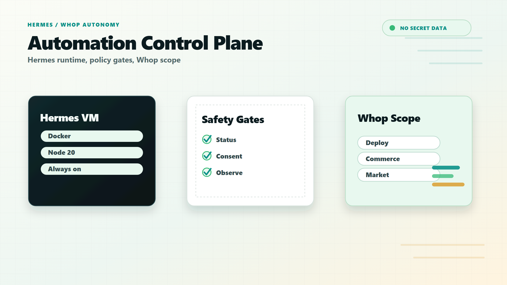
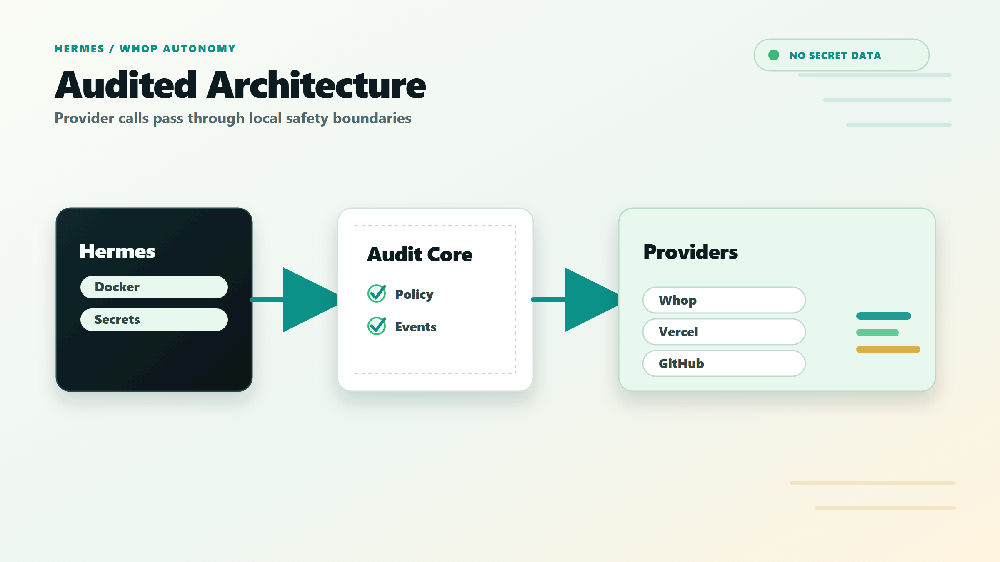
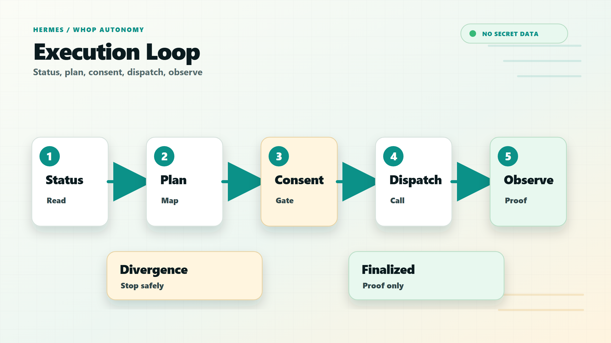
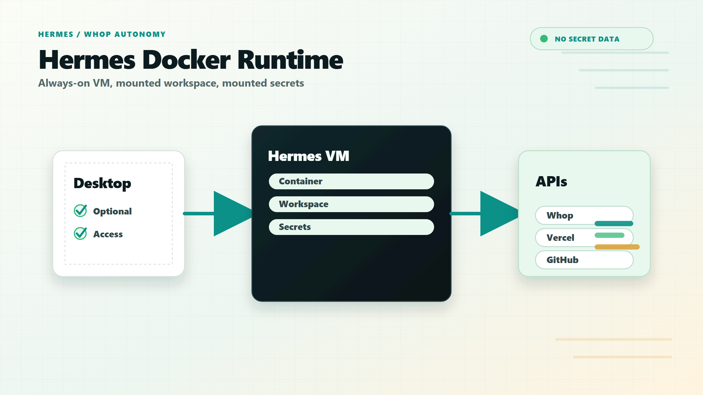
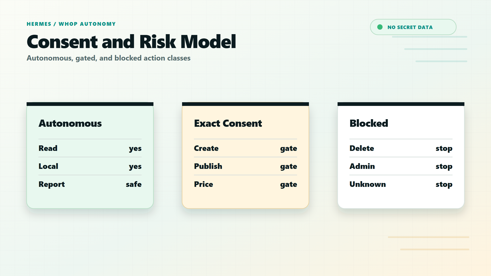
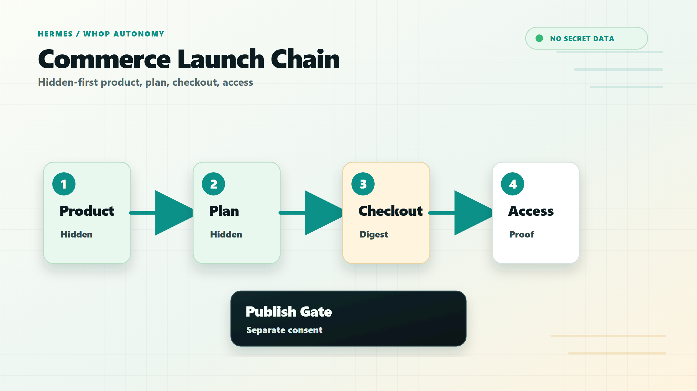
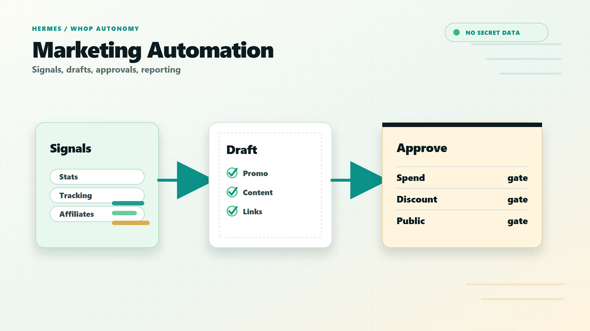

# Hermes Whop Automation App

This directory contains the installable Whop web-app surface for the Hermes operations dashboard.

It is separate from the MCP runner. The MCP runner performs audited automation from Hermes; this app build gives Whop creators and operators an installable B2B dashboard with stable dashboard/discover/experience URLs.

## README Images

Use these sanitized diagrams for the autonomous agent README. They describe the automation system rather than the public CallScore app, and they avoid secrets, checkout URLs, member data, and raw provider output.















## Whop App Settings

Use these values for the automation app once the CallScore public app has been recreated and attached to the products:

- Name: `Hermes Whop Automation`
- App type: `B2B app`
- Base URL: `https://automation.call-score.com`
- Dashboard path: `/dashboard/[companyId]`
- Discover path: `/discover`
- Experience path: `/experiences/[experienceId]`
- OAuth client type: `confidential`
- OAuth callback URL: `https://automation.call-score.com/api/auth/whop/callback`

Keep the app hidden while testing. List it only after the dashboard copy, Store description, and build bundle present a clear creator-facing operations workflow.

## Build

```bash
npm run build:automation-app
```

This writes:

- `dist/automation-app/hermes-whop-automation.web.js`
- `dist/automation-app/hermes-whop-automation.manifest.json`

The manifest includes the checksum and the SDK payload shape for `client.appBuilds.create`.

## Preview

```bash
npm run preview:automation-app -- --port 4177
```

Then open:

- `http://localhost:4177/dashboard/biz_Dpn6837r2Qp6Pp`
- `http://localhost:4177/discover`
- `http://localhost:4177/experiences/exp_preview`

The preview server binds to `127.0.0.1` by default. Use `--host 0.0.0.0` only inside a deliberately protected environment.

## Upload Payload

After uploading `dist/automation-app/hermes-whop-automation.web.js` as a Whop file, create the app build with:

```ts
await client.appBuilds.create({
  app_id: AUTOMATION_APP_ID,
  platform: "web",
  attachment: { id: WHOP_FILE_ID },
  checksum: MANIFEST_CHECKSUM,
  supported_app_view_types: ["dashboard", "discover", "hub"],
});
```

Promote only after Whop approval.
